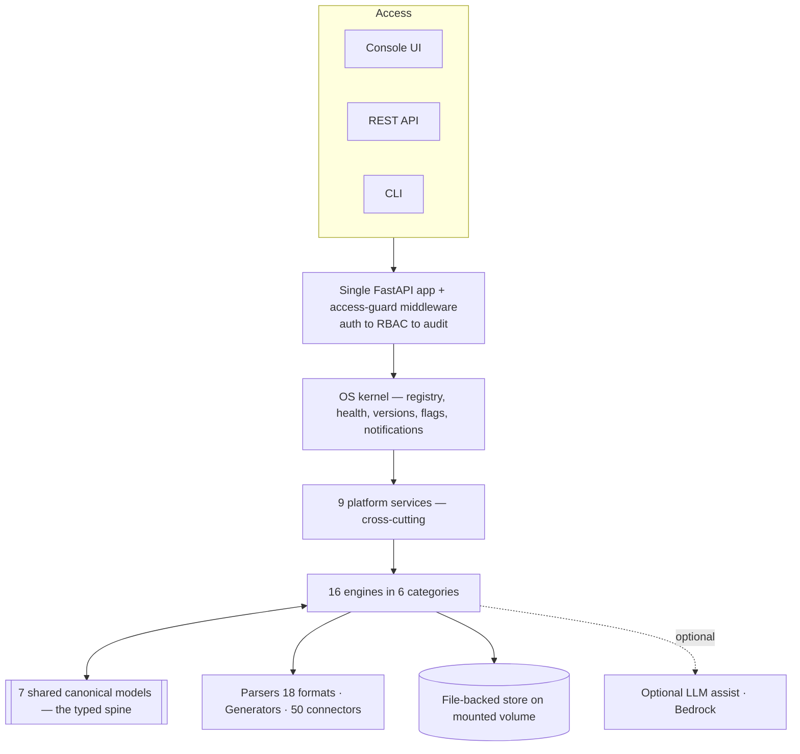

# MetaBridge — Platform Architecture

> The Enterprise Data Modernization Operating System.
> This document describes the architecture **as built** — conceptual (how the
> platform is organized) and physical (how it runs and deploys), from the major
> shape down to the load-bearing details.

---

## 0. At a glance

**Architecture style: a modular monolith — deliberately, not microservices.**
MetaBridge is one deployable unit (a single Python package served by one web
process) organized internally into ~25 independent domain modules that compose
over a shared, typed model spine through a registry/kernel. There is no service
mesh, no inter-service RPC, no message broker, and no per-service database.
"OS" refers to the composition/registry layer (`src/metabridge/platform/kernel.py`),
not a distributed system.

| Constant | Value |
|---|---|
| Core engines | 16 (in 6 categories) |
| Common platform services | 9 |
| Shared canonical models | 7 |
| Source formats parsed | 18 |
| Connectors | 50 |
| Automated tests | ~1,745 |
| Runtime storage backend | File-backed volume (no database) |
| Web framework | FastAPI (single app) served by uvicorn |
| Deployment unit | One container + one state volume |

### Why modular monolith (and not microservices)

- **It ships into the customer's boundary** (single-tenant, self-hosted or VPC).
  A microservice fleet is operational tax the *customer's* ops team would carry —
  wrong for a self-hosted appliance.
- **Data sensitivity.** Schemas, SQL, PII/PHI stay inside one process/boundary.
  Fewer network hops → smaller attack surface and a cleaner residency story.
- **Engines pass rich typed objects** (a whole `Pipeline` IR, a `DigitalTwin`
  graph). In-process that's a function call; across services it becomes
  serialization, versioned contracts and partial-failure handling — cost with no
  benefit at current scale.
- **Testability.** ~1,745 in-process tests run fast and deterministically.

It is a *modular* monolith specifically so engines can be split out later
without rewrites (see [§4](#4-trade-offs--evolution-path)).

---

## 1. Conceptual architecture

### 1.1 Guiding principles

1. **Shared canonical models, not point-to-point.** Every engine reads/writes the
   same typed models; add an engine and it plugs into the existing graph,
   governance and audit.
2. **Deterministic engines.** Numbers are *computed from evidence*, never invented
   by an LLM ("modeled, not measured"). The LLM is optional and assist-only.
3. **Governed by default.** RBAC, tamper-evident audit, human approval for
   consequential AI actions, and signed extensions are structural, not add-ons.
4. **Composition over inheritance.** The kernel enumerates engines/services/models
   via registries; it *owns nothing the engines do*.

### 1.2 The layer stack



| Layer | What it is | Where |
|---|---|---|
| Access | Web console, REST API, CLI | `web/templates`, `src/metabridge/cli.py` |
| Web & API | One FastAPI app + global `access_guard` middleware (auth → RBAC → audit) | `web/app.py` |
| OS kernel | Self-describing registry: engines, services, models, health, versions, flags, notifications | `src/metabridge/platform/kernel.py`, `registry.py` |
| Platform services (9) | Cross-cutting concerns | `src/metabridge/platform/`, `web/auth.py` |
| Engines (16) | Domain capabilities | subpackages under `src/metabridge` |
| Canonical models (7) | The typed spine every engine shares | `src/metabridge/platform/canonical.py` + `ir/`, `cir/`, `twin/`… |
| Edges | Parsers → IR/CIR, generators → target-native, connectors | `parsers/`, `generators/`, `connectors/` |
| Persistence & externals | File-backed store; optional LLM | `METABRIDGE_DATA_DIR`, `llm/` |

### 1.3 The canonical spine (7 models)

The contract every engine speaks (see `src/metabridge/platform/canonical.py`):

| Model id | Meaning |
|---|---|
| `ir_pipeline` | IR Pipeline — transformation graph; the ETL/SQL lingua franca |
| `cir_project` | CIR Project — higher-level canonical intent representation |
| `digital_twin` | Typed estate graph (apps, DBs, warehouses, pipelines, streaming, APIs, dashboards, owners) |
| `cer_estate` | Canonical Event Representation — the streaming estate |
| `cor_orchestration` | Canonical Orchestration Representation — schedulers/DAGs |
| `sap_landscape` | SAP semantic landscape (CDS / BW / HANA) |
| `agent_context` | Shared context the agentic layer reasons over |

Each engine descriptor declares the models it **consumes** and **produces**, so
the kernel can render cross-platform lineage and a live health roll-up.

### 1.4 Engine catalog (16 engines in 6 categories)

| Category | Engines |
|---|---|
| Estate & topology | Enterprise Data Estate · Digital Twin |
| Modernization | Semantic Intelligence · Migration Engine · Pipeline Studio · Validation |
| Governance & security | Governance Engine · Security Intelligence |
| Intelligence | AI Readiness · Technical Debt · FinOps |
| Operations | Documentation · Observability · Agent Orchestration |
| Extensibility | Marketplace · Plugin SDK |

### 1.5 Platform services (9)

Authentication · RBAC · Audit · Reporting · Notifications · Secrets ·
Version Management · Feature Flags · Plugin Registry.

These are cross-cutting: every engine and route runs through them rather than
reimplementing them.

### 1.6 Data flow — one modernization run

```
Source artifact ─► Detection ─► Parser ─► IR/CIR (canonical)
      │                                        │
      │                        Semantic Intelligence (lift intent)
      ▼                                        ▼
 Digital Twin / Estate ◄─── Governance (PII/PHI, residency, masking)
      │                                        │
      │                        Generator ─► target-native pipeline
      ▼                                        ▼
   Validation (equivalence + confidence) ─► Audit + Report + Observability
```

All of this happens **in-process**, passing typed model objects — nothing crosses
a network boundary during a run.

### 1.7 Governance & agentic overlay

On top of the engines sits a governed AI layer (12 agents). It never bypasses the
rules:

- Every consequential action carries a **confidence score computed from real
  evidence**.
- Consequential actions require **human approval** with **segregation of duties**
  — the requester cannot approve their own proposal (`agents:approve` is a
  distinct permission).
- Everything is written to a **tamper-evident, HMAC-keyed audit chain** that is
  re-verified on read.
- Marketplace extensions are **Ed25519-signed**.

---

## 2. Physical architecture

### 2.1 Process & runtime model

- **One process type**: `uvicorn web.app:app --workers 2` (see `Dockerfile`).
  Multiple identical worker processes for concurrency, sharing one data volume.
- **Synchronous, in-process execution.** There is no background queue, worker pool,
  Celery, or thread farm — a request runs the engine work inline and persists
  results as a **job directory** on disk
  (`DATA_DIR/jobs/<id>/` with `input/`, `output/`, `generated/`, `ai_review/`,
  `meta.json`).
- **CLI** is a separate entry point (`metabridge = metabridge.cli:app`, a Typer
  app in `src/metabridge/cli.py`) that calls the same engines directly — no
  server required.

### 2.2 Code & packaging layout

```
src/metabridge/        installable engine library (~25 subpackages)
  ir/ cir/ sqlx/ parsers/ generators/ detection/
  twin/ sap/ events/ orchestration/
  governance/ security/ ai_readiness/ debt/ finops/ assessment/
  docs/ observability/ agents/ plugins/ marketplace/ connectors/
  platform/            OS kernel, registries, canonical model registry,
                       feature flags, versions, notifications, _util
  report/ llm/         reporting + optional LLM assist
  engine.py cli.py acceptance.py livecheck.py
web/                   delivery surface
  app.py               routes + access_guard middleware (~3,800 lines)
  auth.py              file-backed accounts + sessions
  templates/ static/
tests/                 ~1,745 tests
examples/ docs/ README.md DEPLOYMENT.md
Dockerfile docker-compose.yml pyproject.toml
```

### 2.3 Storage model — file-backed, no database

A defining physical trait: **no SQLite/Postgres/MySQL/Mongo/Redis/Kafka is used as
a runtime backend.** All durable state persists as JSON/files under
`METABRIDGE_DATA_DIR`:

- `users.json`, `sessions.json` (auth), `jobs/` (run artifacts), `plugins/`,
  `avatars/`, connections store, plus feature-flags / versions / notifications /
  audit files.
- **Concurrency safety without a DB**: `src/metabridge/platform/_util.py` provides
  `file_lock()` (`fcntl.flock`, `LOCK_EX`) and `atomic_write_json()` (per-writer
  temp file + `os.replace`), so concurrent workers never corrupt or half-write
  state.

### 2.4 Deployment topology

- **Single container** (`Dockerfile`): `python:3.11-slim`, non-root user
  (uid 10001), installs `.[web,dtd]`, exposes `:8000`, `HEALTHCHECK` hits
  `/api/v1/info`.
- **`docker-compose.yml`**: one `metabridge` service, one named volume
  `metabridge_data:/data`, `restart: unless-stopped`, `METABRIDGE_API_KEY`
  required via `.env`.
- **State is externalized to the volume** — the container itself is disposable.

### 2.5 Security boundary

- **Single-tenant**, runs in the customer's own boundary (self-hosted / VPC).
- **AuthN**: file-backed accounts, **PBKDF2-SHA256 @ 390k iterations**, salted;
  sessions are **256-bit random server-side tokens** referenced by an **HttpOnly
  cookie `mb_session`** (~12h TTL). Optional **`METABRIDGE_API_KEY`** gates all
  `/api`.
- **AuthZ**: a single `access_guard` HTTP middleware maps every route to a required
  permission (`_required_permission`), across roles owner / admin / engineer /
  viewer plus `agents:approve` for segregation of duties.
- **Integrity**: HMAC-keyed tamper-evident audit chains; Ed25519-signed marketplace
  items; secrets service; feature flags & version pinning.

### 2.6 Dependency surface (intentionally lean)

- **Core** (`pyproject.toml`): `sqlglot` (SQL dialect translation), `PyYAML`,
  `typer` (CLI), `jinja2` (templating). That is the entire engine library.
- **Optional extras**: `web` (fastapi, uvicorn, python-multipart, pillow, openpyxl,
  python-docx, python-pptx, reportlab), `llm` (anthropic[bedrock]), `dtd` (lxml),
  `dev` (pytest). The platform runs headless with just the core; the web UI,
  document exports, and LLM assist are all opt-in.

### 2.7 Interfaces

Three co-equal front doors over the same engines: **Web console**
(server-rendered templates + `/api`), **REST API** (`/api/*`, OpenAPI at `/docs`),
and **CLI**. Same code paths, same governance.

### 2.8 Scaling & availability

- **Vertical + worker count** today (`--workers N`); state coordination via file
  locks on a shared volume.
- **Horizontal caveat**: because state is a local file volume, multi-node HA needs
  that volume on shared storage (NFS/EFS) *or* the store swapped for a networked
  backend — which is exactly the first seam to open (§4).

---

## 3. Minor details worth knowing

- **SQL engine**: `sqlglot` powers dialect detection + translation
  (Oracle / Teradata / T-SQL / …).
- **Exports**: XLSX (`openpyxl`), DOCX (`python-docx`), PPTX (`python-pptx`),
  PDF (`reportlab`), images (`pillow`) — all in the `web` extra.
- **Health honesty**: engine descriptors probe real import state →
  `available / degraded / error / external`, so the manifest reflects what is
  actually loadable, not a hard-coded "healthy".
- **Constants**: 18 source formats · 50 connectors · 7 canonical models ·
  16 engines · 9 services · ~1,745 tests.

---

## 4. Trade-offs & evolution path

The modular-monolith choice trades independent per-engine scaling/deploy for
radical operational simplicity and a tight data boundary — correct for a
self-hosted product. The **seams to evolve are already in place**: the registry +
uniform engine contract + shared canonical models mean any single engine (e.g. a
heavy Validation or Observability workload) could be extracted behind the same
contract into a service, and the file store could be swapped for a networked
backend, **without touching the other engines**. It is built to be *splittable when
scale demands it*, not split prematurely.
