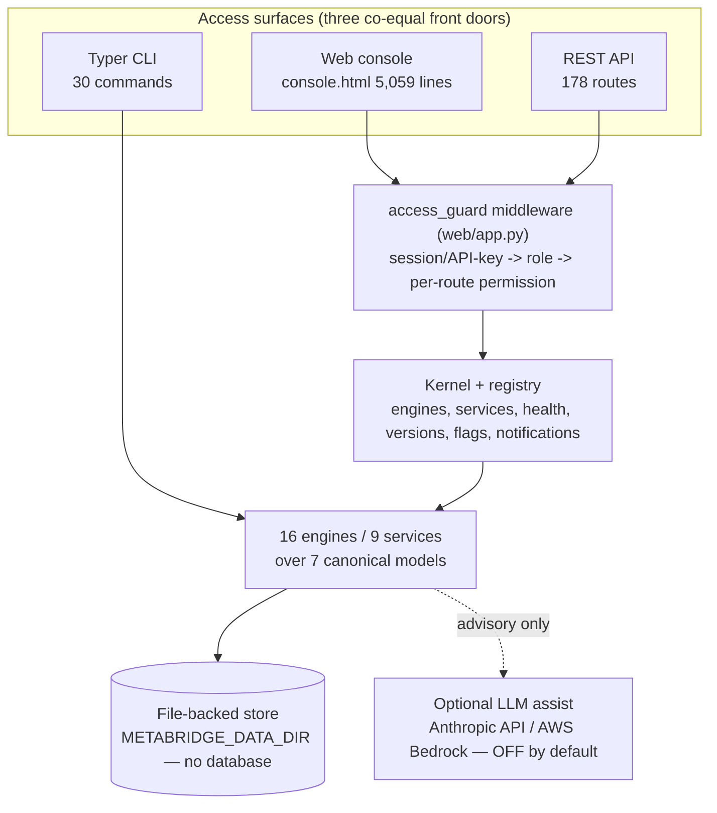

# Existing Architecture Assessment

> **Phase 0 — Document 00.** Factual inventory of the MetaBridge platform as it exists today, verified against the codebase on 2026-07-17. This document contains **no proposals** except where explicitly labelled *PROPOSED* or *ASSESSMENT*; everything else is **VERIFIED** by direct file inspection (`Read`/`grep`/`pytest --collect-only` against the working tree). It is the evidence base for the [Gap Analysis](01-gap-analysis.md) and the control-plane design documents that follow.

Sibling Phase-0 documents: [Gap Analysis](01-gap-analysis.md). Existing platform documentation referenced throughout: [Platform Architecture](../architecture.md), [Deployment Topologies](../deployment-topologies.md), [Global Operations](../global-operations.md), [AWS Reference Architecture](../aws-deployment.md).

---

## 1. Executive summary

MetaBridge is a **single-tenant, self-hosted, modular-monolith** data-modernization platform: one Python package, one FastAPI process, one Docker container, one state volume, **no database**. It ships into the customer's boundary (vendor-managed dedicated instance, BYOC, or air-gapped on-prem — Models A/B/C in [Deployment Topologies](../deployment-topologies.md)).

Three findings frame the entire commercialization program:

1. **There is zero commercial infrastructure in the codebase.** No payment, billing, invoicing, subscription, seat, licensing-enforcement, SSO/SAML/SCIM, rate-limiting, or partner/reseller code exists (§12). Commercialization is a green-field build, not a refactor.
2. **Single-tenancy is deliberate product positioning, not an accident.** There is no `tenant_id`, `Organization`, or `BusinessUnit` anywhere. The isolation story ("one instance = one customer, inside the customer's boundary") is the product's moat for regulated and air-gapped buyers. **Conflict, stated plainly:** the commercialization mandate assumes "multi-tenant SaaS"; the product is intentionally the opposite. **Resolution (PROPOSED, elaborated in later documents):** a two-plane model — the existing product stays single-tenant as the *data plane*; a new, separate, multi-tenant *control plane* owns all commercial concerns. Nothing in this document should be read as a recommendation to retrofit tenancy into the product monolith.
3. **Several existing subsystems are directly reusable as commercial building blocks** (§14): the Ed25519 signing infrastructure (→ signed license files), the tamper-evident audit chain (→ billing-grade event integrity), deterministic assessment/twin counters (→ usage meters), the fail-closed feature-flag service, the permission-mapped RBAC middleware pattern, and the LLM provider abstraction.

---

## 2. Verification method

Every claim below was checked against the working tree at `/Users/YUG/DBT to Informatica Data Tool`:

- Line counts and route counts via `wc -l` and decorator grep over `web/app.py`.
- Test count via `pytest --collect-only -q` (exact result: **1,745 tests collected**).
- Keyword evidence sweep (§12) via case-insensitive `grep` over `src/` and `web/`, with every hit read in context.
- All quoted behaviors (cookie flags, PBKDF2 iterations, signature-bound fields, flag coercion, lock semantics) read directly from source.

Where this assessment found numbers that differ slightly from prior internal statements, the **verified** number is used and the discrepancy noted (e.g. 178 route handlers counted vs. "~176" previously quoted; `web/app.py` is 3,847 lines vs. "~3,900").

---

## 3. Runtime and language stack (VERIFIED)

| Aspect | Fact | Evidence |
|---|---|---|
| Language | Python | `pyproject.toml` (`requires-python = ">=3.9"`) |
| Local dev interpreter | Python 3.9.6 (project `.venv`) | `python3 --version` on host |
| Container/CI interpreter | Python 3.11 (`python:3.11-slim`) | `Dockerfile`, `.gitlab-ci.yml` |
| Web framework | FastAPI, served by uvicorn (`--workers 2`) | `web/app.py`, `Dockerfile` CMD |
| CLI | Typer app, 30 commands, 1,200 lines | `src/metabridge/cli.py` (`metabridge = "metabridge.cli:app"` entry point) |
| Frontend | Server-rendered Jinja templates + vanilla JS; **no frontend framework, no build step** | `web/templates/console.html` (5,059 lines), `web/static/` |
| Core dependencies | `sqlglot`, `PyYAML`, `typer`, `jinja2` — the entire engine library | `pyproject.toml` `[project.dependencies]` |
| Optional extras | `web` (fastapi, uvicorn, python-multipart, pillow, openpyxl, python-docx, python-pptx, reportlab), `llm` (`anthropic[bedrock]`), `dtd` (lxml), `dev` (pytest) | `pyproject.toml` `[project.optional-dependencies]` |
| Packaging | setuptools, `src/` layout, version `0.1.0`, license "Proprietary" | `pyproject.toml` |

**Dependency drift finding (VERIFIED):** `src/metabridge/marketplace/package.py` imports the `cryptography` package (Ed25519 signing) at module top-level, but `cryptography` is **not declared** in `pyproject.toml` under any dependency group. It is currently satisfied ambiently in dev/CI environments. This is latent breakage for clean installs and must be fixed before the same signing code is load-bearing for license enforcement. Classified in §13.

**Python version drift (VERIFIED):** the package claims `>=3.9`, local development runs 3.9.6, and Docker/CI run 3.11. The suite is only continuously proven on 3.11; 3.9 compatibility is asserted, not tested. Classified in §13.

---

## 4. Application architecture (VERIFIED)

The architecture is fully described in [Platform Architecture](../architecture.md); the load-bearing facts for commercialization are:

- **Modular monolith, one deployable unit.** ~25 subpackages under `src/metabridge/`; no service mesh, no inter-service RPC, no message broker, no background queue. Engine work runs **inline in the request** and persists results to a job directory.
- **16 engines in 6 categories** (Estate & Topology, Modernization, Governance & Security, Intelligence, Operations, Extensibility) and **9 platform services** (Authentication, RBAC, Audit, Reporting, Notifications, Secrets, Version Management, Feature Flags, Plugin Registry), all enumerated by a self-describing registry (`src/metabridge/platform/registry.py`, 319 lines) with **honest health probes** that actually import the backing module (`available / degraded / error / external` — never hard-coded healthy).
- **7 shared canonical models** (`ir_pipeline`, `cir_project`, `digital_twin`, `cer_estate`, `cor_orchestration`, `sap_landscape`, `agent_context`) declared in `src/metabridge/platform/canonical.py`; each engine descriptor declares which models it consumes/produces.
- **Kernel** (`src/metabridge/platform/kernel.py`, 75 lines) composes registry + flags + versions + notifications into a single `manifest()` — including a canonical-reference integrity check. Notably, `get_os()` is a module-level singleton bound to one data dir, with a docstring that already anticipates the constraint: *"Callers that need strict per-tenant isolation should construct MetaBridgeOS directly."*

The CLI bypasses the web layer entirely (same engines, direct function calls, no server) — relevant later because any entitlement enforcement placed only in web middleware would not govern CLI use on the same host.

---

## 5. API surface — 178 routes by area (VERIFIED)

`web/app.py` (3,847 lines) contains **178 HTTP route handlers** (counted by `@app.get/post/put/delete/patch` decorators) plus one `@app.middleware("http")` (the access guard) and one static mount. Prior internal docs said "~176"; 178 is the verified count today.

| Functional area | Routes | Representative endpoints |
|---|---|---|
| Engine utilities (`/api/v1/*`) | 16 | `/api/v1/types`, `/explain`, `/impact`, `/lineage`, `/complexity`, `/pcmodel`, `/validate/powercenter`, `/govern`, `/ai/ask` |
| Connectors & connections | 14 | `/api/v1/connectors*`, `/api/v1/connections*` (test/introspect/load/start/stop), `/api/v1/dataload/package` |
| Jobs & reports | 13 | `/api/jobs*`, per-job report/report.json/migration-report/govreport/download, AI review, autofix |
| Events / streaming estate | 11 | `/api/events/analyze|convert|intelligence`, topology, cost-analysis, readiness, lineage, report |
| Digital Twin | 11 | `/api/twin/build`, graph, dependencies, capability-map, inventory, landscape, blast-radius, root-cause, impact, simulate |
| Pages & auth | 9 | `/`, `/login`, `/signup`, `/console`, `/documentation*`, `/auth/signup|login|logout` |
| Marketplace | 9 | catalog, installed, updates, install/uninstall/update, auto-update, keypair |
| Orchestration | 8 | analyze/convert/validate/review, dependencies, graph, lineage, report |
| Core convert/validate/govern | 8 | `/api/analyze`, `/api/convert`, `/api/detect`, `/api/validate`, `/api/review`, `/api/govern`, `/api/scaffold`, `/api/formats` |
| Profile & avatars | 7 | `/api/v1/me`, avatar CRUD, presets |
| Plugins | 7 | list/health/capabilities/detail, scaffold, load, delete |
| Legacy SQL migration | 7 | detect/analyze/convert/validate/review, lineage, report |
| Agent orchestration | 7 | `/api/agents`, run, runs, approvals approve/reject |
| System (kernel/flags/notifications) | 6 | `/api/system`, `/health`, `/flags` (GET/POST), `/notifications`, `/notifications/seen` |
| SAP | 6 | analyze/convert/validate/review, lineage, report |
| ETL migration | 6 | analyze/convert/validate/review, lineage, report |
| Settings (workspace + AI) | 5 | `/api/settings/workspace`, `/api/settings/ai` (+ `/test`) |
| Team management | 4 | `/api/users` list/create/patch/delete |
| Documentation engine | 4 | catalog, generate, detail, download |
| Assessment / AI-readiness / Tech-debt / FinOps / Security | 3 each (15) | create, get, export per area |
| Migrations (generic) | 3 | detail, lineage, report |
| Observability | 2 | `/api/observability`, `/export` |
| **Total** | **178** | |

Each *area* above maps to a route-count meter — the natural granularity for per-module entitlements and usage reporting (§10).

---

## 6. Persistence — file-backed, no database (VERIFIED)

**There is no SQLite, Postgres, MySQL, Mongo, Redis, or Kafka anywhere in the runtime.** All durable state is JSON/files under `METABRIDGE_DATA_DIR` (default `~/.metabridge`, `/data` in the container):

| Store | Path | Written by | Protection |
|---|---|---|---|
| Users | `users.json` | `web/auth.py` `AuthStore` | fixed-name `.tmp` + `replace` (see finding below) |
| Sessions | `sessions.json` | `web/auth.py` | same as users |
| Jobs / run artifacts | `jobs/<id>/` (`input/`, `output/`, `generated/`, `ai_review/`, `meta.json`) | `web/app.py` | per-job directory |
| Feature flags | `platform/flags.json` | `platform/flags.py` | `file_lock` + `atomic_write_json` |
| Versions | `platform/versions.json` | `platform/versions.py` | `file_lock` + `atomic_write_json` |
| Notifications | `platform/notifications.json` (capped at 500 entries) | `platform/notifications.py` | `file_lock` + `atomic_write_json` |
| Saved connections | `connections.json` (chmod 0600; secrets only on explicit opt-in, never returned by API) | `src/metabridge/connections_store.py` | 0600 + atomic write |
| AI provider settings | `settings.json` (chmod 0600; API key / Bedrock token server-side only) | `src/metabridge/llm/assist.py` | 0600 |
| Plugins / marketplace installs | `plugins/`, marketplace install state | `marketplace/install.py`, `plugins/` | install lifecycle with locks |

**Concurrency without a database (VERIFIED):** `src/metabridge/platform/_util.py` provides `file_lock()` (`fcntl.flock LOCK_EX`, explicitly best-effort — a no-op where flock is unavailable) and `atomic_write_json()` (per-writer temp file named with pid + uuid, then `os.replace`), so two concurrent uvicorn workers cannot consume each other's staging files.

**Consistency finding (VERIFIED):** `web/auth.py` `AuthStore._save()` does **not** use `platform/_util.py`. It writes to a **fixed-name** temp file (`f.with_suffix(".tmp")`) and performs read-modify-write on `users.json`/`sessions.json` **without any inter-process lock**. With 2+ workers, concurrent user/session mutations can interleave (lost update) or race on the shared temp filename. Tolerable for a small team on one instance; not acceptable as a pattern for anything commercial. Classified in §13.

**ASSESSMENT:** the file store is a correct fit for the data plane (appliance simplicity, air-gap capable, disposable container + one volume) and a hard **production blocker** as a home for any commercial system of record (subscriptions, invoices, entitlements, usage ledgers) — no transactions, no relational integrity, no point-in-time queries, no multi-writer scaling. This is precisely why the mandated control plane is specified on RDS PostgreSQL rather than extending this store.

---

## 7. Identity, authentication, authorization (VERIFIED)

### 7.1 What exists

- **Accounts:** file-backed (`users.json`), fields: email, name, company, role, salt, hash, created, avatar fields. Passwords: **PBKDF2-SHA256, 390,000 iterations, per-user salt**, constant-time compare (`hmac.compare_digest`), with a dummy hash on unknown users to blunt timing-based user enumeration (`web/auth.py`).
- **Sessions:** server-side random 256-bit tokens (`secrets.token_urlsafe(32)`), TTL **43,200 s (12 h)**, referenced by cookie `mb_session` set `HttpOnly, SameSite=Lax, path=/` — **no `Secure` flag**; TLS is delegated to the customer's reverse proxy (stated in the `web/app.py` docstring: "Put TLS/SSO in front via the customer's reverse proxy").
- **First-run bootstrap:** with no users, `/signup` creates the first account as **owner**; thereafter signup requires `users:manage`. Note the middleware's *open mode*: a fresh instance with **no users and no `METABRIDGE_API_KEY`** grants `{"*"}` to unauthenticated requests until the first account exists (`web/app.py` access_guard). Acceptable for an appliance first-boot; must be re-examined for vendor-managed (Model A) provisioning.
- **RBAC:** four roles — `owner` (`*`), `admin` (jobs:read/run/delete, settings:manage, users:manage, agents:approve), `engineer` (jobs:read/run/delete), `viewer` (jobs:read). A **distinct `agents:approve` permission** implements segregation of duties: a run-capable engineer cannot approve their own agent proposals. Last-owner demotion/removal is blocked.
- **Enforcement point:** a single global `access_guard` HTTP middleware guards every `/api` and `/console` path; `_required_permission(path, method)` maps each route to exactly one permission (default: GET→`jobs:read`, POST/PUT/PATCH→`jobs:run`, DELETE→`jobs:delete`, with explicit overrides for users/settings/flags/approvals). One choke point, uniformly applied — a pattern worth copying into the control plane.
- **Machine access:** optional single static `METABRIDGE_API_KEY` (env), accepted via `X-API-Key` header or `api_key` query param, granting the **fixed** permission set `{jobs:read, jobs:run, jobs:delete}` (`API_KEY_PERMISSIONS` constant in `web/auth.py`) — deliberately excludes user management, settings, and approvals.

### 7.2 What does not exist (VERIFIED absent)

No SSO (SAML/OIDC), no SCIM provisioning, no MFA, no password reset flow, no account lockout/anti-brute-force, no rate limiting of any kind, no per-user API tokens (one shared key), no key rotation, no outbound webhooks, no email delivery of any sort. The keyword sweep (§12) confirms zero code for any of these.

There is **no organization/workspace object** — the "workspace" *is* the instance. Workspace-level settings exist (`/api/settings/workspace`, tested in `tests/test_workspace_settings.py`) but describe one deployment, not a tenant among many.

---

## 8. Audit, integrity, and security controls (VERIFIED)

- **Tamper-evident audit chain** (`src/metabridge/agents/audit.py`, 143 lines): append-only event log where `entry_hash = HMAC-SHA256(server_key, prev_hash + canonical(event))`. `verify()` recomputes the full chain and checks **sequence contiguity** (a deleted middle event is caught), and trails are **re-verified on read** via `from_events()` — a persisted "intact" flag is never trusted. The module docstring is honest about scope: it detects tampering by anyone *without* the server key; it is not an externally anchored ledger. Records successes, denials, skips, failures, and human approve/reject decisions — "complete, not curated."
- **Ed25519 package signing** (`src/metabridge/marketplace/package.py`, 265 lines): real asymmetric crypto via the `cryptography` package. The signature binds the **full manifest** — `id, type, name, version, publisher, dependencies, compatibility, license, payload` (`_SIGNED_FIELDS`) — explicitly to prevent relabelling, downgrade, license-gate bypass, and dependency injection. Verification is fail-closed (`unsigned`, `untrusted_publisher`, `checksum_mismatch`, `signature_invalid`), against a publisher `TrustStore`. A first-party publisher key is derived from a **hard-coded deterministic seed** in source (`_key_from_seed(b"metabridge-marketplace-ed25519!!")`) — fine for the built-in catalog, **must not** be the root of trust for commercial license files (§13).
- **Feature flags** (`src/metabridge/platform/flags.py`, 150 lines): strict type coercion on every stored record so a hand-edited file can **never fail open** (`enabled` must be JSON `true`; roles must be a list; rollout clamped to [0,100]); rollout bucketing is a deterministic SHA-256 of `(key, subject)` — reproducible, testable, never random. Seeded flags include `ai_llm_assist` (default **off**).
- **Governed agent layer:** consequential actions require human approval with segregation of duties (`agents:approve`); every action carries an evidence-derived confidence score; everything lands in the audit chain.
- **Container hardening:** non-root user (uid 10001), slim base image, one exposed port, health check.
- **Not present:** security headers middleware (CSP/HSTS), rate limiting, request size/time-budget enforcement beyond framework defaults, dependency scanning or SAST in CI, secrets scanning, SBOM generation.

---

## 9. Domain objects and natural commercial meters (VERIFIED)

The platform's own domain objects already compute, deterministically, the exact quantities that appear in a systems integrator's estimation spreadsheet:

| Domain object | Where computed | Meter it yields |
|---|---|---|
| **Job** (`jobs/<id>/meta.json` + artifacts) | `web/app.py` | conversions run, per format pair, with timestamps and status — the run ledger |
| **Assessment** | `src/metabridge/assessment/engine.py` | object inventory per type/strategy/complexity; automation-potential figures; effort model (`objects_per_engineer_week_automated`); comparative run-cost per object |
| **Digital Twin** | `src/metabridge/twin/` | node/edge counts of the estate graph; inventory, landscape, blast-radius scope |
| **Tech debt / FinOps / Security / AI-readiness reports** | respective engines | scored findings with explicit `basis` labels ("modeled, not measured") |
| **Observability** | `src/metabridge/observability/engine.py` | run history rollups (measured), SLO targets vs. actuals, with `measured / modeled / no_data` provenance on every monitor |
| **Programs-equivalent** | none | there is no "program/engagement" object; the closest is the job history plus assessment reports. A commercial *engagement* object is a control-plane concept (PROPOSED) |

**ASSESSMENT:** because these counts are computed from evidence (never LLM-invented — a stated design principle in [Platform Architecture](../architecture.md)), they are *credible billing meters*: an SI can reconcile an invoice line ("1,240 objects assessed, 312 converted") against artifacts they possess. What is missing is everything around the meter: no usage event emission, no idempotency keys, no aggregation, no export, no rating. The meters exist; the metering pipeline does not.

Reporting today is per-run/per-analysis export (XLSX via openpyxl, DOCX, PPTX, PDF via reportlab, JSON/HTML reports per job) — deliverable-grade, not commercial-analytics-grade. No cross-instance rollups exist anywhere (by design: instances do not phone home at all).

---

## 10. AI / LLM integration (VERIFIED)

`src/metabridge/llm/assist.py` (240 lines):

- **Provider abstraction** over Anthropic API and AWS Bedrock (`make_client()`); default models: `claude-sonnet-5` (Anthropic) and `global.anthropic.claude-sonnet-4-5-20250929-v1:0` (Bedrock). Bedrock auth via bearer token or ambient SigV4/IAM role.
- **Advisory-only and off by default** (`ai_llm_assist` flag default-off; `make_assist(enabled=...)` returns `None` unless enabled). Every LLM-converted expression is flagged `LLM_CONVERTED_EXPRESSION, resolved_by_llm=true` in reports so customers can audit exactly what the model touched. Assist failures never break a conversion (broad catch returning `None` — deliberate).
- **Keys are server-side only**: `settings.json` mode 0600; disabling AI clears stored credentials; the console never receives the key back.
- **NOT present:** token counting, per-call cost capture, budgets, spend limits, or any usage rollup. `LLMAssist` counts `calls`/`converted` in-memory per run only. Any commercial AI cost-governance story starts from zero telemetry. Classified in §13.

---

## 11. Deployment, CI/CD, logging, configuration (VERIFIED)

### 11.1 Deployment artifacts

| Artifact | Content |
|---|---|
| `Dockerfile` | `python:3.11-slim`; non-root uid 10001; `pip install ".[web,dtd]"`; `METABRIDGE_DATA_DIR=/data`; `VOLUME /data`; `EXPOSE 8000`; `HEALTHCHECK` against `/api/v1/info`; `CMD uvicorn web.app:app --workers 2` |
| `docker-compose.yml` | one `metabridge` service, one named volume `metabridge_data:/data`, `restart: unless-stopped`, **`METABRIDGE_API_KEY` required** via `.env` (compose fails without it) |
| Air-gap path | `docker save/load` delivery, per [Deployment Topologies](../deployment-topologies.md) Model C |
| IaC | **None.** No Terraform, CDK, or CloudFormation anywhere in the repo. [AWS Reference Architecture](../aws-deployment.md) (ECS Fargate + EFS + ALB + Secrets Manager + Bedrock) and [Global Operations](../global-operations.md) (regional cells, one Route 53 record per customer instance) are **documentation, not code** |

### 11.2 CI/CD

`.gitlab-ci.yml`: a single `test` stage on `python:3.11-slim` — `pip install -e ".[web,dtd,dev]"` then `python -m pytest -q`, on merge requests and branch pushes, with a pip cache. **No** build/publish of the Docker image, no image signing, no vulnerability scanning, no deploy stage, no environments. Release management (build/tag/push, per-customer pinned upgrades) is documented as manual operator commands in [Global Operations](../global-operations.md).

### 11.3 Logging and monitoring

**VERIFIED:** there is **no `import logging` anywhere in `src/` or `web/`**. Runtime visibility is uvicorn access/error output plus the in-app Observability engine (job-history analytics with honest `measured/modeled/no_data` provenance) and the in-app notification feed (explicitly *not* an email/SMS/paging gateway — its own docstring says so). No structured logs, no log shipping, no metrics endpoint (no Prometheus/StatsD/OTel), no tracing, no error tracker. For a customer-operated appliance this is defensible; for vendor-managed Model A fleet operations it is a gap ([AWS Reference Architecture](../aws-deployment.md) leans on CloudWatch from outside the app).

### 11.4 Environment configuration

Complete inventory of environment variables read by the code (verified by grep):

| Variable | Purpose |
|---|---|
| `METABRIDGE_DATA_DIR` | root of all state (11 read sites) |
| `METABRIDGE_API_KEY` | optional static API key gating `/api` |
| `METABRIDGE_AI_PROVIDER` | override AI provider selection |
| `ANTHROPIC_API_KEY` | LLM assist key (env alternative to settings.json) |
| `AWS_BEARER_TOKEN_BEDROCK` | Bedrock bearer-token auth (else SigV4/instance role) |
| `MB_<CONNECTOR>_<FIELD>` | connection secrets resolved from env when not saved (per `connections_store.py`) |

That is the entire config surface — small, appliance-appropriate, and entirely uncoordinated (no config service, no per-fleet configuration management).

### 11.5 AWS dependencies

The **product has no hard AWS dependency**. AWS appears only as: (a) optional Bedrock LLM provider via `anthropic[bedrock]`; (b) the reference deployment documentation. This matters commercially: Model B/C customers can run with zero AWS footprint.

---

## 12. Payment / subscription / commercial code — keyword evidence sweep (VERIFIED)

**Plain statement: there is no payment, billing, subscription, licensing-enforcement, or partner code in this codebase.** A case-insensitive sweep across `src/` and `web/` found zero hits for `stripe`, `razorpay`, `payment`, `invoice`, `seat`, `reseller`, `SAML`, `SCIM`, `OIDC`, `rate limit`/`rate_limit`. Every hit for the remaining commercial-sounding keywords is domain noise — the platform *parses and models other systems* that happen to use these words:

| Keyword | Hits (files) | Verified interpretation |
|---|---|---|
| `billing` | `finops/engine.py` | FinOps engine models the **customer's warehouse bills** ("MetaBridge holds METADATA, not billing telemetry"); recommendations like "prefer physical-bytes storage billing". Not vendor billing. |
| `subscription` | `platform/notifications.py`; `events/parsers.py`, `events/generators.py`; `connectors/catalog.py` | In-app notification **topic subscriptions**; Kafka/Pulsar **consumer subscriptions** being parsed/generated from the customer's streaming estate. Not commercial subscriptions. |
| `tenant` | `events/parsers.py`, `connectors/catalog.py`; comments in `kernel.py`, `marketplace/install.py`, `observability/engine.py` | **Pulsar tenants** (a Pulsar namespace concept) in parsed admin exports; code comments about per-data-dir isolation. **No tenant_id field, model, or filter exists anywhere.** |
| `webhook` | `orchestration/parsers.py`, `orchestration/generators.py` | Scheduler **trigger types being parsed/generated** (git webhooks in dbt Cloud/ADF/Airflow definitions, `approval → WebHook` activity mapping). The platform itself sends no webhooks. |
| `license` | `marketplace/package.py`, `catalog.py`, `install.py`; `security/engine.py`; `debt/engine.py` | Marketplace item **license metadata fields** (MIT/Apache-2.0/Commercial/Enterprise-EULA…, `requires_acceptance` gate — signed but not monetized); PII masking rule for **driver's-license** identifiers; tech-debt modeling of **dashboard license cost** (`dashboard_license_usd_month`). No license *enforcement* of MetaBridge itself. |
| `commission` | `assessment/engine.py`, `debt/engine.py`, `finops/engine.py`, others | All substring hits on **"decommission"** (cutover & decommission phases, decommissioning idle resources). Zero partner-commission code. |
| `entitlement` | `deploy/idmc_client.py` | One error-message string advising the user to "check org entitlements" **in Informatica IDMC** when a deploy is rejected. No MetaBridge entitlement system. |

**Conclusion:** the commercialization build has a clean slate — no legacy billing code to migrate, deprecate, or work around. Equally, nothing can be "turned on"; every commercial capability in the [Gap Analysis](01-gap-analysis.md) is either *Missing* or must be built on the reusable primitives in §14.

---

## 13. Technical debt assessment for commercialization

Classifications use the program's standard scale: *Already available / Partially available / Missing / Must be refactored / Production blocker / Post-launch enhancement*. "Blocker" is scoped: **blocker for the commercial program**, not for the product's current single-customer deployments, where these trade-offs are deliberate and documented.

| # | Item | Evidence | Impact on commercialization | Classification (ASSESSMENT) |
|---|---|---|---|---|
| 1 | **File store as a home for commercial data** — no transactions, no relational queries, no multi-writer scale | §6 | Cannot host subscriptions/invoices/entitlements/usage ledgers. Resolution: control plane on RDS PostgreSQL; **do not** retrofit the product store | **Production blocker** (for commercial data only — *Already available and correct* for the data plane) |
| 2 | **`web/app.py` size** — 3,847 lines, 178 handlers, one file; `console.html` 5,059 lines | §5 | Slows every enforcement-bridge change (entitlement checks, usage emission touch many handlers); merge-conflict magnet | **Must be refactored** (routers-by-area split; behavior-preserving) |
| 3 | **Python 3.9/3.11 drift** — `requires-python >=3.9`, dev on 3.9.6, CI/Docker on 3.11 | §3 | Untested compatibility claims; blocks confident dependency upgrades | **Must be refactored** (pin floor to 3.11 or add a 3.9 CI job) |
| 4 | **Undeclared `cryptography` dependency** in the marketplace signing path | §3 | Latent clean-install breakage in the exact module slated for license-file reuse | **Must be refactored** (one-line pyproject fix + install test) |
| 5 | **No rate limiting / anti-brute-force** anywhere; static single API key with query-param fallback | §7 | Unacceptable for any vendor-managed (Model A) endpoint exposed to the internet; login brute-force possible | **Production blocker** for Model A / control plane; *Partially available* mitigation today (customer reverse proxy) |
| 6 | **No SSO/SAML/OIDC/SCIM/MFA** | §7 | Table stakes in enterprise procurement; today delegated to "customer's TLS/SSO proxy", which does not integrate with in-app RBAC | **Missing** (control-plane identity first; data-plane OIDC as a later increment) |
| 7 | **`AuthStore` bypasses the platform's own locking/atomic-write utilities** (fixed temp name, no flock, read-modify-write races across workers) | §6 | Pattern must not propagate; low practical risk at current scale | **Must be refactored** (adopt `platform/_util.py`; small change) |
| 8 | **First-boot "open mode"** — no users + no API key ⇒ all permissions granted | §7 | Fine for hands-on appliance install; risky for automated Model A provisioning windows | **Must be refactored** for Model A (pre-seeded owner or provisioning token) |
| 9 | **First-party marketplace signing key derived from a hard-coded seed in source** | §8 | Cannot anchor commercial license trust; a proper offline root key + distribution of the public key is required | **Must be refactored** before license-file reuse |
| 10 | **No structured logging/metrics/tracing** (zero `import logging` in the codebase) | §11.3 | Vendor-managed fleet operations and billing-dispute forensics need it; air-gapped Model C explicitly does not want phone-home | **Missing** (data-plane structured logs post-launch; control-plane observability from day one) |
| 11 | **No token/cost telemetry on LLM usage** | §10 | AI cost governance and any AI-metered pricing impossible today | **Missing** |
| 12 | **No IaC; manual release/upgrade runbooks** | §11.1–11.2 | Model A economics require automated cell/instance provisioning; docs exist, code does not | **Missing** (IaC for vendor-managed cells; runbooks remain valid for B/C) |
| 13 | **Synchronous in-request engine execution** (no job queue; long conversions hold a worker) | §4 | Capacity/limit enforcement per plan is coarse; two workers per instance today | **Post-launch enhancement** (per-instance sizing is the Model A/B mitigation; the seam is documented in [Platform Architecture](../architecture.md) §4) |
| 14 | **Single shared API key** (no per-principal machine identities, no rotation) | §7 | Usage attribution and revocation granularity insufficient for commercial reporting from connected instances | **Must be refactored** as part of the enforcement bridge (instance identity keys) |

Items deliberately **not** listed as debt: single-tenancy (product positioning, §1), the modular monolith (correct for an appliance), and the file store *for the data plane* (isolation + air-gap moat).

---

## 14. Commercially reusable assets (VERIFIED existence; reuse is PROPOSED)

The strongest Phase-0 finding: five existing subsystems are direct building blocks for the commercial program.

| Asset | Where | Verified property | Proposed commercial reuse |
|---|---|---|---|
| **Ed25519 signing + trust store** | `marketplace/package.py` | Signature binds full manifest (identity + metadata + payload); fail-closed verification with distinct failure statuses; keypair generation; compatibility gates | **Signed license files** for BYOC/air-gapped entitlement enforcement with offline grace, and **signed usage statements** exported from air-gapped instances — same canonical-bytes + trust-store machinery, new root key (§13 item 9) |
| **Tamper-evident audit chain** | `agents/audit.py` | HMAC-keyed hash chain, sequence-contiguity check, re-verified on read, honest threat-model scope | Billing-grade integrity for **usage event ledgers** and entitlement decisions; the "re-verify on read, never trust a stored flag" discipline transfers directly to invoice/usage disputes |
| **Feature flags** | `platform/flags.py` | Fail-closed coercion of stored records; deterministic SHA-256 rollout bucketing; role targeting | The **entitlement cache shape** on connected instances (flag = entitlement, subject = instance) and safe rollout of commercial features; the fail-closed discipline is exactly what entitlement checks need |
| **RBAC middleware pattern** | `web/app.py` `access_guard` + `_required_permission` | Every route mapped to exactly one permission at a single choke point; segregation-of-duties permission (`agents:approve`) proven in production code and tests (`tests/test_rbac.py`) | Template for control-plane authorization (tenant-scoped roles) and for the maker/checker split commercial ops need (e.g. discount approval ≠ deal creation) |
| **Deterministic meters** | `assessment/engine.py`, `twin/`, `jobs/`, `observability/engine.py` | Evidence-derived object counts, twin node/edge counts, run history with provenance labels (`measured/modeled/no_data`) | The **billable units** — auditable by the customer against their own artifacts; feeds the usage-metering context with idempotent batch reporting |
| **LLM provider abstraction** | `llm/assist.py` | Provider-agnostic client factory (Anthropic/Bedrock), server-side key custody (0600), advisory-only with per-expression audit flags | Insertion point for **token metering and budget enforcement** — one factory to instrument, not N call sites; the `resolved_by_llm` flagging is the audit trail for AI-assisted work products |
| **Version registry + notifications** | `platform/versions.py`, `platform/notifications.py` | Component version manifest with a shared comparator; bounded in-app event log | Fleet upgrade coordination signals for Model A cells; entitlement-expiry and license-renewal surfacing in the console |

---

## 15. Bottom line

The existing system is a disciplined, well-tested (**1,745 collected tests**, 99 files, single-stage GitLab CI), deliberately single-tenant appliance with an unusually clean security-primitive layer and **zero commercial code**. The correct read for the program is:

- **Data plane: leave it alone.** Its file store, single-tenancy, and in-boundary posture are the product. Verified debt items 2–4, 7–9, 14 are targeted, behavior-preserving refactors — not a re-architecture.
- **Control plane: build new.** Everything commercial (identity/tenants, catalog, subscriptions, entitlements, metering, billing adapters, partner management) is *Missing* by verified evidence and belongs in the separate multi-tenant service specified by the program mandate — with `tenant_id` on every row, derived from authenticated identity, enforced at API/service/repository layers. That schema discipline applies to the **control plane only**.
- **Bridge them with what already works:** Ed25519-signed licenses, flag-shaped entitlement caches, HMAC-chained usage ledgers, and the deterministic meters the product already computes.

The [Gap Analysis](01-gap-analysis.md) itemizes every required capability against this inventory using the shared classification scale.
