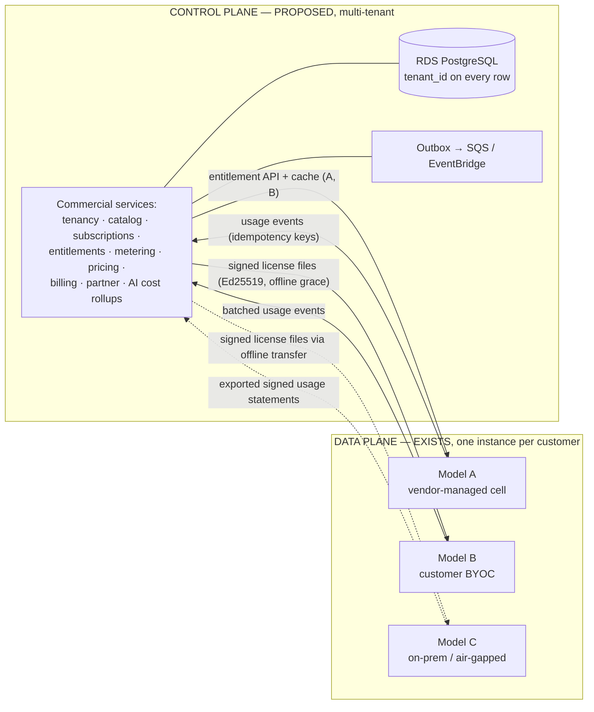
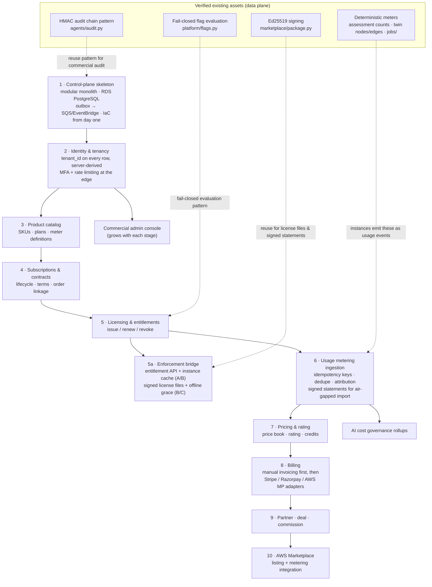

# Commercialization Gap Analysis

**Phase 0 — assessment only. No code changes.** This document inventories what MetaBridge has today against what a commercially operable offering requires, classifies every gap, scores readiness, and derives the build order for the proposed two-plane architecture. Every "exists" claim below was verified by direct inspection of the codebase on 2026-07-17; everything else is explicitly marked **PROPOSED**. All scores, effort signals, and blocker designations are **assessments by the authoring architect**, not measured guarantees — MetaBridge holds no certifications and publishes no SLAs today, and nothing here should be read as claiming otherwise.

Companion Phase-0 documents: [Target Architecture](02-target-architecture.md). Existing platform references: [Architecture](../architecture.md), [Deployment Topologies](../deployment-topologies.md), [Global Operations](../global-operations.md), [AWS Deployment](../aws-deployment.md).

**Classification taxonomy** (every line item gets exactly one): `Already available` · `Partially available` · `Missing` · `Must be refactored` · `Production blocker` · `Post-launch enhancement`. "Production blocker" means: commercially missing **and** launch cannot proceed without it.

---

## 1. Evidence base

What was verified, where, and what it establishes:

| Evidence | Source (verified) | Establishes |
|---|---|---|
| FastAPI app, global `access_guard` middleware, per-route permission map | `web/app.py` (~3,850 lines; 178 route decorators; `_required_permission` lines 72–95, `access_guard` lines 98–131) | Every `/api` route is permission-gated; RBAC is real, not aspirational |
| File-backed auth: PBKDF2-SHA256 at 390,000 iterations, 256-bit server-side session tokens, HttpOnly `mb_session` cookie, 12h TTL | `web/auth.py` (`_PBKDF2_ITERATIONS = 390_000` line 24, `SESSION_TTL_SECONDS = 12 * 3600` line 25, `secrets.token_urlsafe(32)` line 238) | Credible instance-level authn; no database required |
| RBAC roles `owner/admin/engineer/viewer` + distinct `agents:approve` permission (segregation of duties); API key confined to `jobs:*` | `web/auth.py` lines 33–46; `web/app.py` lines 80–84, 108–112 | Instance authorization model is complete for a single workspace |
| Tamper-evident audit chain: HMAC-SHA256 keyed hash chain, sequence-contiguity checks, re-verified on read | `src/metabridge/agents/audit.py` (`compute_hash` lines 58–62, `verify` lines 107–124, `from_events` docstring "never trust a persisted 'intact' flag") | Commercially reusable audit pattern; docstring is honest about scope (not an external ledger) |
| Feature flags: fail-closed bool coercion, deterministic SHA-256 rollout bucketing, file-backed | `src/metabridge/platform/flags.py` (`_norm` lines 43–57, `_bucket` lines 132–134) | Operator capability gating exists — but it is **not** a commercial entitlement system (no plan/contract/expiry concepts) |
| Ed25519 package signing binding the full manifest; publisher trust registry | `src/metabridge/marketplace/package.py` (lines 1–19, 79–99, 121, 162) | Reusable signing infrastructure for offline license files and signed usage statements |
| Deterministic commercial meters | `src/metabridge/assessment/engine.py` (`objects_total` line 371; module docstring: "NOTHING here calls an LLM — every figure derives from repository metadata or an explicitly labelled planning assumption") | Billing-grade units already computed: assessment object counts, plus Digital Twin node/edge counts and `jobs/<id>/` run history |
| AI assist: provider abstraction (Anthropic API / AWS Bedrock), off by default, keys in `settings.json` mode 0600 | `src/metabridge/llm/assist.py` (default Bedrock model id `global.anthropic.claude-sonnet-4-5-20250929-v1:0` line 88; persistence comment line 122) | Advisory-only AI exists; **no token metering, budgets, or cost tracking of any kind** |
| Backup story = copy of the single state volume | `docs/deployment.md` "Backups" (lines 195–202) | Documented manual procedure; no automation, no tested-restore evidence |
| Deployment models A (managed) / B (BYOC) / C (air-gapped) | `../deployment-topologies.md` lines 28, 59, 118; recovery objectives stated as "recommended targets… not measured guarantees" (line 55) | Single-tenant-per-instance delivery is deliberate product positioning |
| Keyword sweep: zero payment/billing/invoice/seat/SAML/SCIM/MFA/rate-limit code | `grep -ri` across `web/` and `src/metabridge/` | All `subscription/tenant/webhook/license/commission` hits are domain noise (Kafka/Pulsar concepts being parsed, marketplace item license *fields*, orchestration webhook *triggers* being parsed, FinOps modeling of the **customer's** warehouse bills). No Stripe/Razorpay/payment code exists |

---

## 2. The central conflict: "multi-tenant SaaS" and deliberate single-tenancy

The commercialization mandate assumes a multi-tenant SaaS. The product, verifiably, is the opposite — and **on purpose**:

- There is no `Organization`, `BusinessUnit`, or `tenant_id` anywhere in the codebase. State is one flat workspace per instance (`users.json`, `sessions.json`, `jobs/`, `connections.json` under `METABRIDGE_DATA_DIR`).
- `web/auth.py` says it plainly (lines 28–31): *"RBAC — single-tenant instances (one deployment per customer), roles govern what each person inside that customer's workspace can do."*
- The delivery models in [Deployment Topologies](../deployment-topologies.md) (A vendor-managed dedicated instance, B BYOC, C on-prem/air-gapped) and the regional cell model in [Global Operations](../global-operations.md) all assume one instance = one customer. This is the product's moat: in-boundary and air-gap-capable deployment is what wins SI and regulated-enterprise deals.

**Resolution — the two-plane model.** The conflict is resolved by refusing to merge the two concerns:

- **Data plane (EXISTS, unchanged in nature):** the current single-tenant product. Per-instance isolation is the strongest tenancy isolation there is. Retrofitting `tenant_id` into the file-backed monolith is explicitly rejected — it would destroy the air-gap/in-boundary positioning, add risk to ~1,745 passing tests' worth of working functionality, and buy nothing (each instance already serves exactly one customer).
- **Control plane (PROPOSED, new):** a separate multi-tenant modular-monolith service backed by Amazon RDS PostgreSQL, owning identity/tenant, catalog, subscriptions/contracts, licensing/entitlements, metering, pricing, billing adapters, partner/commission, AI cost governance rollups, and the commercial admin console. Multi-tenancy requirements (`tenant_id` on every row, derived from authenticated identity — never client-supplied — enforced at API, service, and repository layers) apply **here**, and only here.
- **Enforcement bridge (PROPOSED):** connected instances check entitlements via control-plane API with local caching; BYOC/air-gapped instances enforce via Ed25519-signed license files (reusing `marketplace/package.py` signing) with offline grace; connected instances batch-report usage events with idempotency keys; air-gapped usage exports as signed statements.

---

## 3. Capability gap assessment

### 3.1 Multi-tenancy

| Item | Classification | Evidence / notes |
|---|---|---|
| Per-customer isolation in the data plane (one instance = one customer) | Already available | By design: `web/auth.py` lines 28–31; [Deployment Topologies](../deployment-topologies.md) Models A/B/C; no cross-customer state exists to leak |
| Control-plane tenant model (RDS; `tenant_id` on every row, server-derived, enforced at API/service/repository layers) | Production blocker | Nothing exists. Zero tenancy code anywhere (verified sweep). Every other commercial capability depends on it |
| Retrofitting `tenant_id` into the product monolith | *(anti-requirement)* | Explicitly rejected — see §2. Listed to prevent scope creep |

### 3.2 Licensing & entitlements

| Item | Classification | Evidence / notes |
|---|---|---|
| Signing infrastructure suitable for license files | Partially available | Ed25519 signing that binds a full manifest + publisher trust registry exists (`src/metabridge/marketplace/package.py` lines 1–19, 121–162) — built for marketplace packages, directly reusable for signed license files and signed usage statements |
| Capability gating primitive inside the instance | Partially available | `src/metabridge/platform/flags.py`: fail-closed evaluation (`_norm`, lines 43–57), deterministic rollout. But flags model *operator toggles*, not *commercial entitlements* — no plan, term, expiry, seat/meter limits, or issuer identity |
| Entitlement service (issue/renew/revoke; plan → capability mapping) | Production blocker | Missing entirely |
| Enforcement bridge: instance-side entitlement check with local cache + offline grace | Production blocker | Missing. PROPOSED: connected check for Models A/B; signed license file for B/C with grace window |

### 3.3 Usage metering

| Item | Classification | Evidence / notes |
|---|---|---|
| Deterministic, defensible meter values | Already available | Assessment object counts (`assessment/engine.py` `objects_total` line 371, computed without LLM involvement per module docstring), Digital Twin node/edge counts, `jobs/<id>/` run history, per-area API routes. These are the same units an SI's estimate spreadsheet uses — credible billing meters |
| Usage *event* emission from instances (idempotency keys, batching, retry) | Production blocker | Missing. Meters are computed and displayed, never emitted anywhere |
| Control-plane ingestion (dedupe on idempotency key, tenant attribution, storage) | Production blocker | Missing; depends on 3.1 |
| Air-gapped usage export as signed statements | Missing | PROPOSED; tractable via Ed25519 reuse (3.2). Required before Model C customers can be usage-billed; interim: term licenses with fixed capacity |

### 3.4 Subscriptions & contracts

| Item | Classification | Evidence / notes |
|---|---|---|
| Subscription/contract objects, lifecycle (trial, active, suspended, terminated), term management | Production blocker | Zero code (verified sweep: all "subscription" hits are Kafka/Pulsar domain concepts being parsed by the product) |
| Contract-entitlement linkage (what a signed order entitles the instance to) | Production blocker | Missing; depends on 3.2 and product catalog |

### 3.5 Pricing

| Item | Classification | Evidence / notes |
|---|---|---|
| Vendor price book, rating of usage against plans, discounts/credits | Production blocker | Missing. Important distinction: `assessment/engine.py` *does* compute `cost_estimation` and `cloud_cost_comparison` — but those are the **customer's** migration labor and warehouse run costs (product features), not MetaBridge's own pricing. The FinOps engine likewise models the customer's bills |
| Deal-desk overrides / SI-specific rate cards | Post-launch enhancement | Manual pricing on paper is viable at launch; codified rate cards follow |

### 3.6 Partner / deal / commission

| Item | Classification | Evidence / notes |
|---|---|---|
| Partner registry, deal registration | Missing | Zero code ("commission" hits in the sweep are domain noise). Given the SI go-to-market, needed early — but launch can run on a spreadsheet + CRM without blocking revenue |
| Commission calculation & statements | Post-launch enhancement | Depends on billing (3.5→billing) being real first; premature automation here is wasted effort |

### 3.7 Marketplace readiness

| Item | Classification | Evidence / notes |
|---|---|---|
| In-product plugin marketplace: Ed25519-signed packages, catalog, install lifecycle with locks, plugin SDK | Already available | `src/metabridge/marketplace/` (verified). A genuine product differentiator and the signing substrate for 3.2 |
| AWS Marketplace listing + metering/billing integration | Missing | No integration code. Sequenced last in the build order (§5) because it presupposes catalog, entitlements, metering, and billing all working. Valuable for SI procurement paths; not launch-gating |

### 3.8 AI cost governance

| Item | Classification | Evidence / notes |
|---|---|---|
| Safe-by-default AI posture | Already available | `llm/assist.py`: advisory-only, **off by default** (`_LLM_DEFAULT_OFF` in `flags.py` line 29), provider abstraction over Anthropic API and Bedrock, server-side keys in `settings.json` mode 0600 |
| Token metering, per-instance/per-tenant cost attribution, budgets, kill switch | Production blocker *(scope-limited)* | Nothing exists. Blocking **only for Model A where the vendor pays for inference** — offering vendor-paid AI with no metering or budget cap is an unbounded-cost exposure. For Models B/C (customer's own Bedrock/API keys per [Deployment Topologies](../deployment-topologies.md) lines 110, 165) it is the customer's bill: there it is a Post-launch enhancement (rollup reporting) |

### 3.9 Admin consoles

| Item | Classification | Evidence / notes |
|---|---|---|
| Instance workspace console (jobs, users, settings, flags, approvals) | Already available | `web/templates/console.html` (~5,000 lines, server-rendered, no build step); 178 permission-gated route registrations in `web/app.py`; flag admin gated to `settings:manage` (line 86–87) |
| Commercial admin console (tenants, contracts, entitlements, invoices, partner views, fleet health) | Production blocker *(internal-minimum)* | Missing. Launch requires at least an internal ops-grade version; customer-facing self-service portal is a Post-launch enhancement |

### 3.10 Security & governance

| Item | Classification | Evidence / notes |
|---|---|---|
| Instance authentication (PBKDF2-SHA256 390k iters, server-side 256-bit tokens, HttpOnly cookie, timing-safe verify) | Already available | `web/auth.py` lines 24–26, 218–241; constant-time-ish comparison at lines 222–225 |
| RBAC with route→permission mapping and segregation of duties (`agents:approve` distinct from `jobs:run`) | Already available | `web/app.py` lines 72–95; `web/auth.py` lines 35–46. API key deliberately cannot manage users, settings, or approvals (line 46 comment) |
| Tamper-evident audit chain | Already available | `agents/audit.py`; scope honestly documented (lines 14–17). PROPOSED: reuse the same pattern for control-plane commercial audit (billing events, entitlement changes) |
| SSO (SAML/OIDC) on data-plane instances | Production blocker *(assessed as deal-gating)* | Zero SSO code (verified). Technically the product runs without it; commercially, enterprise procurement and SI security reviews routinely require SSO. Classified a blocker for the enterprise segment on that assessed basis, not a technical one |
| SCIM provisioning | Post-launch enhancement | Missing; meaningful only after SSO exists |
| MFA | Production blocker *(control plane)* / Missing *(instances)* | Zero MFA code. The vendor's commercial console holds every customer's billing data — MFA there is non-negotiable at launch. Instance-local MFA is a fast-follow (or arrives "for free" once instance SSO delegates to customer IdPs) |
| Rate limiting | Production blocker *(control plane)* / Missing *(instances)* | Zero rate-limiting code. The control plane is internet-facing and multi-tenant → mandatory. Data-plane instances are in-boundary with lower exposure; still worth adding to login endpoints (PBKDF2 at 390k iterations makes unthrottled login a CPU-amplification vector) |
| Outbound webhooks | Post-launch enhancement | None exist (orchestration "webhook" hits are inbound trigger *definitions being parsed*, not outbound delivery). Wanted eventually for SI toolchain integration |
| First-boot open mode | Must be refactored *(for vendor-managed provisioning)* | `web/app.py` lines 113–114: with no users and no API key, every request gets `perms = {"*"}`. Fine for a customer standing up their own box; unacceptable for fleet-provisioned Model A instances, which need a one-time bootstrap token flow. Small, contained change |

### 3.11 AWS infrastructure-as-code

| Item | Classification | Evidence / notes |
|---|---|---|
| Reference deployment documentation | Partially available | [AWS Deployment](../aws-deployment.md) describes ECS Fargate + EFS + ALB + Secrets Manager + Bedrock; [Global Operations](../global-operations.md) defines the regional cell model. Docs, not code |
| Terraform/CDK/CloudFormation for cells and the control plane | Production blocker *(Model A at fleet scale)* | Zero IaC in the repository (verified: no `*.tf`, no CDK app, no templates). Hand-provisioned cells cannot scale past a handful of Model A customers, and the control plane (RDS, SQS, EventBridge) should be IaC from day one |

### 3.12 Observability

| Item | Classification | Evidence / notes |
|---|---|---|
| Product-level operational observability | Already available | `src/metabridge/observability/engine.py`: dashboards over the instance's own job history, agent runs, connection health; docstring is explicit that durations/success are MEASURED while resource/cloud figures are MODELED unless telemetry is supplied. Container has a `HEALTHCHECK` on `/api/v1/info` |
| Fleet/SaaS observability (centralized metrics, logs, traces, alerting to a vendor on-call) | Production blocker *(Model A / control plane)* | Missing. No metrics export, no structured log shipping, no tracing. Operating paid Model A cells blind is not viable; existing per-instance health endpoints are the natural scrape target |

### 3.13 Backup / disaster recovery

| Item | Classification | Evidence / notes |
|---|---|---|
| Instance backup procedure | Already available *(procedure)* | `docs/deployment.md` lines 195–202: the single data volume *is* the instance; documented tar/volume-snapshot approach and restore-by-replacement. Architecturally simple by design |
| Automated backups, tested restores, measured RPO/RTO, cross-region strategy | Production blocker *(Model A)* | Nothing automated; [Deployment Topologies](../deployment-topologies.md) line 55 correctly states recovery objectives are "recommended targets… not measured guarantees." A vendor charging for Model A must automate and *test* restores before signing customers. For Models B/C, backup is the customer's duty (document it in the contract) |
| Control-plane DR (RDS PITR, multi-AZ, event-stream replay) | Production blocker | Does not exist because the control plane does not exist; must be designed in, not bolted on — billing data loss is existential |

### 3.14 Documentation

| Item | Classification | Evidence / notes |
|---|---|---|
| Product, deployment, and operations documentation | Already available | 20+ documents in `docs/` including [architecture](../architecture.md), [deployment topologies](../deployment-topologies.md), [global operations](../global-operations.md), [AWS deployment](../aws-deployment.md), governance/security, API and CLI references. Unusually strong for this stage, and honest (assessed targets labelled as such) |
| Commercial documentation (pricing/packaging sheets, order forms, SLA definitions, security/procurement questionnaire pack, DPA templates) | Missing | None exists. SLA documents must not be published until the observability and DR items above make the numbers measurable — publishing unmeasured SLAs would violate the honesty bar this program is committed to |

---

## 4. Commercialization-readiness rubric

Weights reflect commercial launch criticality. **All scores are assessments** from the evidence in §3, not audits. Scoring: points awarded within each weight for what verifiably exists today.

| # | Capability area | Weight | Score | Justification |
|---|---|---:|---:|---|
| 1 | Product core & deterministic meters | 10 | 8 | 16 engines + 9 platform services over 7 canonical models, ~1,745 passing tests, self-describing kernel/registry; billing-grade deterministic counts already computed. Loses points only for no usage *emission* |
| 2 | Multi-tenancy (two-plane basis) | 10 | 2 | Data-plane per-instance isolation is real and deliberate (credit); the multi-tenant control plane — where the mandate's tenancy requirements actually land — is 0% built |
| 3 | Licensing & entitlements | 8 | 2 | Ed25519 manifest-binding signing + fail-closed flag evaluation are genuine head starts; no entitlement semantics, service, or enforcement bridge exist |
| 4 | Usage metering | 8 | 3 | Meter values exist, deterministic and defensible; event pipeline, idempotent ingestion, and tenant attribution do not |
| 5 | Subscriptions & contracts | 7 | 0 | Zero code; all keyword hits are domain noise |
| 6 | Pricing & billing | 6 | 0 | Zero vendor-pricing or payment code (no Stripe/Razorpay/invoice anywhere); customer-cost modeling in the product is not vendor billing |
| 7 | Partner / deal / commission | 5 | 0 | Zero code |
| 8 | Marketplace readiness | 6 | 2 | In-product signed-package marketplace is real and reusable; AWS Marketplace integration absent |
| 9 | AI cost governance | 5 | 1 | Safe posture (off by default, server-side 0600 keys, provider abstraction) earns the point; zero metering/budget/attribution |
| 10 | Admin consoles | 6 | 2 | Instance console is complete and permission-gated; commercial/fleet console absent |
| 11 | Security & governance (SSO/SCIM/MFA/rate-limit/webhooks) | 10 | 4 | Strong instance-level authn/RBAC/segregation-of-duties and a reusable tamper-evident audit chain; but no SSO, SCIM, MFA, rate limiting, or outbound webhooks, and a first-boot open mode to close for managed fleets |
| 12 | AWS IaC | 6 | 1 | Good reference docs (ECS/EFS/ALB/Secrets Manager); zero actual IaC |
| 13 | Observability (fleet) | 5 | 2 | Real per-instance observability engine with honest measured-vs-modeled provenance + container healthcheck; no centralized fleet telemetry |
| 14 | Backup / DR | 4 | 1 | Sound, simple, documented single-volume procedure; nothing automated or restore-tested, targets explicitly not guarantees |
| 15 | Documentation | 4 | 3 | Extensive, honest product/deployment/ops docs; commercial doc set absent |
| | **Total** | **100** | **31** | **Assessed commercialization readiness: 31/100.** The product is strong; the *business machinery around it* is almost entirely unbuilt — which is exactly what the two-plane program addresses without touching the working product |

---

## 5. Build-order dependency graph

The chain below is strict where drawn solid: each stage's data model or API is a hard input to the next. Dashed edges are reuse of verified existing assets. (PROPOSED — nothing in the control-plane column exists today.)

Reading the graph: **stages 1–6 plus the internal-minimum admin console are the launch-critical path** (they are the production blockers in §6). Stages 7–8 can launch in degraded form (manual rating and invoicing driven from metered data). Stages 9–10 are deliberately last — automating commissions or listing on AWS Marketplace before billing works is effort spent out of order.

---

## 6. Production-blocker list

Consolidated from §3. Each item blocks commercial launch as assessed; sequence numbers refer to §5.

| # | Blocker | Why launch cannot proceed without it | Stage |
|---|---|---|---|
| B1 | Control-plane foundation: modular monolith on RDS PostgreSQL with outbox → SQS/EventBridge, deployed via IaC | Every commercial object (tenant, contract, entitlement, usage record, invoice) needs transactional, multi-tenant storage. Nothing exists today | 1 |
| B2 | Control-plane tenancy: `tenant_id` on every row, derived from authenticated identity (never client-supplied), enforced at API/service/repository layers | A commercial system that can leak one customer's contract or usage to another is disqualifying; must be foundational, not retrofitted | 2 |
| B3 | Control-plane security baseline: MFA for the commercial console, rate limiting, secrets management | The console aggregates every customer's commercial data and is internet-facing; also closes the PBKDF2 login CPU-amplification exposure at the edge | 2 |
| B4 | Licensing/entitlement service + enforcement bridge (connected API with instance cache; Ed25519-signed license files with offline grace for B/C) | Without enforcement, there is nothing that makes a contract mean anything at the instance | 5, 5a |
| B5 | Usage metering pipeline with idempotency keys and deduplicating ingestion | Usage-based or capacity-verified billing without exactly-once accounting produces disputed invoices; the meters exist but are never emitted | 6 |
| B6 | Minimum billing capability: rate metered usage against a price book and issue invoices (manual/PSP-lite acceptable at launch) | Revenue collection is the point; full Stripe/Razorpay/AWS-MP automation can follow, invoicing correctness cannot | 7–8 |
| B7 | Internal commercial admin console (tenants, contracts, entitlements, usage, invoices, fleet status) | Ops cannot run onboarding, renewals, or disputes over raw SQL | 2+ |
| B8 | IaC + automated, restore-tested backup/DR for the control plane and Model A cells | Hand-built cells don't scale and can't be rebuilt reliably; unverified backups of billing data are an existential risk. Recovery targets stay "recommended" (per existing docs) until measured | 1 |
| B9 | Fleet observability for Model A cells and the control plane (metrics, logs, alerting to vendor on-call) | Charging for a managed service the vendor cannot see is operationally indefensible; also the precondition for ever publishing an SLA honestly | 1–2 |
| B10 | Enterprise SSO (OIDC/SAML) on data-plane instances | Assessed as deal-gating for enterprise/SI procurement rather than technically blocking; sequenced with launch because sales cycles hit it immediately | parallel |
| B11 | AI cost governance (token metering, budgets, kill switch) — **scoped to Model A vendor-paid inference only** | Unmetered, unbudgeted vendor-paid Bedrock usage is an unbounded cost exposure; not blocking where customers bring their own keys (Models B/C) | 6 |
| B12 | First-boot open-mode hardening (`web/app.py` lines 113–114) for fleet-provisioned instances | Vendor-provisioned Model A instances must never expose an unauthenticated `{"*"}` window; replace with a bootstrap-token flow. Small change, disproportionate risk if skipped | 5a |

Not blockers (explicitly): SCIM, outbound webhooks, commission automation, AWS Marketplace listing, customer self-service portal, deal-desk rate cards — all Post-launch enhancements per §3.

---

## 7. Reuse guardrails — what must not be rebuilt

Phase 0's strongest finding is what *already works*. The build program must treat these as protected assets:

1. **Do not retrofit tenancy into the product.** The file-backed, database-free, single-tenant instance is the deployment moat (Models A/B/C, air-gap capable). All multi-tenancy lands in the new control plane (§2).
2. **Reuse the Ed25519 signing infrastructure** (`marketplace/package.py`) for license files and signed usage statements rather than introducing a second signing scheme — one trust model, one key-management story.
3. **Reuse the HMAC audit-chain pattern** (`agents/audit.py`) for the control plane's commercial audit log (entitlement changes, invoice issuance, manual credits) — tamper-evidence on billing actions is a sales asset, and the honest-scope framing in its docstring is the right template.
4. **Reuse the fail-closed evaluation discipline** from `platform/flags.py` (`_norm`) in entitlement checks: a malformed or hand-edited entitlement record must never evaluate to "entitled."
5. **Bill on the meters that already exist** (assessment object counts, twin node/edge counts, job history). They are deterministic, LLM-free, and match how SIs already scope engagements — do not invent new units that require new instrumentation before launch.

The through-line of this analysis: **MetaBridge's product readiness far exceeds its commercial readiness (assessed 31/100).** The two-plane program closes that gap by building the missing business machinery beside the product, never inside it.
