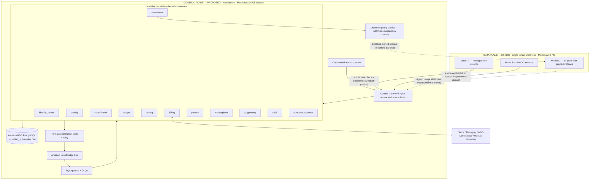
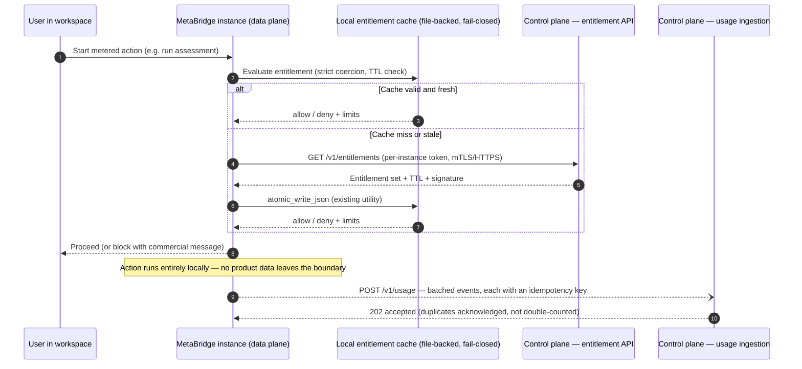

# Target Commercial Architecture

> **Phase 0 — assessment and target design. No code described in the "Control Plane" and "Enforcement Bridge" sections exists today unless explicitly marked *Exists (verified)*.** This document defines the target architecture for commercializing MetaBridge: what we keep, what we build, and exactly where the boundary between the two sits. Companion documents: [Gap Analysis](01-gap-analysis.md). Platform references: [Architecture](../architecture.md), [Deployment Topologies](../deployment-topologies.md), [Global Delivery & Operations](../global-operations.md), [AWS Reference Architecture](../aws-deployment.md).

**Status legend used throughout:** `EXISTS (verified)` — present in the codebase/docs today, file paths given. `PROPOSED` — target design, not built. Every table row and diagram element is classified one way or the other.

---

## 1. The architectural conflict, stated honestly

The commercialization mandate assumes a "multi-tenant SaaS." The product is **deliberately not one**:

- **EXISTS (verified):** MetaBridge is single-tenant by design — one container + one file-backed volume per customer, no database, no `tenant_id` anywhere in the code, no shared control plane in any delivery model ([Deployment Topologies](../deployment-topologies.md): "All three models are single-tenant… There is no shared multi-tenant control plane in any model"). State is JSON files under `METABRIDGE_DATA_DIR` with `fcntl.flock` + atomic `os.replace` writes (`src/metabridge/platform/_util.py`). This is the product's moat: in-boundary, BYOC, and fully air-gapped delivery ([Global Delivery & Operations](../global-operations.md) cell model).
- A keyword-evidence sweep (verified) found **zero** payment, billing, invoicing, seat, SAML/SCIM, or rate-limiting code. Hits for "subscription", "tenant", "webhook", "license", "commission" are domain noise — Kafka/Pulsar concepts being parsed, marketplace license *fields*, orchestration webhook *triggers* being parsed, FinOps modeling of the *customer's* warehouse bills.

**Resolution — the two-plane model.** We do not retrofit multi-tenancy into the product. That would require a database, break the one-artifact/one-volume model, and destroy the air-gap posture that regulated buyers pay for. Instead:

| Plane | Tenancy | Persistence | Status |
|---|---|---|---|
| **Data plane** — the product | Single-tenant per instance, unchanged | File-backed volume, unchanged | EXISTS (verified) |
| **Control plane** — the business | Multi-tenant, `tenant_id` on every row | Amazon RDS PostgreSQL | PROPOSED (nothing exists) |
| **Enforcement bridge** — between them | Per-instance credentials / signed license files | Instance-local cache + signed artifacts | PROPOSED (reuses verified signing & flag patterns) |

The multi-tenancy requirements in the mandate (tenant_id on every row, derived from authenticated identity, enforced at every layer) apply **to the control plane only**.

---

## 2. Two-plane architecture overview

Key structural decisions:

1. **The control plane is itself a modular monolith** — the same architecture style the team already operates successfully in the product ([Architecture](../architecture.md) §0), for the same reasons: one deployable, fast in-process tests, seams reserved for later extraction (§8). It is a *separate* deployable from the product; the two never share a process, a repo module, or a datastore.
2. **The data plane never becomes a client of the control plane for its core function.** Conversions, governance scans, and reports run entirely locally, exactly as today. The control plane gates *commercial* permission (is this instance licensed, at what tier, with what meters), not *functional* capability.
3. **Every control-plane write that matters commercially is a PostgreSQL transaction**; domain events leave only via the outbox (§4.4), so the billing ledger and the event stream can never disagree.

---

## 3. Data plane — what exists, and what explicitly does not change

### 3.1 What does NOT change (this is a design commitment, not an omission)

| Property | Detail | Status |
|---|---|---|
| Product core | 16 engines, 9 platform services, 7 canonical models, kernel/registry (`src/metabridge/platform/kernel.py`, `registry.py`); ~1,745 tests | EXISTS — unchanged |
| File-backed state | `METABRIDGE_DATA_DIR` with `users.json`, `sessions.json`, `jobs/<id>/`, `plugins/`, `platform/{flags,versions,notifications}.json`, `connections.json`; `fcntl.flock` + atomic writes | EXISTS — unchanged; **no database is added to the product** |
| Single-tenancy | One instance = one customer workspace; no `tenant_id` inside the product | EXISTS — unchanged, deliberately |
| Air-gap capability | Model C `docker save/load` path, zero outbound dependency for deterministic engines | EXISTS — unchanged; the bridge must never make connectivity mandatory |
| Delivery topologies | Models A / B / C and regional cells | EXISTS ([Deployment Topologies](../deployment-topologies.md), [Global Delivery & Operations](../global-operations.md)) — unchanged |
| In-instance security | PBKDF2-SHA256 accounts, server-side sessions (`mb_session`), RBAC via `access_guard` middleware, `agents:approve` segregation of duties, HMAC-chained audit (`src/metabridge/agents/audit.py`), Ed25519-signed marketplace | EXISTS — unchanged |
| AI posture | LLM assist advisory-only, off by default, Bedrock/Anthropic provider abstraction (`src/metabridge/llm/assist.py`) | EXISTS — behavior unchanged (token counters are additive, §5.3) |

### 3.2 The single additive data-plane change: the commercial agent

PROPOSED. One new, thin, optional module inside the product (working name `commercial/`), following the existing platform-service pattern:

- **Entitlement client + local cache** — file-backed under `METABRIDGE_DATA_DIR/platform/entitlements.json`, written with the existing `atomic_write_json`/`file_lock` utilities, and normalized with the same **strict fail-closed coercion** pattern that `src/metabridge/platform/flags.py` already implements (only JSON `true` enables; malformed records never fail open). EXISTS as a pattern; PROPOSED as a module.
- **License-file verifier** — reuses the Ed25519 verification mechanics of `src/metabridge/marketplace/package.py` (canonical-bytes signing, trust store, fail-closed statuses `unsigned` / `untrusted_publisher` / `checksum_mismatch` / `signature_invalid`). §5.2.
- **Usage spooler** — appends usage events locally (jobs are already durable directories), batches them to the control plane when connected, exports signed statements when not. §5.3.
- **Meter emitters** — the meters already exist and are deterministic (verified): assessment object counts (`src/metabridge/assessment/engine.py`), Digital Twin node/edge counts, job history under `jobs/`, per-area API routes. The agent reads them; it does not change how they are computed. The one genuinely new counter is LLM token usage in `llm/assist.py` (today there is **no** token metering — verified), which is an additive instrumentation change.

This module ships in the same single artifact and is inert unless the instance is enrolled or a license file is installed — preserving the "one artifact, three topologies" invariant.

---

## 4. Control plane — the new multi-tenant commercial monolith

Everything in this section is **PROPOSED**. Nothing here exists in the repository today (verified by keyword sweep).

### 4.1 Bounded contexts

One deployable, twelve contexts. Each context owns its tables (separate PostgreSQL schema per context), exposes an internal Python API to siblings, and communicates cross-context state changes via domain events only — no cross-schema foreign keys. This mirrors the product's engine/registry discipline and keeps extraction seams real (§8).

| Context | Owns | Core responsibilities | Notable reuse of verified assets |
|---|---|---|---|
| `identity_tenant` | tenants, users, roles, instance registrations, instance credentials | Tenant lifecycle; commercial-console SSO (OIDC); issues per-instance tokens for the bridge | Product RBAC stays in-instance; this is vendor/partner/customer-admin identity only |
| `catalog` | products, SKUs, features, meter definitions | The sellable shape of the product: editions, add-ons, meter units (objects assessed, twin nodes/edges, jobs, AI tokens) | Meter definitions map 1:1 to counters the product already computes |
| `subscription` | subscriptions, contracts, terms, renewals | Contract state machine; term dates; renewal/expansion/cancellation | — |
| `entitlement` | entitlement sets, grants, license records | Derives effective entitlements from subscription + catalog; serves the bridge API; requests license-file signing | Flag-style deterministic evaluation and fail-closed coercion (`platform/flags.py` pattern) |
| `usage` | usage events, aggregates, statements | Idempotent ingestion, per-meter rollups, rating input; verification of imported air-gapped statements | Idempotency keys + unique constraints; events sourced from meters that already exist |
| `pricing` | price books, rate cards, discounts, currency | Rating: usage × rate card → charge lines; partner-specific pricing | — |
| `billing` | invoices, payments, ledger, provider adapters | Invoice assembly; adapters: Stripe, Razorpay, AWS Marketplace (metering + entitlement APIs), manual/PO invoicing | Adapter port pattern mirrors `llm/assist.py` provider abstraction |
| `partner` | partners, deal registrations, commissions | SI/OEM deal registration, white-label attribution, commission accrual | White-label delivery model already documented ([Deployment Topologies](../deployment-topologies.md)) |
| `marketplace` | commercial listings, publisher agreements, revenue share | The *commercial* side of the existing product marketplace: paid listings, rev-share | Product-side install/signing pipeline EXISTS (`src/metabridge/marketplace/`) — unchanged |
| `ai_gateway` | AI usage rollups, budgets, alerts | Per-tenant AI cost governance: token rollups from usage events, budget thresholds, alerts. **Not** an inference proxy — inference stays in the customer boundary (Bedrock/Anthropic, per [AWS Reference Architecture](../aws-deployment.md)) | Product AI remains off-by-default, advisory-only |
| `audit` | commercial audit chain | Tamper-evident log of every commercially consequential action (entitlement change, license issue/revoke, invoice finalize, manual adjustment) | Direct reuse of the HMAC-chained, sequence-contiguous design of `src/metabridge/agents/audit.py` (verified: `entry_hash = HMAC(key, prev_hash + body)`, re-verified on read) |
| `customer_success` | health signals, adoption metrics | Fleet version-vs-pin reconciliation (via `GET /api/v1/info`, which EXISTS), usage trend analytics, renewal-risk views | Fleet observability model already documented ([Global Delivery & Operations](../global-operations.md)) |

### 4.2 Persistence: Amazon RDS PostgreSQL

- **Multi-AZ RDS PostgreSQL**, one logical database, one schema per bounded context.
- **Transactions for billing-critical operations**: subscription activation, entitlement grant, invoice finalization, and payment recording each commit atomically *with their outbox rows* (§4.4).
- **Schema conventions (mandatory):** every tenant-scoped table carries `tenant_id UUID NOT NULL`; every index on tenant-scoped tables leads with `tenant_id`; unique business keys are composite `(tenant_id, …)`.
- **PostgreSQL Row-Level Security as defense-in-depth**: application sets `SET LOCAL app.tenant_id` per transaction; RLS policies filter on it. RLS is the backstop, not the primary mechanism — the repository layer is (§4.3).
- Financial amounts as `NUMERIC`, money never in floats; append-only ledger tables for `billing.ledger` and `audit.events`.

### 4.3 Tenant-isolation enforcement points

`tenant_id` is **always derived from the authenticated principal — never accepted from a client-supplied field, path, or payload.** Enforcement is layered so a single mistake cannot leak across tenants:

| Layer | Enforcement | Failure mode it stops |
|---|---|---|
| **API** | Auth middleware resolves the principal (console user session / partner OAuth client / instance token) → `TenantContext`. Any request body or query parameter containing `tenant_id` is ignored or rejected. Per-tenant rate limits here (note: the product has none today — verified — and an internet-facing multi-tenant API cannot ship without them). | Spoofed tenant in request payloads; noisy-neighbor abuse |
| **Service** | Every application-service method takes `TenantContext` as an explicit first argument; no ambient globals. Cross-tenant operations (vendor-admin views) require a distinct, audited `operator` principal type. | Accidental tenant-less code paths |
| **Repository** | Base repository injects `WHERE tenant_id = :ctx` on every query; raw SQL outside repositories fails CI lint. PostgreSQL RLS as backstop (§4.2). | Hand-written query missing the filter |
| **Jobs / async consumers** | Every domain event and queue message carries `tenant_id` in its envelope; consumers reconstruct `TenantContext` from the envelope before touching a repository, never from message body fields. | Cross-tenant processing in workers |
| **Exports / reports / files** | Any generated artifact (invoice PDFs, usage statements, CSV exports) is stored under a tenant-prefixed key (`s3://…/<tenant_id>/…`) and served via per-request authorization, never predictable URLs. | Object-storage enumeration leaks |
| **Cache keys** | All cache keys are namespaced `t:<tenant_id>:…`; cache helpers refuse un-namespaced keys. | Cached entitlement/pricing bleeding across tenants |

### 4.4 Event-driven design: outbox → EventBridge/SQS, idempotent consumers, DLQs

**Pattern (PROPOSED):**

1. A state change and its event insert into the context's `outbox` table **in the same PostgreSQL transaction** — no dual-write.
2. A relay process polls the outbox (batched, ordered per aggregate) and publishes to the **EventBridge bus**; rows are marked published only after EventBridge acknowledges. At-least-once by construction.
3. EventBridge rules route events to per-consumer **SQS queues**. Each consumer is **idempotent**: consumption is recorded in a `processed_events(consumer, event_id)` table (or by natural idempotency such as upsert-on-unique-key), so redelivery is harmless.
4. Every queue has a **DLQ** with a redrive policy; CloudWatch alarms on DLQ depth > 0. Poison messages are triaged, never dropped.

**Domain events (initial set):**

| Event | Producer context | Primary consumers |
|---|---|---|
| `TenantProvisioned` / `TenantSuspended` | identity_tenant | entitlement, customer_success, audit |
| `InstanceRegistered` / `InstanceHeartbeatMissed` | identity_tenant | customer_success, entitlement |
| `SubscriptionActivated` / `SubscriptionRenewed` / `SubscriptionCancelled` / `SubscriptionExpired` | subscription | entitlement, billing, partner, customer_success |
| `EntitlementIssued` / `EntitlementChanged` / `EntitlementRevoked` | entitlement | audit, customer_success |
| `LicenseFileIssued` / `LicenseFileRevoked` | entitlement | audit, customer_success |
| `UsageBatchAccepted` / `UsageStatementImported` | usage | pricing, ai_gateway, customer_success |
| `UsageAggregated` (per meter, per period) | usage | pricing, billing |
| `ChargesRated` | pricing | billing |
| `InvoiceDrafted` / `InvoiceFinalized` / `PaymentSucceeded` / `PaymentFailed` / `DunningEscalated` | billing | subscription (grace/suspend), partner (commission), audit, customer_success |
| `DealRegistered` / `DealApproved` / `CommissionAccrued` | partner | billing, audit |
| `AiBudgetThresholdReached` | ai_gateway | customer_success, notifications |
| `ListingPublished` / `RevenueShareAccrued` | marketplace | billing, partner |

Consequential consumers (anything that changes money or entitlements) also write to the `audit` context's HMAC chain — the same tamper-evidence discipline the product already applies to agent actions (verified pattern, `src/metabridge/agents/audit.py`).

### 4.5 AWS deployment and service mapping

The control plane deploys with the **same AWS building blocks the existing per-instance reference already standardizes** ([AWS Reference Architecture](../aws-deployment.md)) — ECS Fargate, ALB+ACM, WAF, Secrets Manager, CloudWatch, ECR, private subnets, VPC endpoints — plus the stateful services the product deliberately avoids:

| Concern | AWS service | Notes | Status |
|---|---|---|---|
| Compute | ECS Fargate service (≥ 2 tasks, 2 AZs) | Same container discipline as the product reference; stateless, so `desiredCount > 1` is safe here (state is in RDS, unlike the product's EFS single-writer model) | PROPOSED |
| Relational store | Amazon RDS PostgreSQL, Multi-AZ | Transactions for billing-critical ops; automated backups + PITR | PROPOSED |
| Event bus | Amazon EventBridge | Domain-event routing; archive + replay for reprocessing | PROPOSED |
| Queues | Amazon SQS + DLQs | Per-consumer queues, redrive policies, depth alarms | PROPOSED |
| Scheduled work | EventBridge Scheduler | Billing period close, renewal reminders, license-expiry sweeps | PROPOSED |
| Outbox relay | In-app relay worker (same Fargate service) | Simplest correct start; CDC (DMS/Debezium) is a later optimization | PROPOSED |
| Secrets | AWS Secrets Manager | PSP API keys, HMAC audit key, Ed25519 license signing key | PROPOSED (pattern EXISTS in product reference) |
| Key custody | KMS-encrypted secret for the Ed25519 license key | **Honest constraint:** AWS KMS does not natively sign with Ed25519, so the license key is a KMS-encrypted Secrets Manager secret used only inside an isolated signing component with tightly scoped IAM. Alternative — switching license signatures to KMS-native ECDSA — would forgo reuse of the product's existing Ed25519 verifier and is assessed in [Gap Analysis](01-gap-analysis.md) | PROPOSED |
| Edge | Route 53, ALB + ACM, AWS WAF (managed rules + rate-based rules) | Same edge posture as the cell model ([Global Delivery & Operations](../global-operations.md)) | PROPOSED |
| Images | Amazon ECR | Versioned, never `:latest` — same release rule the fleet already documents | PROPOSED (rule EXISTS in docs) |
| Observability | CloudWatch logs/metrics/alarms; DLQ, RDS, and 5xx alarms | Extends the existing fleet-observability practice | PROPOSED |
| Payments | Stripe / Razorpay / AWS Marketplace Metering & Entitlement APIs / manual | Adapters behind a billing port; no PSP is privileged in the domain model | PROPOSED |

The control plane is **one more cell-like unit** in Metafordata's AWS organization — it does not live inside any customer cell, and no customer data-plane content (schemas, SQL, artifacts) ever transits it. It carries commercial metadata only: identities, contracts, entitlements, usage counters, invoices.

---

## 5. The enforcement bridge

Design constraints, in priority order: (1) never break an air-gapped or offline customer — that capability is the product's moat; (2) fail **closed** on commercial state parsing (the `flags.py` strict-coercion discipline), but degrade **gracefully** on network absence; (3) reuse verified crypto assets rather than inventing new ones.

### 5.1 Connected instances (Model A always; Models B/C when the customer permits egress)

- **Entitlement check:** periodic pull with local TTL cache, not per-request calls — the instance must remain fully usable during control-plane outages within the cached window, and beyond it per the degradation policy (§5.4).
- **Usage push:** batched, asynchronous, never on the request path. Each event carries a UUID idempotency key; the `usage` context enforces `UNIQUE (tenant_id, idempotency_key)` so at-least-once delivery cannot double-bill.
- **Instance identity:** per-instance credential issued at enrollment by `identity_tenant`, stored via the instance's existing secrets handling (`settings.json`-style, mode 0600 — the pattern EXISTS for AI keys).

### 5.2 Air-gapped and offline instances: Ed25519-signed license files

Direct reuse of the marketplace signing infrastructure — **EXISTS (verified)** in `src/metabridge/marketplace/package.py`:

- `canonical_bytes()` — deterministic sorted-key JSON serialization signed over;
- explicit signed-field binding (the marketplace signs identity + gate-driving metadata, not just payload — precisely the property a license needs so entitlements/expiry cannot be stripped or relabelled);
- `TrustStore` publisher→public-key mapping and `verify_item()`'s fail-closed statuses (`unsigned`, `untrusted_publisher`, `checksum_mismatch`, `signature_invalid`).

**PROPOSED license manifest (signed fields):** `license_id`, `tenant_ref`, `instance_binding` (optional fingerprint), `sku` + entitlement grants, per-meter caps, `issued_at`, `not_after`, `grace_days`, `signer_key_id`. The instance verifies against a **dedicated licensing public key** shipped in its trust store, distinct from the marketplace publisher keys.

**Mandatory security fix on reuse — do not skip:** the marketplace's first-party key is derived from a hard-coded seed in source (`_key_from_seed(b"metabridge-marketplace-ed25519!!")`, `package.py` line 258) — acceptable for signing the built-in catalog, **completely unacceptable as a license root**, because that private key is effectively public. The commercial license root must be a freshly generated Ed25519 keypair whose private half exists only inside the control plane's signing component (KMS-encrypted secret, §4.5). What we reuse is the *mechanics and the verifier*, not the key.

**Offline behavior:** enforcement is `not_after` + `grace_days` evaluated locally, with a monotonic high-water-mark timestamp persisted in instance state to blunt clock rollback (tamper-*resistant*, not tamper-*proof* — stated honestly: software running inside the customer's boundary cannot cryptographically defend against its own operator; the contract does that). Renewal is a new license file moved across the boundary exactly like the existing `docker save`/`docker load` upgrade path.

### 5.3 Usage: batched push and signed statements

- **Connected:** as in §5.1 — batched, idempotent, asynchronous.
- **Air-gapped:** the instance exports a **signed usage statement** — period, per-meter aggregates (assessment object counts, twin node/edge counts, job counts, AI tokens where enabled), license_id, and a hash-chain over the constituent records reusing the audit-chain construction (**EXISTS** as a pattern: HMAC-SHA256 chain with sequence-contiguity checks, `src/metabridge/agents/audit.py`). The customer transfers the file out on their own terms; the control plane's `usage` context imports and verifies it (`UsageStatementImported`).
- **Honesty about the trust model:** a statement produced by software on the customer's hardware, keyed by material on that hardware, is *tamper-evident* against casual or accidental modification — it is **not** non-repudiation against a determined operator. Air-gapped usage billing is therefore contract-plus-evidence, and pricing for Model C should not depend on unverifiable fine-grained metering. This constraint should shape packaging (see [Gap Analysis](01-gap-analysis.md)).
- **AI cost governance:** the product today has **no token metering, budgets, or per-tenant cost tracking** (verified — `src/metabridge/llm/assist.py`). Token counters are an additive instrumentation change in the data plane; rollups, budgets, and alerts live in the control plane's `ai_gateway`. Inference itself never routes through the control plane — the Bedrock-in-boundary posture is a selling point ([AWS Reference Architecture](../aws-deployment.md)) and is unchanged.

### 5.4 Degradation policy matrix (PROPOSED — a product decision to ratify)

| Situation | Behavior |
|---|---|
| Control plane unreachable, cache within TTL | Fully operational (cache serves) |
| Control plane unreachable, cache beyond TTL | Grace window (e.g. 7–14 days): operational + banner; usage keeps spooling locally |
| Grace exhausted, term still valid | Soft enforcement: warnings, admin notifications — do not brick a mid-migration customer |
| Term expired (subscription or license `not_after` + `grace_days`) | Hard enforcement: new metered actions blocked; read/export of existing work always remains available |
| Entitlement/license record malformed | **Fail closed** on the record, fall back to last-known-good cache — the `flags.py` `_norm()` discipline |

The asymmetry is deliberate: *parsing* failures fail closed (security), *connectivity* failures fail open within bounded grace (customer trust). Blocking data egress of a customer's own completed work is never acceptable in any state.

---

## 6. Verified existing assets the target reuses

| Asset | Where (verified) | Reused for |
|---|---|---|
| Ed25519 canonical-manifest signing + trust store + fail-closed verify | `src/metabridge/marketplace/package.py` | License files (§5.2) — with a new root key |
| HMAC-SHA256 hash chain, re-verified on read, sequence contiguity | `src/metabridge/agents/audit.py` | Control-plane commercial audit (§4.1); signed usage statements (§5.3) |
| Strict fail-closed record coercion + deterministic SHA-256 bucketing | `src/metabridge/platform/flags.py` | Entitlement cache normalization; staged rollout of bridge features |
| `file_lock` + `atomic_write_json` | `src/metabridge/platform/_util.py` | Instance-side entitlement cache and usage spool |
| Deterministic meters | `src/metabridge/assessment/engine.py` (object/severity counts), Digital Twin node/edge counts, `jobs/` history | Billing meters — already the units in an SI's estimate spreadsheet |
| Provider-port abstraction | `src/metabridge/llm/assist.py` (Anthropic/Bedrock) | Shape for billing PSP adapters (§4.1) |
| Public health/version endpoint | `GET /api/v1/info` | `customer_success` fleet reconciliation (§4.1) |
| AWS building-block reference | [../aws-deployment.md](../aws-deployment.md), [../global-operations.md](../global-operations.md) | Control-plane deployment baseline (§4.5) |

---

## 7. Module extraction seams (control plane, for later — not now)

The control plane launches as one deployable. These seams are reserved so extraction is a re-deployment exercise, not a rewrite — the same evolution posture the product architecture documents for its engines ([Architecture](../architecture.md) §4):

| Future service | Why it would leave first | Seam that makes it cheap |
|---|---|---|
| **Usage ingestion** | Highest and burstiest write volume; different scaling profile from CRUD contexts | Already API-fronted + queue-fed; owns only `usage.*` tables; communicates outward via events only |
| **License signing** | Key-custody isolation wants the smallest possible blast radius | Already an isolated component with a single internal API (`sign(manifest) → signature`) and exclusive IAM access to the key secret |
| **Billing/PSP adapters** | Third-party latency/failures shouldn't share fate with entitlement serving | Port interface + queue-driven; provider adapters are already plugins behind the billing port |
| **Outbox relay** | Operationally independent; natural CDC replacement candidate | Reads one table, writes one bus; zero domain logic |
| **ai_gateway rollups** | Analytics-shaped workload; may want columnar storage later | Consumes usage events only; no synchronous callers |

Rules that keep the seams honest: one schema per context, no cross-schema foreign keys or joins, cross-context communication via domain events or explicit internal APIs, and per-context test suites that run without sibling contexts.

---

## 8. Honest critique of the mandated direction

1. **The two-plane model is right, but it doubles the operational estate.** Today Metafordata operates zero shared runtime infrastructure ([Global Delivery & Operations](../global-operations.md) is deliberate about that). The control plane introduces the first 24×7 multi-tenant service, with RDS, queues, PSP webhooks, and an internet-facing API — a materially new ops competency. Budget for it explicitly; see [Gap Analysis](01-gap-analysis.md).
2. **Air-gapped metering has a hard trust ceiling** (§5.3). Fine-grained consumption pricing for Model C is not credibly enforceable; capacity/tier licensing with periodic true-up statements is. Pricing design must respect this, or the architecture will be blamed for a packaging mistake.
3. **The connected bridge must never become load-bearing for product function.** The moment a conversion waits on a control-plane call, the in-boundary story — the product's core differentiation — is compromised. The TTL-cache + grace design (§5.4) is the guardrail; it should be enforced by tests, not convention.
4. **Rate limiting and SSO do not exist anywhere today** (verified). The control plane cannot inherit them from the product; both are day-one requirements for a multi-tenant internet-facing API and are classified as production blockers in [Gap Analysis](01-gap-analysis.md).
5. **No IaC exists** (verified — reference docs only, no Terraform/CDK modules in the repo). The control plane and the cell model both need real modules; the illustrative HCL in [../aws-deployment.md](../aws-deployment.md) is a starting sketch, not infrastructure.
6. **Scores and estimates in this program are assessments, not measurements.** No SLAs, certifications, or compliance attestations exist today, and none are claimed here; the docs themselves are careful to say "recommended targets, not measured guarantees" — the commercial program must keep that discipline in front of customers.

---

## 9. Related documents

- [Gap Analysis](01-gap-analysis.md) — every delta between this target and the current codebase, classified (Already available / Partially available / Missing / Must be refactored / Production blocker / Post-launch enhancement)
- [Platform Architecture](../architecture.md) — the modular monolith, canonical models, and evolution seams
- [Deployment Topologies](../deployment-topologies.md) — Models A / B / C, the single-tenant commitment, white-label delivery
- [Global Delivery & Operations](../global-operations.md) — regional cells, release trains, DR, fleet observability
- [AWS Reference Architecture](../aws-deployment.md) — the per-instance AWS build the control plane's deployment baseline extends
