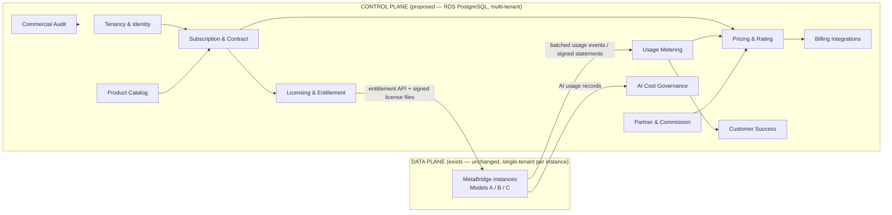
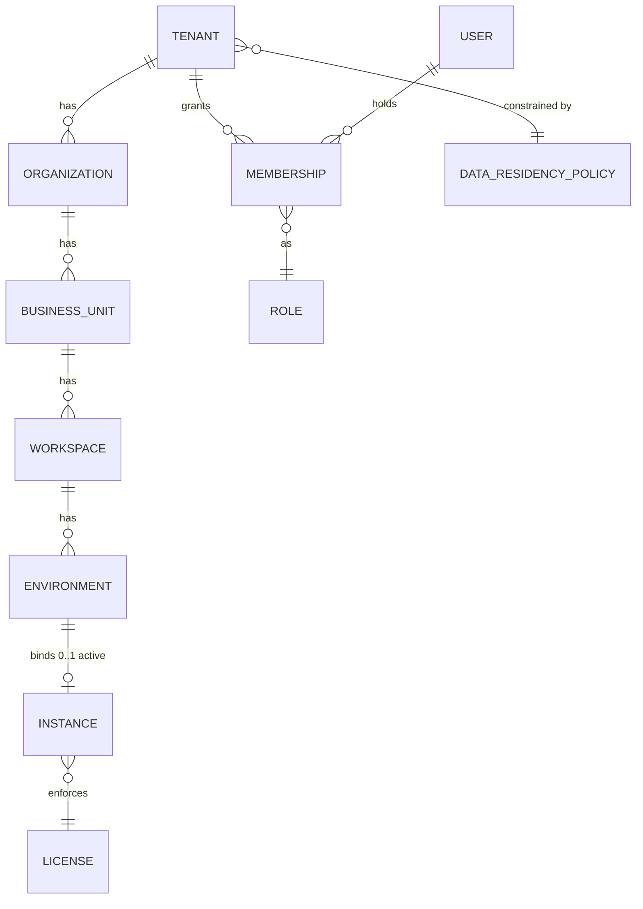
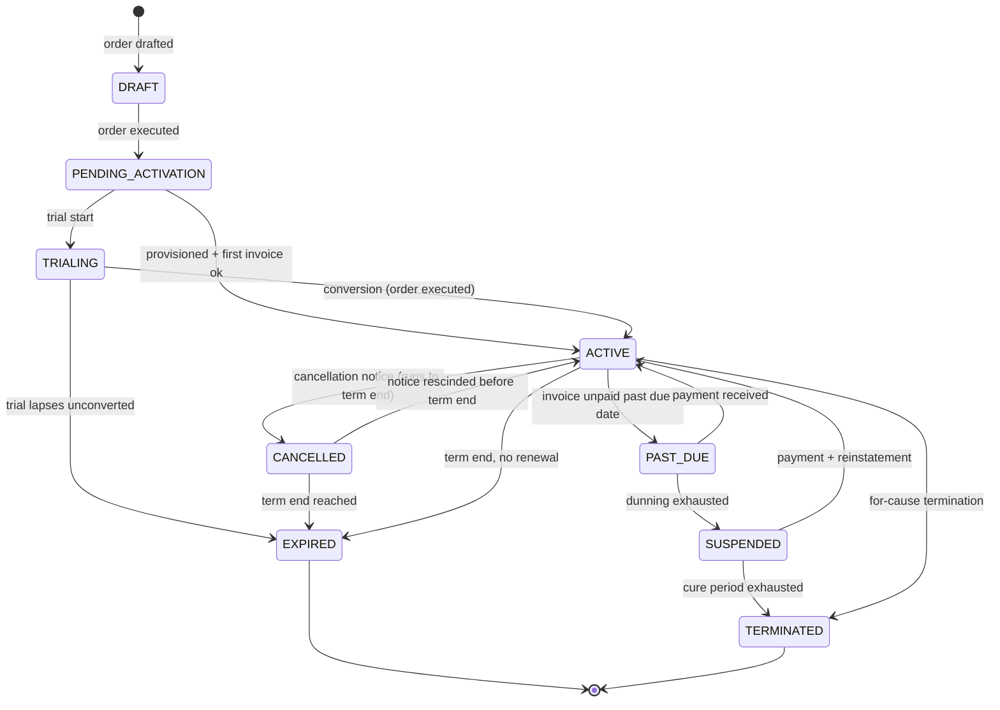
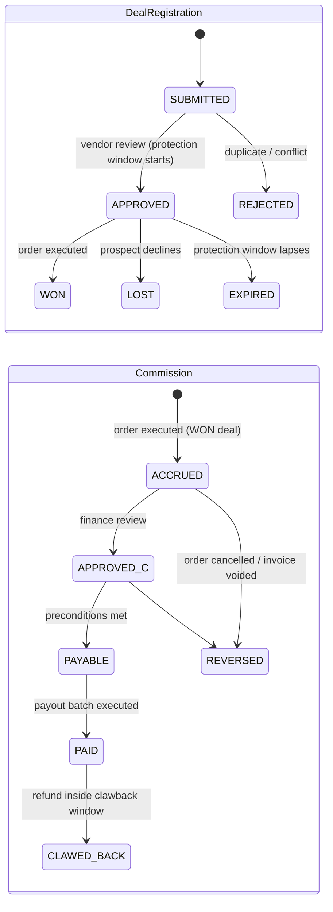

# Commercial Domain Model

**Phase 0 — Assessment (no code changes) · Document 03 · Target path: `docs/commercialization/03-domain-model.md`**

This document defines the commercial entity model for the MetaBridge **control plane** — the new, multi-tenant commercial service proposed in the Phase-0 program — organized by bounded context. It is a *design assessment*, not a description of shipped software.

**Read this with one distinction firmly in mind:**

- **WHAT EXISTS (verified against the codebase):** the data plane — the single-tenant MetaBridge product with file-backed state, instance-local accounts and RBAC (`web/auth.py`), deterministic assessment counts (`src/metabridge/assessment/engine.py`), Digital Twin node/edge counts (`src/metabridge/twin/model.py`), an HMAC hash-chained audit trail (`src/metabridge/agents/audit.py`), and Ed25519 package signing (`src/metabridge/marketplace/package.py`). There is **no** tenant, subscription, license, meter, invoice, partner, or commission entity anywhere in the codebase today (verified by keyword sweep — all hits are domain noise such as Kafka subscription concepts being parsed or marketplace license *fields*).
- **WHAT IS PROPOSED:** everything else in this document. Every bounded context below is a **new** control-plane schema on Amazon RDS PostgreSQL. Nothing here retrofits the data-plane monolith.

The deliberate single-tenancy of the product (see [../deployment-topologies.md](../deployment-topologies.md): "There is no shared multi-tenant control plane in any model") conflicts with a naive "make it multi-tenant SaaS" reading of the program mandate. That conflict is resolved by the **two-plane model**: multi-tenancy lives *only* in the control-plane schema defined here; data-plane instances remain single-tenant and are represented in the control plane as `Instance` rows bound to a Workspace/Environment. See [Gap Analysis](01-gap-analysis.md) and [Target Architecture](02-target-architecture.md) for the surrounding rationale.

---

## 1. Schema conventions (apply to every control-plane table)

| Convention | Rule |
|---|---|
| Primary keys | `id UUID` (v7 recommended for index locality), generated server-side. Never client-supplied. |
| Tenancy column | `tenant_id UUID NOT NULL` on **every** row. Derived from the authenticated principal (session, service token, or instance enrollment credential) — **never** accepted from a request body, query string, or header. Enforced three times: at the API layer (route → tenant resolution), the service layer (tenant-scoped context object), and the repository layer (mandatory tenant predicate; PostgreSQL RLS as backstop). |
| Vendor-global rows | The global product catalog, regions, and tier ladders are vendor-owned. To keep the "every row has `tenant_id`" invariant uniform, these rows carry the reserved **platform tenant** id (a single well-known tenant owned by Metafordata). Customer-specific catalog rows (negotiated price books, overrides) carry the customer's `tenant_id`. This is an honest deviation from a literal reading of the mandate, stated here rather than papered over: a product catalog is not customer data, and pretending otherwise produces worse queries, not better isolation. |
| Audit columns | `created_by UUID`, `created_at timestamptz`, `updated_at timestamptz` on every table. `created_by` references a control-plane User or a service principal. |
| Immutability | `UsageEvent`, `AdjustmentEvent`, `AuditEvent`, `SubscriptionStateTransition`, and `AIUsageRecord` are append-only: no `UPDATE`/`DELETE` grants; corrections are compensating rows. |
| Money | `numeric(19,4)` + ISO-4217 `currency` column. No floats. |
| State machines | Every stateful entity stores `state` + an append-only `*StateTransition` history table (who, when, from, to, reason). Transitions are validated in one place per aggregate. |
| Transactions | Billing-critical writes (order → subscription → entitlement issuance; rating → invoice) are single RDS transactions; cross-context effects propagate via the **outbox pattern** to SQS/EventBridge (see [Target Architecture](02-target-architecture.md)). |

Entity tables below list only domain-significant fields; assume `id`, `tenant_id`, `created_by`, `created_at`, `updated_at` everywhere.

---

## 2. Bounded-context map



Ownership rule: each context owns its tables; other contexts reference by UUID and consume domain events. No cross-context foreign-key writes.

---

## 3. Tenancy & Identity context — *all PROPOSED*

### 3.1 What exists today (verified) and how it maps

`web/auth.py` (verified) defines the **data-plane** account model: file-backed users (`users.json`) with fields `email`, `name`, `company`, `role`, `salt`, `hash`, `created`; roles `owner / admin / engineer / viewer` (`ROLES` tuple, line 33) with a permission map including the distinct `agents:approve` segregation-of-duties permission; sessions in `sessions.json` (256-bit tokens, 12 h TTL, `mb_session` cookie). There is no email verification, no MFA, no SSO, and no concept of anything above a single workspace — by design.

**Mapping decision (proposed):** data-plane accounts stay exactly where they are — inside each instance, governing people *within* that customer's workspace. The control plane gets its **own** identity model for the commercial console (Metafordata staff, partner users, customer billing admins). The two are **not synchronized** in Phase 1; the join point is the `Instance` entity, not user identity. This avoids rebuilding working functionality and keeps air-gapped instances (Model C) fully functional with zero control-plane dependency.

### 3.2 Hierarchy

`Tenant → Organization → BusinessUnit → Workspace → Environment → (binds to) Instance`

### 3.3 Entities

| Entity | Purpose | Key fields (besides standard columns) | Relationships |
|---|---|---|---|
| **Tenant** | Root commercial party; the unit of isolation, contracting, and billing. | `slug` (unique), `legal_name`, `status` (PROSPECT/ACTIVE/SUSPENDED/OFFBOARDED), `home_region_id`, `residency_policy_id`, `partner_id` (nullable — sourcing partner) | 1‑N Organization, Membership, Subscription, Instance. `tenant_id` on a Tenant row = its own `id`. |
| **Organization** | Legal entity / subsidiary under a tenant (enterprises contract per legal entity). | `name`, `country_code`, `tax_id`, `billing_address` | N‑1 Tenant; 1‑N BusinessUnit, Contract. |
| **BusinessUnit** | Cost-center / chargeback grouping inside an organization. | `name`, `cost_center_code` | N‑1 Organization; 1‑N Workspace. |
| **Workspace** | The commercial shadow of one customer workspace — the unit a data-plane instance serves. | `name`, `purpose` (PRODUCTION/PROJECT/SANDBOX) | N‑1 BusinessUnit; 1‑N Environment. |
| **Environment** | Deployment slot of a workspace (prod, staging, DR, enclave). | `name`, `kind` (PROD/NONPROD/DR/ENCLAVE), `region_id` | N‑1 Workspace; **0‑or‑1 active Instance binding**. |
| **Instance** | Registration of one deployed data-plane instance (the bridge entity). | `delivery_model` (A/B/C per [../deployment-topologies.md](../deployment-topologies.md)), `connectivity` (CONNECTED/INTERMITTENT/AIR_GAPPED), `product_version`, `enrollment_credential_hash`, `instance_public_key`, `last_heartbeat_at`, `license_id` (current) | N‑1 Environment (exactly one); N‑1 License. |
| **User** | Control-plane identity (staff, partner, customer billing contact). | `email` (unique), `display_name`, `status`, `auth_provider` (PASSWORD/OIDC — OIDC proposed, nothing exists), `mfa_enrolled` | 1‑N Membership. |
| **Membership** | Grants a User a Role within a Tenant. | `user_id`, `role_id`, `state` (INVITED/ACTIVE/REVOKED); unique `(tenant_id, user_id)` | N‑1 User, Tenant, Role. |
| **Role** | Named permission bundle, control-plane scope. | `code` (e.g. `cp_owner`, `cp_billing_admin`, `cp_partner_manager`, `cp_viewer`), `is_system` | N‑N Permission via RolePermission. |
| **Permission** | Atomic action string, same style as the data plane's `jobs:run` / `agents:approve` scheme (verified pattern in `web/auth.py` — reused as a *convention*, not shared code). | `code` (e.g. `subscriptions:manage`, `licenses:issue`, `usage:read`, `commissions:approve`) | N‑N Role. |
| **Team** | Grouping of memberships for assignment/notification (CS pods, partner teams). | `name`, `kind` | N‑N Membership via TeamMember. |
| **Region** | Vendor cell region (the regional-cell model in [../global-operations.md](../global-operations.md)). Vendor-global rows (platform tenant). | `code` (e.g. `eu-central-1`), `cloud`, `status` | Referenced by Tenant, Environment, DataResidencyPolicy. |
| **DataResidencyPolicy** | Declarative residency constraint for a tenant's control-plane data and Model-A placements. | `allowed_region_ids[]`, `usage_data_residency` (IN_REGION/GLOBAL_OK), `notes` | N‑1 Tenant; referenced by Tenant, enforced at Environment/Instance creation. |

### 3.4 The instance-binding rule (normative)

> **One data-plane instance binds to exactly one control-plane (Workspace, Environment) pair.** The binding is created at enrollment (Models A/B) or at license issuance (Model C). An Environment has at most one *active* Instance; replacement (upgrade, region move) closes the old binding and opens a new one, preserving history. The instance's `tenant_id` is derived from its enrollment credential or the tenant claim inside its signed license file — never from anything the instance sends in a request body.



---

## 4. Product Catalog context — *all PROPOSED*

Vendor-global rows (platform tenant) unless noted.

| Entity | Purpose | Key fields | Relationships |
|---|---|---|---|
| **Product** | Sellable product line (e.g. MetaBridge Platform; future add-on products). | `code`, `name`, `status` (DRAFT/ACTIVE/SUNSET) | 1‑N Plan, Feature, MeterDefinition. |
| **Feature** | Marketable capability toggled or limited per plan (maps to engine/service areas already exposed as per-area API routes — verified route structure in `web/app.py`). | `code` (e.g. `assessment`, `digital_twin`, `agents`, `ai_assist`), `description` | N‑1 Product; referenced by EntitlementDefinition. |
| **MeterDefinition** | Declares a billable/observable meter. | `code` (see §7.1), `unit`, `aggregation` (SUM/MAX/DISTINCT_COUNT), `dedup_scope` | N‑1 Product; referenced by PriceBookEntry, UsageEvent. |
| **Plan** | Commercial package identity (e.g. `team`, `enterprise`, `airgap-enterprise`). | `code`, `name`, `product_id`, `status` | 1‑N PlanVersion. |
| **PlanVersion** | Immutable published snapshot of a plan's shape. | `version` (int), `state` (DRAFT/PUBLISHED/RETIRED), `published_at`, `entitlement_set` (via EntitlementDefinition rows), `default_term_months` | N‑1 Plan; pinned by Subscription. |
| **EntitlementDefinition** | One entitlement inside a PlanVersion (value kinds in §6.2). | `feature_code` or `meter_code`, `value_kind`, `value` (jsonb: bool / limit / quota+period / enum tier) | N‑1 PlanVersion. |
| **AddOn** | Separately purchasable increment (extra quota pack, extra environment, premium support). | `code`, `entitlement_delta` (jsonb), `status` | N‑1 Product; referenced by SubscriptionItem. |
| **PriceBook** | Named set of prices. Global default (platform tenant) or negotiated per customer/partner (customer/partner `tenant_id`). | `code`, `currency`, `scope` (GLOBAL/TENANT/PARTNER), `status` | 1‑N PriceBookEntry. |
| **PriceBookEntry** | Effective-dated price for (plan version | add-on | meter tier). | `plan_version_id`/`addon_id`/`meter_code`, `pricing_model` (FLAT/PER_UNIT/TIERED/VOLUME), `tiers` (jsonb), `unit_price`, `floor_price`, `effective_from`, `effective_to` | N‑1 PriceBook. |
| **DiscountRule** | Reusable discount definition with stacking semantics. | `code`, `kind` (PERCENT/FIXED/FREE_UNITS), `value`, `applies_to` (PLAN/ADDON/METER/INVOICE), `stacking` (EXCLUSIVE/STACKABLE), `priority`, `max_pct`, `requires_approval_above_pct`, `valid_from/to` | Referenced by Order, Subscription, RatingRun. |

**Versioning rules (normative):**
1. A `PlanVersion` in `PUBLISHED` state is immutable — any change (entitlements, default term) creates a new version.
2. A Subscription **pins** `plan_version_id` at activation. Publishing a new version never mutates existing subscriptions (grandfathering by construction); migration is an explicit Amendment.
3. `PriceBookEntry` rows are effective-dated and non-overlapping per `(price_book_id, target, tier)`; price changes insert a new row with `effective_from`, never update in place. Rating resolves the entry effective at the usage period, not at rating time.

---

## 5. Subscription & Contract context — *all PROPOSED*

| Entity | Purpose | Key fields | Relationships |
|---|---|---|---|
| **Contract** | The legal agreement (MSA/order-form container), per Organization. | `organization_id`, `state` (DRAFT/EXECUTED/EXPIRED/TERMINATED), `executed_at`, `governing_law`, `payment_terms_days`, `document_refs` (jsonb) | 1‑N Order; N‑1 Organization. |
| **Order** | A signed commercial transaction (initial sale, expansion, renewal). | `contract_id`, `kind` (NEW/EXPANSION/RENEWAL/DOWNGRADE), `state` (DRAFT/SUBMITTED/APPROVED/EXECUTED/CANCELLED), `total_value`, `currency`, `deal_registration_id` (nullable) | 1‑N OrderLine; produces/updates Subscription. |
| **OrderLine** | One plan/add-on line on an order with negotiated pricing. | `plan_version_id`/`addon_id`, `quantity`, `negotiated_unit_price`, `discount_rule_ids[]`, `price_override_approval_id` (nullable) | N‑1 Order. |
| **Subscription** | The running commercial relationship for a tenant on a product. | `plan_version_id` (pinned), `state` (§5.1), `term_start`, `term_end`, `auto_renew`, `billing_period` (MONTHLY/QUARTERLY/ANNUAL), `price_book_id`, `current_order_id` | N‑1 Tenant; 1‑N SubscriptionItem, License, SubscriptionStateTransition. |
| **SubscriptionItem** | Quantity line under a subscription (seats-equivalent quantities, add-ons, committed meter quotas). | `addon_id`/`meter_code`, `quantity`, `committed_quantity` | N‑1 Subscription. |
| **Amendment** | Mid-term contractual change (upgrade, quota increase, term extension). | `subscription_id`, `order_id`, `effective_at`, `diff` (jsonb), `state` | N‑1 Subscription. |
| **RenewalOffer** | Generated renewal proposal ahead of `term_end`. | `subscription_id`, `proposed_plan_version_id`, `proposed_price`, `expires_at`, `state` (OPEN/ACCEPTED/DECLINED/LAPSED) | N‑1 Subscription. |
| **CancellationNotice** | Formal notice of non-renewal / cancellation with effective date. | `subscription_id`, `received_at`, `effective_at`, `reason_code`, `rescinded_at` (nullable) | N‑1 Subscription. |
| **SubscriptionStateTransition** | Append-only state history (audit + revenue recognition input). | `from_state`, `to_state`, `at`, `actor`, `reason` | N‑1 Subscription. |

### 5.1 The nine subscription states and legal transitions

States: **DRAFT, PENDING_ACTIVATION, TRIALING, ACTIVE, PAST_DUE, SUSPENDED, CANCELLED, EXPIRED, TERMINATED** (the last three are terminal-or-near-terminal; only `CANCELLED` can be rescinded).



Rules: transitions not drawn are illegal and rejected at the aggregate; every transition writes a `SubscriptionStateTransition` row and emits an outbox event; entitlement/licensing (§6) *derives* from these states — `PAST_DUE` keeps entitlements warm, `SUSPENDED` degrades to read-only-grade entitlements, `TERMINATED`/`EXPIRED` revokes (with the offline-grace nuance for air-gapped licenses in §6.4).

**Honest critique:** nine states is the ceiling of what a first release should carry. The dunning pair (`PAST_DUE`/`SUSPENDED`) only earns its complexity once self-serve card billing exists; for the launch motion (SI-led, invoice-based) those states will mostly be driven manually. We keep them in the model because retrofitting states into a live billing system is far costlier than carrying two rarely-used ones.

---

## 6. Licensing & Entitlement context — *all PROPOSED (signing mechanism EXISTS)*

The one genuinely reusable asset here is verified: `src/metabridge/marketplace/package.py` implements real Ed25519 signing over canonical JSON bytes, binding the *full manifest* (the module's own comments note that signing only the payload would allow relabelling), with a publisher trust store and fail-closed verification (unsigned → blocked). **Signed license files reuse this exact pattern**: canonical-bytes serialization, full-document binding, trust-store verification inside the instance.

| Entity | Purpose | Key fields | Relationships |
|---|---|---|---|
| **License** | Issued grant tying a Subscription's entitlements to one Instance (or a pool). | `subscription_id`, `instance_id` (nullable until activation), `state` (ISSUED/ACTIVE/REVOKED/EXPIRED), `not_before`, `not_after`, `offline_grace_days`, `entitlement_snapshot` (jsonb) | N‑1 Subscription; 1‑N LicenseFile, Activation. |
| **LicenseFile** | The signed artifact shipped to the instance (the air-gap path). | `license_id`, `serial`, `canonical_payload` (jsonb), `signature` (Ed25519, hex), `signer_key_id`, `issued_at`, `supersedes_serial` | N‑1 License. Signature binds the *entire* payload incl. tenant, instance binding, entitlements, validity window, grace — same full-manifest-binding rule as marketplace items. |
| **Entitlement** | Resolved, effective entitlement for (subscription × feature/meter) after plan + add-ons + overrides. | `feature_code`/`meter_code`, `value_kind`, `value` (jsonb), `source` (PLAN/ADDON/OVERRIDE) | N‑1 Subscription. Recomputed on any subscription change; snapshot embedded into LicenseFile. |
| **EntitlementOverride** | Contractual exception granted outside the plan. | `subscription_id`, `feature/meter`, `value`, `approved_by`, `expires_at` | N‑1 Subscription. |
| **Activation** | One instance claiming a license (connected: online handshake; air-gapped: recorded when the signed usage statement first arrives, or manually). | `license_id`, `instance_id`, `activated_at`, `deactivated_at`, `fingerprint` (instance public key), `state` | N‑1 License, Instance. |
| **QuotaReservation** | Reservation ledger for asynchronous consumption (§6.3). | `entitlement_id`, `meter_code`, `quantity_reserved`, `quantity_committed`, `state` (RESERVED/COMMITTED/RELEASED/EXPIRED), `job_ref`, `expires_at`, `idempotency_key` | N‑1 Entitlement, Instance. |
| **EntitlementDecisionLog** | Sampled/denied `checkAccess` outcomes for support and abuse analysis (append-only). | `instance_id`, `feature/meter`, `decision`, `reason_code`, `at` | N‑1 Instance. |

### 6.1 `checkAccess` interface (proposed contract)

```
checkAccess(principal: InstanceIdentity | UserIdentity,
            feature_or_meter: code,
            quantity: decimal = 1,
            mode: CHECK | RESERVE | COMMIT | RELEASE,
            reservation_id?: UUID,
            idempotency_key?: string)
  -> { decision: ALLOW | ALLOW_GRACE | DENY,
       reason_code, remaining?, reservation_id?, license_expiry, retry_after? }
```

Connected instances call the control-plane API and **cache decisions locally** with a TTL; on network failure they serve from cache, then degrade into the offline-grace rules below. Air-gapped instances evaluate the same logic **locally** against the signed `LicenseFile` — the interface is identical, only the resolver differs.

### 6.2 Entitlement value kinds

| Value kind | Meaning | Example |
|---|---|---|
| `BOOLEAN` | Feature on/off | `digital_twin = true` |
| `NUMERIC_LIMIT` | Standing ceiling (not period-reset) | `max_environments = 4` |
| `METERED_QUOTA` | Quantity per period, consumed via meter | `OBJECTS_ASSESSED = 50 000 / year` |
| `TIER` | Enum grade selecting behavior | `support_tier = PREMIER` |
| `DATE_WINDOW` | Validity window | `not_after = 2027-06-30` |

### 6.3 RESERVE / COMMIT / RELEASE for async AI jobs

AI-assisted work is long-running and of uncertain final size (the assist layer exists — `src/metabridge/llm/assist.py`, advisory-only, off by default — but has **no token metering today**, a verified gap). A check-then-consume pattern would either double-spend or block. The reservation protocol:

```mermaid
stateDiagram-v2
    [*] --> RESERVED : RESERVE(estimated qty) — quota held
    RESERVED --> COMMITTED : COMMIT(actual qty) — job succeeded; delta returned to quota
    RESERVED --> RELEASED : RELEASE — job failed or cancelled; full hold returned
    RESERVED --> EXPIRED : TTL lapse — auto-release (crash safety)
    COMMITTED --> [*]
    RELEASED --> [*]
    EXPIRED --> [*]
```



`RESERVE` is idempotent on `idempotency_key`; `COMMIT` with `actual > reserved` succeeds up to a configurable overage tolerance and emits an overage `UsageEvent`; expired reservations are swept by a scheduled job.

### 6.4 Reason codes

`OK`, `OK_GRACE` (inside offline grace or dunning-warm window), `NO_ACTIVE_SUBSCRIPTION`, `FEATURE_NOT_ENTITLED`, `LIMIT_EXCEEDED`, `QUOTA_EXHAUSTED`, `RESERVATION_NOT_FOUND`, `RESERVATION_EXPIRED`, `LICENSE_EXPIRED`, `GRACE_EXPIRED`, `LICENSE_REVOKED`, `LICENSE_SIGNATURE_INVALID`, `LICENSE_INSTANCE_MISMATCH`, `CLOCK_ROLLBACK_SUSPECTED` (local wall-clock earlier than last-seen monotonic anchor — degrade to `ALLOW_GRACE`, flag for review, never hard-fail a production conversion on a clock quirk).

Enforcement posture (deliberate): the data plane's deterministic engines keep working during grace; enforcement fails **soft then dark** — degrade features, never corrupt or hold customer data hostage. This matches the product's air-gap positioning and is a commercial decision as much as a technical one.

---

## 7. Usage Metering context — *all PROPOSED (meter sources EXIST)*

### 7.1 Meter codes and their verified sources

| Meter code | Unit | Verified existing source (data plane) | Status |
|---|---|---|---|
| `OBJECTS_ASSESSED` | object | `src/metabridge/assessment/engine.py` — `executive_summary.objects_total` = count of parsed mappings (`n_objects`), plus `object_inventory` rows; deterministic, parse-only, no LLM in the numbers (module's own guarantee) | **Already available** (count exists; emission missing) |
| `OBJECTS_CONVERTED` | object | Job artifacts under `jobs/<id>/` (job history is file-backed, verified) | **Partially available** (derivable from job records; no event emission) |
| `TWIN_NODES` / `TWIN_EDGES` | node/edge | `src/metabridge/twin/model.py` — serializes `nodes`/`edges` counts (`out["edges"] = len(self.edges)`, line 218) | **Already available** (count exists; emission missing) |
| `JOBS_RUN` | job | `jobs/<id>/` directory lifecycle | **Partially available** |
| `AI_TOKENS_IN` / `AI_TOKENS_OUT` | token | **None.** `src/metabridge/llm/assist.py` has no token metering, budgets, or cost tracking (verified) | **Missing** (requires additive data-plane instrumentation — see §10) |
| `ACTIVE_USERS` | user/period | `users.json` + session activity exist per instance | **Partially available** |
| `INSTANCE_MONTHS` | instance-month | Control-plane Instance heartbeats / license validity | **Missing** (control-plane native) |

`OBJECTS_ASSESSED` is the flagship meter because it is *exactly the unit in an SI's estimate spreadsheet* — the assessment engine already computes it deterministically with labelled assumptions (`ASSUMPTIONS` dict, engine lines 45–57). **Definition guardrail (proposed):** the billable aggregation is `DISTINCT_COUNT` of objects per project per billing period — re-running an assessment on the same project must not double-bill. `MeterDefinition.dedup_scope` carries this rule; the raw events still record every run for analytics.

### 7.2 Entities

| Entity | Purpose | Key fields | Relationships |
|---|---|---|---|
| **UsageEvent** | Immutable atomic usage fact. | `meter_code`, `quantity numeric`, `unit`, `occurred_at`, `received_at`, `instance_id`, `workspace_id`, `environment_id`, `source` (INSTANCE_BATCH/SIGNED_STATEMENT/CONTROL_PLANE), **`idempotency_key`** (unique per `(tenant_id, idempotency_key)`), `dimensions` (jsonb: project, source_format, job_id), `schema_version` | N‑1 Instance; referenced by AdjustmentEvent, RatedLine. Append-only. |
| **AdjustmentEvent** | The only correction mechanism: a compensating event referencing the original. | `original_event_id`, `quantity_delta` (signed), `reason_code`, `approved_by`, `evidence_ref` | N‑1 UsageEvent. Original rows are never updated or deleted; aggregates recompute over `events + adjustments`. |
| **UsageAggregate** | Materialized rollups. | `meter_code`, `level` (HOURLY/DAILY/BILLING_PERIOD), `scope` (INSTANCE/ENVIRONMENT/WORKSPACE/TENANT), `period_start/end`, `quantity`, `distinct_basis` (jsonb where dedup applies), `computed_at`, `is_final` | Derived; recomputable from source events at any time. |
| **UsageStatement** | Signed export/import artifact for air-gapped instances: the instance signs a canonical usage document with its key (reusing the marketplace canonical-bytes + Ed25519 pattern); the control plane verifies and ingests it as `SIGNED_STATEMENT`-source events, idempotent on statement serial. | `instance_id`, `period_start/end`, `serial`, `canonical_payload`, `signature`, `verified_at`, `state` (RECEIVED/VERIFIED/INGESTED/REJECTED) | N‑1 Instance; 1‑N UsageEvent (ingested). |
| **IngestBatch** | Bookkeeping for connected instances' batched reports. | `instance_id`, `event_count`, `first/last idempotency keys`, `state` | N‑1 Instance. |

**Aggregation levels (normative):** raw event → hourly → daily → billing period; each level rolls up across the scope ladder instance → environment → workspace → tenant. Billing-period aggregates are frozen (`is_final`) at invoice generation; post-freeze adjustments produce a `CreditNote` or next-period true-up, never a mutation of a finalized aggregate.

---

## 8. Pricing & Rating context — *all PROPOSED*

### 8.1 Calculation waterfall (normative, per rated line)

```
1. LIST        — PriceBookEntry effective for the usage period (global book)
2. TIER/VOLUME — apply the entry's pricing_model tiers to aggregated quantity
3. CONTRACT    — negotiated PriceBook / OrderLine negotiated_unit_price override
4. DISCOUNTS   — DiscountRules in priority order; EXCLUSIVE rules terminate stacking;
                 cumulative discount capped by max_pct
5. CREDITS     — promotional / service credits drawn down
6. PARTNER     — partner margin/markup per PartnerAgreement (resell motion only)
7. FLOOR CHECK — if effective unit price < PriceBookEntry.floor_price:
                 require PriceOverrideApproval, else the rating run FAILS CLOSED
8. FINAL       — rounding policy, currency; tax delegated to the billing provider
```

Every step writes its input, rule id, and delta to the rated line — the waterfall is *replayable* (same inputs → same invoice), consistent with the platform's determinism culture (the assessment engine's "no AI in the numbers" stance, verified).

| Entity | Purpose | Key fields | Relationships |
|---|---|---|---|
| **RatingRun** | One deterministic pricing execution per subscription per period. | `subscription_id`, `period_start/end`, `price_book_id`, `state` (RUNNING/COMPLETE/FAILED/SUPERSEDED), `inputs_digest` | 1‑N RatedLine; feeds Invoice. |
| **RatedLine** | Priced outcome per plan/add-on/meter. | `meter_code`/`item_ref`, `quantity`, `list_amount`, `waterfall` (jsonb of steps 1–8 with rule ids), `final_amount`, `currency` | N‑1 RatingRun. |
| **DiscountApplication** | Record of one DiscountRule applied. | `discount_rule_id`, `rated_line_id`, `amount`, `stacking_position` | N‑1 RatedLine. |
| **PriceOverrideApproval** | Human approval for below-floor or above-threshold discounts. | `requested_by`, `approved_by` (must differ — same segregation-of-duties principle as the data plane's `agents:approve`, verified in `web/auth.py`), `floor_price`, `proposed_price`, `justification`, `state` | Referenced by OrderLine, RatedLine. |

### 8.2 Billing-integration entities (adapters)

The control plane owns invoices; providers are adapters behind one port. **Verified: no payment/billing code of any kind exists today.**

| Entity | Purpose | Key fields | Relationships |
|---|---|---|---|
| **BillingAccount** | Tenant's billing profile. | `organization_id`, `provider` (STRIPE/RAZORPAY/AWS_MARKETPLACE/MANUAL), `external_customer_ref`, `payment_terms_days`, `tax_ids` | N‑1 Organization. |
| **Invoice** | Issued bill from a RatingRun. | `rating_run_id`, `number`, `state` (DRAFT/ISSUED/PAID/PARTIALLY_PAID/OVERDUE/VOID), `due_at`, `total`, `currency`, `external_ref` | 1‑N InvoiceLine, Payment. |
| **InvoiceLine** | Line mirroring a RatedLine. | `rated_line_id`, `description`, `amount` | N‑1 Invoice. |
| **Payment** | Money received (webhook from provider, or manual entry). | `invoice_id`, `provider_ref`, `amount`, `received_at`, `method`, `idempotency_key` | N‑1 Invoice. |
| **CreditNote** | Post-finalization correction instrument. | `invoice_id`, `amount`, `reason`, `adjustment_event_ids[]` | N‑1 Invoice. |
| **DunningAttempt** | Collection step record driving PAST_DUE→SUSPENDED. | `invoice_id`, `step`, `channel`, `at`, `outcome` | N‑1 Invoice. |
| **MarketplaceAgreement** | AWS Marketplace private-offer/agreement linkage. | `aws_agreement_id`, `aws_customer_identifier`, `product_code`, `dimension_map` (jsonb: meter_code → marketplace dimension) | N‑1 BillingAccount; constrains which meters bill through Marketplace. |
| **MeteringDispatch** | Idempotent record of usage pushed to AWS Marketplace (`BatchMeterUsage`) or provider metering APIs. | `agreement_id`, `meter_code`, `quantity`, `period`, `dispatch_key` (unique), `state` (PENDING/SENT/ACKED/FAILED), `provider_response` | N‑1 MarketplaceAgreement. |

---

## 9. Partner & Commission context — *all PROPOSED*

The launch motion is SI-led (see the [MetaBridge product positioning](../deployment-topologies.md#white-label-delivery) — white-label delivery is already a documented capability of all three models), so this context is strategically central even though **zero partner/commission code exists today** (verified — "commission" hits in the codebase are FinOps modeling of the *customer's* warehouse bills, not vendor commissions).

| Entity | Purpose | Key fields | Relationships |
|---|---|---|---|
| **Partner** | SI/OEM/reseller firm. Partners are also Tenants (they may run demo instances); `partner_id` links. | `name`, `kind` (SI/OEM/RESELLER/REFERRAL), `status`, `tier_id` (current), `country_code` | 1‑N PartnerAgreement, DealRegistration, Commission. |
| **PartnerTier** | Rung on the ladder with benefits/requirements. Vendor-global. | `code`, `rank`, `requirements` (jsonb: certified engineers, closed ARR), `benefits` (jsonb: margin %, deal-protection days, MDF) | Referenced by Partner via PartnerTierAssignment. |
| **PartnerTierAssignment** | Effective-dated tier holding. | `partner_id`, `tier_id`, `effective_from/to`, `review_ref` | N‑1 Partner, PartnerTier. |
| **PartnerAgreement** | Signed partner contract governing margin/commission terms. | `partner_id`, `state` (DRAFT/ACTIVE/SUSPENDED/TERMINATED), `commission_plan_id`, `banking_verified`, `tax_docs_verified` | N‑1 Partner. |
| **DealRegistration** | Partner's claim on an opportunity (deal protection). | `partner_id`, `prospect_name`, `estimated_value`, `state` (§9.2), `protection_expires_at`, `order_id` (on WON) | N‑1 Partner; referenced by Order. |
| **CommissionPlan** | Rules computing commission from won orders/paid invoices. | `code`, `basis` (FIRST_YEAR/ALL_INVOICED), `rate_table` (jsonb by tier/kind), `clawback_window_days` | Referenced by PartnerAgreement. |
| **Commission** | One accrued commission obligation. | `partner_id`, `order_id`, `invoice_id`, `amount`, `state` (§9.3), `clawback_of_id` (nullable) | N‑1 Partner; grouped into PayoutBatch. |
| **PayoutBatch** | Executed payout of payable commissions. | `partner_id`, `total`, `executed_at`, `provider_ref`, `state` | 1‑N Commission. |

### 9.1 Tier ladder (proposed)

`REGISTERED → SELECT → PREMIER → STRATEGIC` — ascending requirements (certified delivery engineers, closed ARR, reference customers) and benefits (margin points, longer deal protection, roadmap access). Assessed periodically via `PartnerTierAssignment`; never auto-demoted mid-agreement.

### 9.2 / 9.3 Deal and commission state machines



**Payability preconditions (all must hold before APPROVED_C → PAYABLE):** (1) the underlying `Invoice` is `PAID` in full; (2) the `clawback_window_days` on the CommissionPlan has elapsed since payment; (3) the `PartnerAgreement` is `ACTIVE` with banking and tax docs verified; (4) the `DealRegistration` was `APPROVED` at order execution; (5) no open dispute or credit note against the invoice. Commissions are never netted silently — reversals and clawbacks are explicit compensating `Commission` rows (`clawback_of_id`), mirroring the metering adjustment discipline.

---

## 10. AI Cost Governance context — *all PROPOSED (provider abstraction EXISTS, metering MISSING)*

Verified today: `src/metabridge/llm/assist.py` provides the provider abstraction (Anthropic API / AWS Bedrock, default Bedrock model `global.anthropic.claude-sonnet-4-5-20250929-v1:0`), advisory-only, off by default, keys server-side in `settings.json` mode `0600`. There is **no token metering, no budgets, no per-tenant cost tracking** — a production blocker for any AI-priced SKU.

| Entity | Purpose | Key fields | Relationships |
|---|---|---|---|
| **AIUsageRecord** | Immutable record of one model invocation, reported by instances alongside usage events. | `instance_id`, `provider` (ANTHROPIC/BEDROCK), `model_id`, `input_tokens`, `output_tokens`, `purpose` (explain/assist area), `job_ref`, `occurred_at`, `est_cost` (rate-card estimate — **labelled estimate**, provider bills remain the source of truth), `idempotency_key` | N‑1 Instance; rolls into UsageAggregate via `AI_TOKENS_*` meters. |
| **AIBudget** | Per-tenant/workspace period budget in tokens or currency-estimate. | `scope` (TENANT/WORKSPACE), `period`, `limit_tokens`/`limit_est_cost`, `action_on_breach` (WARN/THROTTLE/BLOCK_AI_ONLY) | N‑1 Tenant/Workspace; enforced via `checkAccess` + RESERVE/COMMIT (§6.3). |
| **AIRateCard** | Vendor-maintained token → cost estimation table, versioned. Platform-tenant rows. | `provider`, `model_id`, `input_rate`, `output_rate`, `effective_from` | Referenced by AIUsageRecord estimation. |

**Boundary note (honest):** emitting `AIUsageRecord` requires an *additive* instrumentation hook in the data plane's `llm/assist.py` call path — counting tokens on responses it already receives. This is the narrowest data-plane change in the whole commercial program and does not violate the "do not rebuild working functionality" rule; it is classified **Missing / must be added (small, additive)** in the [Gap Analysis](01-gap-analysis.md). Breach of an AI budget must never block deterministic engines — `BLOCK_AI_ONLY` is the hardest permissible action, consistent with AI being advisory-only in the product.

---

## 11. Commercial Audit context — *PROPOSED, pattern EXISTS and is reused deliberately*

Verified: `src/metabridge/agents/audit.py` implements an append-only, tamper-evident chain — `entry_hash = HMAC-SHA256(server_key, prev_hash + canonical(event))`, genesis `"0"*64`, `verify()` re-checks the chain **and sequence contiguity** so a deleted middle event is caught, and the module honestly scopes its guarantee ("not a substitute for an external, independently-anchored ledger against an attacker who also holds the key"). This is a commercially reusable pattern; the control plane adopts it **per-tenant** so any tenant's commercial audit trail can be exported and independently verified.

| Existing `AuditEvent` field (verified) | Control-plane `CommercialAuditEvent` field (proposed) | Notes |
|---|---|---|
| `seq` | `seq` (per-tenant chain) | Contiguity check per tenant chain |
| `timestamp` | `at timestamptz` | |
| `agent_id` | `actor_type` (USER/SERVICE/INSTANCE/SYSTEM) + `actor_id` | Humans, service principals, enrolled instances |
| `task_type` / `action_class` | `action` (e.g. `subscription.state_changed`, `license.issued`, `price.override_approved`, `commission.paid`) | Namespaced verb catalog |
| `decision` / `status` | `outcome` (ALLOWED/DENIED/EXECUTED/FAILED) | |
| `confidence*` | *(dropped)* | Agent-specific; not meaningful commercially |
| `evidence_digest` | `payload_digest` + `resource_type`, `resource_id` | SHA-256 of the canonical payload |
| `summary` / `detail` | `summary` / `detail jsonb` | Redaction rules for PII in detail |
| `prev_hash` / `entry_hash` | same, HMAC-SHA256, key in AWS Secrets Manager with rotation via chain checkpoints | Rotation = signed checkpoint event binding old-key head to new-key genesis |
| *(new)* | `tenant_id`, `request_id`, `correlation_id`, `source_ip` | Multi-tenant + traceability additions |

Every state transition in §§5–10 (subscription states, license issuance/revocation, price override approvals, commission approval/payout, budget breaches, `checkAccess` denials above a sampling threshold) writes a `CommercialAuditEvent` in the same RDS transaction as the domain write.

---

## 12. Customer Success context — *all PROPOSED*

Signals derive from what instances already report (heartbeats, usage batches, signed statements) — nothing here requires new data-plane behavior.

| Entity | Purpose | Key fields | Relationships |
|---|---|---|---|
| **HealthScoreSnapshot** | Periodic composite health per tenant/workspace. **Labelled assessment, not a measurement** — the scoring formula is versioned and stored with the score. | `scope`, `score`, `formula_version`, `inputs` (jsonb: usage trend, feature breadth, license posture, support signals), `computed_at` | N‑1 Tenant/Workspace. |
| **AdoptionSignal** | Discrete adoption fact (first assessment run, first conversion, twin usage, AI enabled). | `signal_code`, `instance_id`, `occurred_at`, `evidence_ref` (usage event id) | N‑1 Tenant. |
| **LifecycleStageTransition** | Journey stage history: PROSPECT → ONBOARDING → ADOPTING → EXPANDING → RENEWING → AT_RISK → CHURNED. | `from_stage`, `to_stage`, `at`, `trigger` (RULE/MANUAL) | N‑1 Tenant. |
| **RiskFlag** | Open risk item (usage decline, unpaid invoice, license nearing expiry with no renewal, air-gapped statement overdue). | `code`, `severity`, `opened_at`, `resolved_at`, `owner_membership_id` | N‑1 Tenant. |
| **PlaybookRun** | Execution of a CS playbook against a flag/stage. | `playbook_code`, `state`, `steps` (jsonb), `outcome` | N‑1 Tenant; N‑1 RiskFlag (nullable). |
| **Touchpoint** | Logged interaction (QBR, escalation, training). | `kind`, `at`, `participants`, `notes_ref` | N‑1 Tenant. |

---

## 13. Gap classification summary

Classification of the domain model against the codebase as verified today:

| Area | What exists (verified) | What is proposed | Classification |
|---|---|---|---|
| Tenancy hierarchy, Membership/Role/Permission (control plane) | Nothing above single-workspace `web/auth.py` accounts | Full §3 schema | **Missing** |
| Instance registration / binding | Delivery Models A/B/C documented ([../deployment-topologies.md](../deployment-topologies.md)); no enrollment code | `Instance`, enrollment, heartbeats | **Missing** |
| Product catalog, plans, price books | Nothing | Full §4 schema | **Missing** |
| Subscription & contract lifecycle | Nothing | §5 schema + 9-state machine | **Missing** (production blocker for any paid launch) |
| License signing mechanism | Ed25519 canonical-bytes signing with full-manifest binding and trust store (`src/metabridge/marketplace/package.py`) | Reuse pattern for LicenseFile / UsageStatement | **Already available (pattern); Partially available (needs license-shaped payloads + instance-side verifier wiring)** |
| Entitlement resolution, `checkAccess`, reservations | Nothing | §6 schema + API | **Missing** (production blocker) |
| Meter *values* | Deterministic counts exist: assessment objects (`assessment/engine.py`), twin nodes/edges (`twin/model.py`), jobs (`jobs/<id>/`) | — | **Already available** |
| Meter *emission* (events, idempotency, batching, signed statements) | Nothing — no webhooks, no outbound reporting (verified sweep) | §7 pipeline | **Missing** (production blocker for usage pricing) |
| Pricing waterfall, rating, invoicing, provider adapters | Zero payment/billing code (verified sweep) | §8 schema | **Missing** (production blocker) |
| Partner / deal / commission | Zero (verified; all keyword hits are domain noise) | §9 schema | **Missing** — commission payout automation itself is a **post-launch enhancement** (manual finance ops suffices at first; the *data model* should land early so history is never backfilled) |
| AI token metering / budgets | Provider abstraction exists (`llm/assist.py`); no metering | §10 schema + additive instrumentation hook | **Missing**; the assist-layer hook is the sole (small, additive) data-plane change — flagged so it is scoped deliberately, not smuggled in |
| Commercial audit chain | HMAC hash-chain with contiguity verification exists (`agents/audit.py`) | Per-tenant adaptation §11 | **Already available (pattern) / Partially available (needs tenant scoping + key management on RDS)** |
| Customer success | Nothing | §12 schema | **Missing** — largely **post-launch enhancement** beyond RiskFlag/LifecycleStage |
| Multi-tenant SaaS assumption vs product reality | Product is deliberately single-tenant in all three models (verified in code and docs) | Tenancy applies to the control plane only; product untouched | **Conflict stated and resolved** via the two-plane model |

---

## 14. Related documents

- [Gap Analysis](01-gap-analysis.md) — full classification and sequencing of everything marked Missing above
- [Target Architecture](02-target-architecture.md) — control-plane service shape, RDS/SQS/EventBridge, outbox, enforcement bridge
- [../architecture.md](../architecture.md) — the data-plane modular monolith this model deliberately does not touch
- [../deployment-topologies.md](../deployment-topologies.md) — Models A/B/C that the `Instance` entity represents
- [../global-operations.md](../global-operations.md) — regional cells behind the `Region` entity
- [../aws-deployment.md](../aws-deployment.md) — per-cell AWS reference build (Model A placement target)
