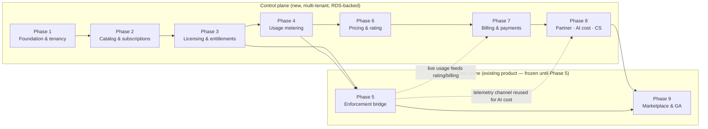

# Implementation Roadmap & Backlog

> **Phase 0 deliverable — assessment and plan only. No code changes are made or implied by this document.**
> This is the execution plan for the MetaBridge commercialization program: nine phases, a prioritized backlog of 60 work items, phase-gate criteria, and the program's exit definition. It adapts the master command's nine-phase sequence to the **two-plane architecture** described in [Target Architecture](02-target-architecture.md) and grounded in the gaps catalogued in [Gap Analysis](01-gap-analysis.md). All sizes in this document are **complexity assessments, not calendar commitments** (see [Estimate honesty](#9-estimate-honesty)).

---

## 1. Planning baseline — what exists (verified)

The roadmap is anchored to the codebase as it is today, not as we wish it were. Everything in this table was re-verified against source during Phase 0:

| Fact | Evidence | Roadmap consequence |
|---|---|---|
| Modular monolith: FastAPI app (`web/app.py`, ~3,850 lines, ~176 routes) + Typer CLI, 16 engines / 9 services / 7 canonical models over a kernel/registry | [../architecture.md](../architecture.md), `src/metabridge/platform/kernel.py`, `registry.py` | The **data plane** already works. The program builds *around* it, not into it |
| **No database.** All state is file-backed under `METABRIDGE_DATA_DIR` with `fcntl.flock` + atomic `os.replace` writes | `src/metabridge/platform/_util.py`, [../architecture.md](../architecture.md) §2.3 | Commercial state (billing-critical, transactional) cannot live here → control plane gets **RDS PostgreSQL** |
| **Single-tenant by design** — no `tenant_id`, no Organization model anywhere; one instance = one customer; air-gap capable | [../deployment-topologies.md](../deployment-topologies.md) Models A/B/C, [../global-operations.md](../global-operations.md) cell model | Multi-tenancy requirements apply to the **new control plane only**; the product is never retrofitted |
| Auth: PBKDF2-SHA256 (390k iters), server-side sessions, RBAC via global `access_guard` middleware; `agents:approve` segregation of duties; optional `METABRIDGE_API_KEY` | `web/auth.py`, `web/app.py` `_required_permission` | Instance-side auth is adequate for the bridge; the control plane needs its own commercial-grade identity |
| **No** SSO/SAML/OIDC/SCIM/MFA, **no** rate limiting, **no** outbound webhooks, **no** payment/billing/seat/reseller code of any kind (keyword sweep confirmed all hits are domain noise) | Repo-wide evidence sweep, Phase 0 | Everything commercial is greenfield in the control plane — classified **Missing** in [Gap Analysis](01-gap-analysis.md) |
| Tamper-evident HMAC hash-chain audit, re-verified on read | `src/metabridge/agents/audit.py` | **Already available** as a pattern → port to control-plane commercial audit |
| Ed25519-signed marketplace packages; signature binds the full manifest; install lifecycle with locks | `src/metabridge/marketplace/package.py`, `catalog.py`, `install.py` | **Already available** as a pattern → reuse for **signed license files** and signed usage statements |
| Feature flags with strict fail-closed bool coercion and SHA-256 deterministic rollout bucketing | `src/metabridge/platform/flags.py` | **Already available** → gates enforcement-bridge rollout inside the product |
| Deterministic commercial meters already computed: assessment object counts, Digital Twin node/edge counts, job history, per-area API routes | `src/metabridge/assessment/engine.py`, `src/metabridge/twin/`, `jobs/` | **Partially available** — the numbers exist; the metering *pipeline* (ingest, idempotency, aggregation) does not |
| LLM assist: provider abstraction (Anthropic API / Bedrock, default `global.anthropic.claude-sonnet-4-5-20250929-v1:0`), advisory-only, off by default; **no token metering, no budgets** | `src/metabridge/llm/assist.py` | AI cost governance needs a small, late data-plane addition (token counters) plus control-plane rollups |
| CI: single GitLab stage running `pytest -q` (~1,745 tests) on `python:3.11-slim` | `.gitlab-ci.yml` | CI must grow build/deploy stages for the control plane; the product suite becomes the **data-plane regression gate** |
| **No IaC.** The Terraform in [../aws-deployment.md](../aws-deployment.md) is explicitly illustrative, not a module | [../aws-deployment.md](../aws-deployment.md) | Control-plane IaC is greenfield work in Phase 1, and it is on the critical path |

---

## 2. Documented adjustment to the master phase plan

**The conflict, stated plainly:** the master command's phase sequence carries a "multi-tenant SaaS" assumption — that tenancy, entitlements, and billing hooks would be threaded into the product itself. The verified reality is that MetaBridge is **deliberately single-tenant**: its in-boundary/air-gapped posture ([../deployment-topologies.md](../deployment-topologies.md) Models A/B/C) is the product's moat, and there is no tenant concept in ~3,850 lines of `web/app.py` or anywhere else. Retrofitting `tenant_id` into a file-backed monolith would destroy the moat and violate the program rule *do not rebuild working functionality*.

**The resolution** is the two-plane model from [Target Architecture](02-target-architecture.md), and it forces two documented adjustments to the phase plan:

| # | Adjustment | Rationale |
|---|---|---|
| A1 | **Phase 1 stands up the control-plane service + RDS PostgreSQL + row-level tenancy before anything else.** The original plan's early phases assumed an existing persistence and identity substrate to extend; here the commercial substrate does not exist and must be built first | Every later phase (catalog, entitlements, metering, billing) writes billing-critical state that needs transactions and tenant isolation from day one — retro-fitting tenancy into a live commercial schema is the classic failure mode this ordering avoids |
| A2 | **The product data plane is untouched until Phase 5 (Enforcement Bridge).** Phases 1–4 are 100% new code in a new deployable; the first product-repo change lands only when its server-side dependencies (entitlement API, usage ingest) already exist and are tested | Keeps the ~1,745-test product frozen and shippable throughout; contains blast radius; preserves the air-gap delivery path at every intermediate state of the program |

The master command's mandated **ordering is preserved**: entitlements → metering → pricing → billing; partner after the commercial core; marketplace last (rationale in [§8](#8-sequencing-rationale)).

---

## 3. Phase overview and dependency flow

| Phase | Name | Plane touched | Theme | Rollup size |
|---|---|---|---|---|
| 1 | Control-plane foundation & tenancy | Control (new) | Service skeleton, RDS, tenant isolation, outbox/eventing, IaC, CI/CD | **XL** |
| 2 | Product catalog, subscriptions & contracts | Control | What we sell, to whom, on what terms | **M** |
| 3 | Licensing & entitlements | Control | The revenue-protection primitive: online API + Ed25519 signed license files | **L** |
| 4 | Usage metering | Control | Idempotent ingest, deterministic aggregation, signed statements | **L** |
| 5 | **Enforcement bridge** | **Data (first touch)** | Instance-side entitlement client, license verification, usage reporter, air-gap export | **L** |
| 6 | Pricing & rating | Control | Rate cards, deterministic replayable rating | **L** |
| 7 | Billing & payments | Control | Invoices, Stripe/Razorpay/manual/AWS Marketplace adapters, dunning | **XL** |
| 8 | Partner, AI cost governance & CS analytics | Control (+ small data-plane telemetry) | Deals, commissions, token-cost rollups, adoption analytics | **L** |
| 9 | Marketplace commercialization & GA hardening | Both | Paid marketplace items, security review, perf, DR drills, GA cutover | **L** |

**Critical path to first revenue:** P1 → P2 → P3 → P4 → P6 → P7 (a subscription-plus-manual-invoice deal can be billed before the bridge ships). **Critical path to usage-based revenue and enforcement:** adds P5. Phases 8 and 9 are off the revenue-critical path by design.

---

## 4. Phase-gate review: the 15-point completion format

Every phase exits through the same 15-point gate. Points 1–15 are constant; each phase section below adds the phase-specific checks that instantiate points 1, 5, 8, 10, and 13.

1. **Objectives met** — the phase's stated objectives demonstrated live to the review board.
2. **Scope closed** — all in-scope items merged; every deferred item logged with owner and target phase.
3. **Design approved** — an ADR exists and is approved for each new bounded context, schema, or external integration.
4. **CI green** — control-plane suite passes **and** the existing ~1,745-test product suite passes unchanged (per `.gitlab-ci.yml` discipline).
5. **Test coverage** — new code carries unit + integration tests; phase-specific test obligations met.
6. **Migrations safe** — DB migrations forward-tested; rollback path documented and rehearsed.
7. **Security reviewed** — new endpoints, permissions, and secrets handling reviewed; findings triaged.
8. **Tenant isolation verified** — automated cross-tenant access tests pass; no query path without tenant scoping (control-plane phases).
9. **Observability live** — metrics, structured logs, and alarms exist for every new component.
10. **Performance sanity** — new APIs measured against phase-declared budgets (assessed measurements, not guarantees).
11. **Docs updated** — API reference, admin guide, and runbooks reflect the phase.
12. **Operational readiness** — runbook exists; on-call briefed; backup/restore verified wherever new state was added.
13. **Data-plane impact check** — air-gapped Model C path still functions; zero product-suite regressions; product releasable at any time.
14. **Defects triaged** — no open P0/P1 against phase scope.
15. **Sign-off recorded** — engineering lead + product owner; finance joins the gate from Phase 6 onward.

---

## 5. Phase details

### Phase 1 — Control-plane foundation & tenancy

**Objectives.** Stand up the new commercial service as a separate modular monolith (mirroring the architectural style that already works for the product — see [../architecture.md](../architecture.md) §0) on Amazon RDS PostgreSQL, with tenancy correct from the first migration: `tenant_id` on every row, derived from authenticated identity and never client-supplied, enforced at API, service, and repository layers. Establish the outbox → SQS/EventBridge event backbone, IaC, CI/CD, and a ported tamper-evident audit chain.

**Scope — in:** new repo/deployable, RDS + migrations, tenant/identity schema, tenant-context middleware, repository-layer scoping + isolation test harness, control-plane authN (local accounts + service tokens), outbox pattern + event publisher, Terraform baseline, GitLab CI stages (test/build/deploy), commercial audit log, observability baseline, rate limiting.
**Scope — out:** any product-repo change; SSO/OIDC for the control plane (assessed **post-launch enhancement**, revisited at Gate 8); any commercial domain logic (catalog, billing).

**Dependencies:** none — this is the program root.

| ID | Work item | Size |
|---|---|---|
| CP-101 | Control-plane service skeleton (FastAPI modular monolith, bounded-context layout) | M |
| CP-102 | RDS PostgreSQL provisioning + migration tooling (Alembic) | M |
| CP-103 | Tenant & identity schema (`tenant_id` on every row; orgs, users, roles) | L |
| CP-104 | Tenant-context middleware — tenant derived from authenticated identity, never from request payloads | M |
| CP-105 | Repository layer with mandatory tenant scoping + automated cross-tenant isolation test harness | L |
| CP-106 | Control-plane authN/authZ (accounts, sessions, service tokens, admin roles) | M |
| CP-107 | Outbox table + relay → SQS/EventBridge (no dual writes) | L |
| CP-108 | IaC baseline — Terraform for VPC, RDS, service runtime, secrets (greenfield; none exists today) | L |
| CP-109 | CI/CD for the control plane (extends the single-stage `.gitlab-ci.yml` pattern with build + deploy) | M |
| CP-110 | Commercial audit log — port the HMAC hash-chain pattern from `src/metabridge/agents/audit.py` | M |
| CP-111 | Observability baseline (structured logs, metrics, alarms) | M |
| CP-112 | Rate limiting + security headers on control-plane API (the product has none; the control plane is internet-facing and must) | S |

**Gate 1 (15-point format; phase-specific checks):** isolation harness demonstrates a tenant-A principal cannot read/write tenant-B rows through any API path; a poison test proving a repository query *without* tenant scope fails CI; outbox fault-injection shows no lost/duplicated events across a forced crash; Terraform applies from clean state to a working environment; audit chain verifies on read after simulated tampering.

---

### Phase 2 — Product catalog, subscriptions & contracts

**Objectives.** Model what MetaBridge sells: SKUs/editions/features, and the subscription/contract lifecycle (draft → active → suspended → expired; terms, renewals, trials) that every downstream phase hangs off. Emit lifecycle domain events through the Phase 1 outbox.

**Scope — in:** catalog schema, subscription/contract lifecycle with state machine, contract terms/document storage, trial/PoC subscription type, first commercial-admin-console screens, lifecycle events.
**Scope — out:** pricing amounts (Phase 6), payment collection (Phase 7), entitlement derivation (Phase 3).

**Dependencies:** Phase 1 complete (schema, tenancy, outbox, console shell).

| ID | Work item | Size |
|---|---|---|
| CM-201 | Product catalog model (SKUs, editions, feature sets; versioned) | M |
| CM-202 | Subscription & contract lifecycle state machine (term, renewal, suspension) | L |
| CM-203 | Contract terms & document attachment storage | S |
| CM-204 | Trial / PoC subscription type with expiry semantics | S |
| CM-205 | Admin console: tenant, catalog, and subscription screens | M |
| CM-206 | Subscription lifecycle domain events via outbox | S |

**Gate 2:** full lifecycle demonstrable end-to-end in the admin console; every state transition audit-chained and event-emitted; illegal transitions rejected with tests; a trial expires correctly under clock simulation.

---

### Phase 3 — Licensing & entitlements

**Objectives.** Build the revenue-protection primitive: entitlements (feature grants, capacity limits, expiry) derived from subscriptions, served two ways — a low-latency online evaluation API for connected instances, and **Ed25519-signed license files** for BYOC/air-gapped instances (Models B/C), directly reusing the design proven in `src/metabridge/marketplace/package.py`, where the signature binds the full manifest.

**Scope — in:** entitlement model + derivation, evaluation API with cache semantics, signed license file format + issuer, license lifecycle (issue/renew/revoke, offline grace policy), KMS-backed signing-key management with rotation, admin issuance screens.
**Scope — out:** instance-side verification and enforcement (Phase 5); usage-based limits enforcement (needs Phase 4 meters).

**Dependencies:** Phase 2 (entitlements derive from subscriptions).

| ID | Work item | Size |
|---|---|---|
| LE-301 | Entitlement model — feature grants, capacity limits, expiry; derived from subscription state | L |
| LE-302 | Entitlement evaluation API (low-latency read path, ETag/version + cache-TTL semantics) | M |
| LE-303 | Signed license file format + issuer — Ed25519, signature binds the full license manifest (marketplace-signing pattern reuse) | M |
| LE-304 | License lifecycle: issue, renew, revoke; offline grace policy definition | M |
| LE-305 | Signing-key management (KMS-backed, rotation, escrow procedure) | M |
| LE-306 | Admin console: license issuance & entitlement inspection views | S |

**Gate 3:** a license file issued for a synthetic tenant verifies against the published public key and fails verification on any single-byte manifest mutation; revocation propagates to the evaluation API within the declared TTL; grace-period semantics documented and unit-tested; key rotation rehearsed without invalidating in-flight licenses.

---

### Phase 4 — Usage metering

**Objectives.** Turn the product's already-deterministic counts — assessment object counts (`src/metabridge/assessment/engine.py`), Digital Twin node/edge counts, job history — into a commercial metering pipeline: a meter catalog, an idempotent ingest API, transactional aggregation on RDS, and a **signed usage statement** format so air-gapped instances can export usage the control plane can trust on import.

**Scope — in:** meter catalog mapped to existing deterministic counters, ingest API with idempotency keys + dedupe store, aggregation to hourly/daily rollups, signed statement format (export/verify/import), reconciliation & correction workflow, usage views.
**Scope — out:** the instance-side reporter (Phase 5); rating/pricing of usage (Phase 6); AI token meters (Phase 8 — no token metering exists in `src/metabridge/llm/assist.py` today, verified).

**Dependencies:** Phase 3 (meters are defined against the entitlement/limit vocabulary; statements are signed with Phase 3 key infrastructure).

| ID | Work item | Size |
|---|---|---|
| UM-401 | Meter catalog — assessment objects, twin nodes/edges, jobs, API-area calls; each mapped to its existing deterministic source | M |
| UM-402 | Usage ingest API — batch events, idempotency keys, dedupe store, replay-safe | L |
| UM-403 | Aggregation pipeline — raw events → hourly/daily rollups in RDS transactions | L |
| UM-404 | Signed usage statement format — Ed25519-signed export for air-gapped instances; verified import path | M |
| UM-405 | Usage reconciliation & correction workflow (late/duplicate/disputed events) | M |
| UM-406 | Usage APIs + admin console usage views | S |

**Gate 4:** replaying the same ingest batch N times produces identical aggregates (idempotency proof); a mutated signed statement is rejected on import; aggregation is deterministic across re-runs from raw events; reconciliation adjusts an aggregate with a full audit-chain record.

---

### Phase 5 — Enforcement bridge (first data-plane change)

**Objectives.** The one carefully-scoped set of product changes in the whole program. Connected instances (Model A, connected Model B) check entitlements against the Phase 3 API with local caching and offline grace; BYOC/air-gapped instances (Model C) verify Ed25519 license files fully offline; instances batch-report usage with idempotency keys when connected; air-gapped usage exports as signed statements via CLI/console. Every enforcement point ships behind the existing fail-closed feature-flag system (`src/metabridge/platform/flags.py`) so rollout is gradual and reversible.

**Scope — in:** entitlement client + cache, license verification (reusing the existing Ed25519 verify path already shipped in the marketplace code), flag-gated enforcement points (deny/warn modes), usage batch reporter, air-gap export command, unlicensed/dev mode + upgrade path for existing installed instances, full regression including a Model C topology test.
**Scope — out:** any change to engines, canonical models, storage model, auth, or tenancy of the product — the instance remains single-tenant and file-backed; any UI beyond a license/entitlement status panel.

**Dependencies:** Phase 3 (entitlement API + license format), Phase 4 (ingest endpoint must exist before instances report).

| ID | Work item | Size |
|---|---|---|
| EB-501 | Instance-side entitlement client — poll + local cache with TTL and offline grace | L |
| EB-502 | Instance-side license-file verification (Ed25519 verify; same primitives as `marketplace/package.py`) | M |
| EB-503 | Enforcement points in the product — flag-gated, deny/warn modes, fail-closed flag semantics | L |
| EB-504 | Usage batch reporter — idempotency keys, retry with backoff, bounded local spool | M |
| EB-505 | Air-gapped usage export (signed statement via CLI/console) + control-plane import | M |
| EB-506 | Backward compatibility: unlicensed/dev mode; upgrade path for existing instances | M |
| EB-507 | Full product regression: ~1,745 existing tests + new bridge tests + Model C air-gap topology test | M |

**Gate 5:** all ~1,745 pre-existing product tests pass **unchanged**; an air-gapped instance runs a complete modernization job with zero network egress and a valid license file; an instance with all enforcement flags off behaves byte-for-byte like today's product; cache-expiry + grace + revocation matrix tested; usage spool survives instance restart without loss or duplication.

---

### Phase 6 — Pricing & rating

**Objectives.** Versioned rate cards and price books over the Phase 4 meters, and a rating engine that is deterministic and replayable — the same raw usage and the same rate-card version must always produce the same rated charges. This mirrors the product's own "modeled, not measured / deterministic engines" principle ([../architecture.md](../architecture.md) §1.1) applied to money.

**Scope — in:** price book / rate card model (per-meter rates, tiers, commitments, currency), rating engine, discounting & SI-partner pricing terms, draft-invoice preview ("explain this bill"), pricing admin screens.
**Scope — out:** invoice issuance and payment (Phase 7); commission math (Phase 8).

**Dependencies:** Phase 4 (rating consumes aggregated usage); Phase 2 (subscription context).

| ID | Work item | Size |
|---|---|---|
| PR-601 | Price book / rate card model — versioned, per-meter rates, tiers, commitments, multi-currency fields | L |
| PR-602 | Rating engine — aggregated usage × rate-card version → rated charges; deterministic and replayable | L |
| PR-603 | Discounting & SI-partner pricing terms | M |
| PR-604 | Draft-invoice preview with line-level "explain" (meter → quantity → rate → charge) | M |
| PR-605 | Pricing admin console screens | S |

**Gate 6:** re-rating a closed period reproduces identical output (replay proof); rate-card changes never mutate history (versioning proof); every rated line traces to raw usage events; finance signs the gate from here on (point 15).

---

### Phase 7 — Billing & payments

**Objectives.** Turn rated charges + subscription fees into invoices inside RDS transactions, collected through a provider-adapter interface: **manual invoicing first** (the realistic enterprise/SI default), then Stripe, Razorpay, and AWS Marketplace metering. Dunning and payment-failure hooks drive subscription state, which drives entitlements — closing the commercial loop.

**Scope — in:** invoice generation, adapter interface, four adapters (manual, Stripe, Razorpay, AWS Marketplace), inbound provider webhooks (idempotent), dunning → suspension hooks, tax fields + finance export.
**Scope — out:** being a tax engine (export fields only; assessed **post-launch enhancement** with a specialist provider); revenue-recognition automation (finance-tool export instead).

**Dependencies:** Phase 6 (invoices are rated output); Phase 2 (subscription fees); Phase 5 optional (usage-based invoices for live instances need the bridge; subscription-fee invoices do not).

| ID | Work item | Size |
|---|---|---|
| BP-701 | Invoice generation — rated charges + subscription fees → immutable invoice records, transactional | L |
| BP-702 | Billing provider adapter interface (charge, refund, status, webhook contract) | M |
| BP-703 | Stripe adapter | M |
| BP-704 | Razorpay adapter | M |
| BP-705 | Manual invoicing / wire-transfer workflow (enterprise default; ships first) | M |
| BP-706 | AWS Marketplace metering & billing adapter (incl. listing mechanics; external-timeline risk) | L |
| BP-707 | Dunning + payment-failure → subscription suspension → entitlement effect | M |
| BP-708 | Tax fields & finance-system export (CSV/API), explicitly not a tax engine | S |
| BP-709 | Inbound webhook ingestion from providers — signature-verified, idempotent | M |

**Gate 7:** one synthetic tenant billed end-to-end through **manual** and through **Stripe** paths in a staging environment; a replayed provider webhook cannot double-apply a payment; a failed payment demonstrably suspends entitlements through the full chain; invoice records immutable post-issue; finance sign-off on the ledger model.

---

### Phase 8 — Partner, AI cost governance & customer-success analytics

**Objectives.** The SI go-to-market layer: partner registry, deal registration/attribution, commission calculation with auditable statements. Plus the two rollup contexts: **AI cost governance** (requires a small, late data-plane addition — token usage counters in the LLM assist path, emitted over the Phase 5 usage channel; `src/metabridge/llm/assist.py` has none today) and **customer-success analytics** over usage and job telemetry.

**Scope — in:** partner registry & agreements, deal registration, commission engine + statements, partner views, instance token-usage counters (data-plane, flag-gated, reuses EB-504 channel), AI cost rollups/budgets/alerts, CS adoption & health analytics, CS dashboards.
**Scope — out:** a self-service partner portal as a separate product (admin-console views suffice at GA); ML-based health scoring (**post-launch enhancement** — deterministic rules first).

**Dependencies:** Phase 7 (commissions derive from billed revenue); Phase 5 (telemetry channel for token counters).

| ID | Work item | Size |
|---|---|---|
| PC-801 | Partner registry — SI partners, agreements, tiers | M |
| PC-802 | Deal registration & attribution to tenants/subscriptions | M |
| PC-803 | Commission calculation engine + auditable partner statements | L |
| PC-804 | Partner views in the commercial admin console | M |
| PC-805 | Data plane: token usage counters in LLM assist, emitted via the Phase 5 usage channel (flag-gated) | M |
| PC-806 | AI cost rollups, budgets, and alerts per tenant/instance | M |
| PC-807 | Customer-success analytics — adoption/health from usage + job telemetry (deterministic rules) | M |
| PC-808 | CS dashboards & account views | S |

**Gate 8:** commission statements reconcile exactly to billed invoices for a synthetic quarter; token-cost rollups match instance-side counters under test load; the Phase 5 gate's data-plane regression check (point 13) is re-run in full because PC-805 touched the product; SSO/OIDC decision for the control plane formally revisited and recorded.

---

### Phase 9 — Marketplace commercialization & GA hardening

**Objectives.** Last by design: monetize the existing Ed25519-signed marketplace (paid items, install-time entitlement checks via the bridge, publisher/rev-share accounting), then harden the whole program for GA — security review, load validation of the hot paths, RDS DR drills, runbooks, and cutover of the first paying tenants onto live enforcement.

**Scope — in:** paid marketplace item model, install-time entitlement checks, rev-share accounting, program-wide security review + remediation, load/perf validation (ingest + entitlement read paths), DR/backup drills + on-call, GA cutover.
**Scope — out:** third-party publisher onboarding at scale (**post-launch enhancement**); any new commercial domain.

**Dependencies:** Phases 3, 5, 7 (marketplace payments ride the billing rails; install checks ride the bridge).

| ID | Work item | Size |
|---|---|---|
| MK-901 | Paid marketplace item model — price + license terms on the existing Ed25519-signed package format | M |
| MK-902 | Install-time entitlement checks in the marketplace install lifecycle (bridge integration) | M |
| MK-903 | Publisher / revenue-share accounting | L |
| MK-904 | Program-wide security review & remediation window (control plane + bridge) | L |
| MK-905 | Load/perf validation — ingest and entitlement read paths against declared budgets | M |
| MK-906 | Runbooks, RDS backup/restore + DR drills, on-call rotation | M |
| MK-907 | GA cutover — first paying tenants moved to live entitlement enforcement | M |

**Gate 9 = program exit:** the full [Definition of Done](#10-program-exit-criteria--definition-of-done) below.

---

## 6. Prioritized backlog

Ordered by phase, then by within-phase priority. **Blocker = y** means the item sits on the critical path to first revenue or to GA enforcement; a slip cascades. Sizes are complexity assessments (see [§9](#9-estimate-honesty)).

| ID | Item | Phase | Size | Depends on | Blocker? |
|---|---|---|---|---|---|
| CP-101 | Control-plane service skeleton | 1 | M | — | y |
| CP-102 | RDS PostgreSQL + migration tooling | 1 | M | CP-101 | y |
| CP-103 | Tenant & identity schema | 1 | L | CP-102 | y |
| CP-104 | Tenant-context middleware | 1 | M | CP-103 | y |
| CP-105 | Tenant-scoped repository layer + isolation harness | 1 | L | CP-103 | y |
| CP-106 | Control-plane authN/authZ | 1 | M | CP-103 | y |
| CP-107 | Outbox + SQS/EventBridge publisher | 1 | L | CP-102 | y |
| CP-108 | IaC baseline (Terraform — greenfield) | 1 | L | — | y |
| CP-109 | Control-plane CI/CD stages | 1 | M | CP-101, CP-108 | y |
| CP-110 | Commercial audit log (hash-chain port) | 1 | M | CP-102 | y |
| CP-111 | Observability baseline | 1 | M | CP-101 | y |
| CP-112 | Rate limiting + security headers | 1 | S | CP-101 | y |
| CM-201 | Product catalog model | 2 | M | CP-105 | y |
| CM-202 | Subscription & contract lifecycle | 2 | L | CM-201 | y |
| CM-203 | Contract terms & document storage | 2 | S | CM-202 | n |
| CM-204 | Trial / PoC subscription type | 2 | S | CM-202 | n |
| CM-205 | Admin console: tenant/catalog/subscription screens | 2 | M | CM-202 | y |
| CM-206 | Subscription lifecycle events via outbox | 2 | S | CM-202, CP-107 | y |
| LE-301 | Entitlement model & derivation | 3 | L | CM-202 | y |
| LE-302 | Entitlement evaluation API | 3 | M | LE-301 | y |
| LE-303 | Signed license file format + issuer (Ed25519) | 3 | M | LE-301 | y |
| LE-304 | License lifecycle + offline grace policy | 3 | M | LE-303 | y |
| LE-305 | Signing-key management (KMS, rotation) | 3 | M | LE-303 | y |
| LE-306 | Admin console: license & entitlement views | 3 | S | LE-302 | n |
| UM-401 | Meter catalog (mapped to existing counters) | 4 | M | LE-301 | y |
| UM-402 | Usage ingest API (idempotency keys) | 4 | L | UM-401 | y |
| UM-403 | Aggregation pipeline (transactional rollups) | 4 | L | UM-402 | y |
| UM-404 | Signed usage statement export/import | 4 | M | UM-402, LE-305 | y |
| UM-405 | Usage reconciliation workflow | 4 | M | UM-403 | n |
| UM-406 | Usage APIs + console views | 4 | S | UM-403 | n |
| EB-501 | Instance entitlement client + cache | 5 | L | LE-302 | y |
| EB-502 | Instance license-file verification | 5 | M | LE-303 | y |
| EB-503 | Flag-gated enforcement points in product | 5 | L | EB-501, EB-502 | y |
| EB-504 | Usage batch reporter (instance side) | 5 | M | UM-402 | y |
| EB-505 | Air-gap usage export + import | 5 | M | UM-404 | y |
| EB-506 | Unlicensed/dev mode + upgrade path | 5 | M | EB-503 | y |
| EB-507 | Full product regression + Model C topology test | 5 | M | EB-501…506 | y |
| PR-601 | Price book / rate card model | 6 | L | UM-401, CM-201 | y |
| PR-602 | Rating engine (deterministic, replayable) | 6 | L | PR-601, UM-403 | y |
| PR-603 | Discounting & SI pricing terms | 6 | M | PR-601 | n |
| PR-604 | Draft-invoice preview ("explain") | 6 | M | PR-602 | n |
| PR-605 | Pricing admin screens | 6 | S | PR-601 | n |
| BP-701 | Invoice generation (transactional) | 7 | L | PR-602, CM-202 | y |
| BP-702 | Billing provider adapter interface | 7 | M | BP-701 | y |
| BP-705 | Manual invoicing / wire workflow | 7 | M | BP-702 | y |
| BP-703 | Stripe adapter | 7 | M | BP-702 | y |
| BP-704 | Razorpay adapter | 7 | M | BP-702 | n |
| BP-706 | AWS Marketplace adapter | 7 | L | BP-702, UM-403 | n |
| BP-709 | Provider webhook ingestion (idempotent) | 7 | M | BP-703 | y |
| BP-707 | Dunning → suspension → entitlement hooks | 7 | M | BP-701, LE-301 | y |
| BP-708 | Tax fields & finance export | 7 | S | BP-701 | n |
| PC-801 | Partner registry | 8 | M | CM-202 | n |
| PC-802 | Deal registration & attribution | 8 | M | PC-801 | n |
| PC-803 | Commission engine + statements | 8 | L | PC-802, BP-701 | n |
| PC-804 | Partner console views | 8 | M | PC-803 | n |
| PC-805 | Data plane: LLM token counters (flag-gated) | 8 | M | EB-504 | n |
| PC-806 | AI cost rollups, budgets, alerts | 8 | M | PC-805, UM-403 | n |
| PC-807 | CS analytics (deterministic rules) | 8 | M | UM-403 | n |
| PC-808 | CS dashboards | 8 | S | PC-807 | n |
| MK-901 | Paid marketplace item model | 9 | M | CM-201, LE-301 | n |
| MK-902 | Install-time entitlement checks | 9 | M | MK-901, EB-503 | n |
| MK-903 | Publisher rev-share accounting | 9 | L | MK-901, BP-701 | n |
| MK-904 | Program security review + remediation | 9 | L | all phases | y |
| MK-905 | Load/perf validation of hot paths | 9 | M | EB-507, UM-402 | y |
| MK-906 | Runbooks, DR drills, on-call | 9 | M | CP-108 | y |
| MK-907 | GA cutover to live enforcement | 9 | M | MK-904…906 | y |

*(66 items. Every ID above traces to a phase work-item table in §5.)*

---

## 7. What is reused vs. built (honesty ledger)

| Program need | Classification (per [Gap Analysis](01-gap-analysis.md)) | Basis |
|---|---|---|
| Signed license files, signed usage statements | **Partially available** — Ed25519 signing/verification pattern exists and is production-tested (`src/metabridge/marketplace/package.py`); the license/statement *domain* is new | Reuse pattern, build domain |
| Commercial audit trail | **Partially available** — hash-chain pattern exists (`src/metabridge/agents/audit.py`); porting to RDS-backed control plane is new work | Port |
| Enforcement rollout control | **Already available** — fail-closed flags with deterministic bucketing (`src/metabridge/platform/flags.py`) | Direct reuse |
| Billing meters | **Partially available** — deterministic counts exist (`src/metabridge/assessment/engine.py`, twin, jobs); ingest/aggregation/statements are **Missing** | Map + build |
| Tenancy, catalog, subscriptions, entitlement service, pricing, billing, partner, AI cost rollups, CS analytics, IaC, control-plane CI/CD | **Missing** — zero payment/billing/seat/reseller/tenant code exists (keyword sweep verified) | Greenfield in control plane |
| Product multi-tenancy | **Not applicable by design** — deliberately out of scope; resolved via two-plane model (Adjustment A1/A2) | — |
| AI token metering in product | **Missing** (small data-plane item, deferred to Phase 8 by design) | PC-805 |

---

## 8. Sequencing rationale

- **Entitlements (P3) before metering (P4).** Enforcement is the revenue-protection primitive; without it, everything downstream is bookkeeping with no teeth. The entitlement/limit vocabulary also *defines* what the meters must measure — designing meters first invites measuring things nobody is entitled against. The license-file format additionally fixes the key infrastructure that Phase 4's signed statements reuse (LE-305 → UM-404).
- **Metering (P4) before pricing (P6).** Rate cards price meters. You cannot rate what you do not measure; building pricing first historically produces invented meters that the product cannot actually emit. MetaBridge's advantage is that its meters are *already deterministic and evidence-based* — the pipeline just has to carry them without corrupting that property (hence idempotency keys and replayable aggregation as gate criteria, not nice-to-haves).
- **Pricing (P6) before billing (P7).** Invoices are rated output. PSP adapters (Stripe/Razorpay) are commodity engineering; **rating correctness is where the financial risk lives**, so it gets its own phase and its own replay-proof gate before any money moves. Manual invoicing ships first inside P7 because enterprise/SI deals will be invoiced manually long before self-serve card payments matter.
- **Enforcement bridge (P5) exactly between metering and pricing.** It is the earliest point at which both of its server-side dependencies exist and are tested (entitlement API from P3, ingest from P4) — and the latest point that still lets live usage flow before billing goes live. Deliberately deferring the first data-plane change to P5 keeps the product frozen, releasable, and air-gap-clean during the entire commercial-core build (Adjustment A2).
- **Partner (P8) after the commercial core.** Commissions derive from billed revenue; deal attribution attaches to subscriptions and invoices. With no billing, there is nothing to commission — building partner tooling earlier would mock its own inputs.
- **Marketplace (P9) last.** It is the smallest revenue line at launch, and it depends on nearly everything: catalog (what's sold), entitlements (install checks), billing (collection), and the bridge (enforcement in the instance). The existing marketplace already works for signed, free distribution today, so nothing is blocked by waiting.
- **AI cost governance in P8, not earlier.** It needs the P5 telemetry channel and is the only other data-plane touch in the program; batching both product changes behind the same regression discipline (gate point 13) minimizes the number of times the frozen product is disturbed.

---

## 9. Estimate honesty

- **T-shirt sizes are complexity assessments, not calendar commitments.** They compare items to each other; they do not convert to dates without a team shape and measured velocity, neither of which exists at Phase 0.
  - **S** — well-understood, single component, established pattern.
  - **M** — multiple components or a new schema, but a known shape.
  - **L** — a new bounded context, a cross-plane interaction, or correctness-critical logic (rating, ingest idempotency, isolation).
  - **XL** — used only at the phase-rollup level for phases with external dependencies or foundational risk (Phases 1 and 7).
- **Largest uncertainty drivers (assessed):** AWS Marketplace listing/certification mechanics (BP-706 — external timeline we do not control); PSP compliance review depth (BP-703/704); greenfield IaC + environment strategy (CP-108 — nothing exists today, verified); the offline-grace and revocation UX negotiated with SI partners for Model C customers (LE-304/EB-505); and any latent assumption in this plan about the product that further Phase-0 verification overturns.
- **What would legitimately change this plan:** a signed anchor customer whose contract shape demands manual invoicing only (shrinks P7), or an AWS Marketplace-led GTM decision (promotes BP-706 onto the critical path and re-sizes P7 upward).
- No SLA, throughput, or availability figure in this document is a guarantee; where numbers appear they are targets to validate, consistent with the discipline already used in [../aws-deployment.md](../aws-deployment.md) and [../global-operations.md](../global-operations.md).

---

## 10. Program exit criteria — Definition of Done

The program is done — and only done — when every box below is checked and evidenced at Gate 9:

- [ ] **Control plane live on Amazon RDS PostgreSQL** with `tenant_id` on every row, derived from authenticated identity (never client-supplied), enforced at API, service, and repository layers, with automated cross-tenant isolation tests in CI.
- [ ] **Data plane unchanged in nature:** still single-tenant, file-backed, air-gap capable; all ~1,745 pre-existing product tests pass; delivery Models A, B, and C ([../deployment-topologies.md](../deployment-topologies.md)) all remain fully deliverable.
- [ ] **Entitlements enforceable both ways:** online via the evaluation API with local caching and offline grace, and offline via Ed25519-signed license files (signature binding the full manifest); revocation and expiry honored end-to-end.
- [ ] **Usage metering trustworthy:** idempotent ingest (replay-safe under test), deterministic transactional aggregation, signed air-gap usage statements verified on import, and a working reconciliation/correction workflow.
- [ ] **Pricing deterministic:** versioned rate cards; rating replayable — identical inputs and rate-card version always produce identical rated charges; closed periods immutable.
- [ ] **Billing operational:** invoices generated transactionally; manual invoicing **and** Stripe live in production; Razorpay and AWS Marketplace adapters implemented behind the provider interface; inbound webhooks idempotent; dunning drives suspension drives entitlements.
- [ ] **Event backbone sound:** all domain events flow through the outbox to SQS/EventBridge with no dual-write anomalies under fault injection.
- [ ] **Partner economics auditable:** deal registration, attribution, and commission statements reconcile exactly to billed revenue.
- [ ] **AI cost governance live:** instance token telemetry (flag-gated) rolling up to per-tenant cost, budgets, and alerts.
- [ ] **Customer-success analytics live:** adoption/health dashboards computed by deterministic rules from usage and job telemetry.
- [ ] **Commercial admin console** covers tenant, catalog, subscription, entitlement/license, usage, pricing, invoice, and partner operations.
- [ ] **Commercial audit:** every commercially consequential control-plane action recorded in a tamper-evident hash chain, verified on read (pattern from `src/metabridge/agents/audit.py`).
- [ ] **Security posture:** program-wide security review completed with P0/P1 findings remediated; rate limiting active on all control-plane surfaces; signing keys KMS-managed with rehearsed rotation.
- [ ] **Operational readiness:** IaC reproduces environments from scratch; RDS backup/restore and DR drills executed; runbooks published; on-call rotation staffed.
- [ ] **Proof of commerce:** at least one real tenant billed end-to-end in production (subscription + usage), and at least one Model C customer operating on a signed license file with exported signed usage statements.
- [ ] **Honesty preserved:** no commercial or marketing artifact produced by this program claims SLAs or certifications that have not been measured or attained.

---

## Related documents

- [Gap Analysis](01-gap-analysis.md) — the Already available / Partially available / Missing / Must be refactored / Production blocker / Post-launch classifications this roadmap sequences
- [Target Architecture](02-target-architecture.md) — the two-plane architecture, control-plane bounded contexts, and enforcement-bridge design this roadmap implements
- [../architecture.md](../architecture.md) — the product's modular-monolith architecture as built
- [../deployment-topologies.md](../deployment-topologies.md) — delivery Models A/B/C the bridge must serve
- [../global-operations.md](../global-operations.md) — the regional cell model for per-tenant instances
- [../aws-deployment.md](../aws-deployment.md) — the single-instance AWS reference architecture the control plane will sit alongside
