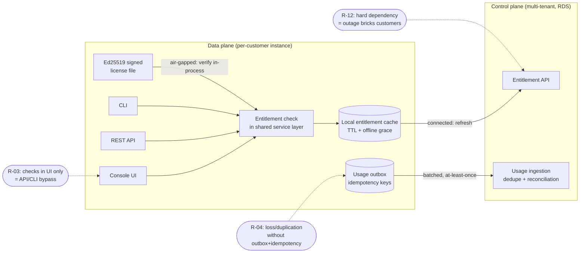

# Risk Register

**Phase 0 — Commercialization Assessment · Document 05**

This register enumerates the risks the MetaBridge commercialization program must manage, spanning the existing single-tenant data plane (the product as built — see [../architecture.md](../architecture.md)), the proposed multi-tenant control plane (see [Target Architecture](02-target-architecture.md)), and the enforcement bridge between them. Every risk is grounded in verified code or documentation where it concerns the existing system, and classified per the scheme in [Gap Analysis](01-gap-analysis.md). Phases reference the [Implementation Roadmap](04-implementation-roadmap.md).

**Honesty note.** All likelihood, impact, and severity values in this document are *assessments* made by the Phase-0 architecture review — they are judgments, not measurements, and no SLA or certification is claimed anywhere. Scores are **inherent (pre-mitigation)**; the mitigation column states the planned control, and residual risk is re-assessed at each phase gate.

---

## 1. Method and scoring

### 1.1 Scales

| Scale | Low | Medium | High | Critical |
|---|---|---|---|---|
| **Likelihood** | Unlikely in program horizon | Plausible without action | Expected without action | — |
| **Impact** | Annoyance, local rework | Delays a phase or a deal | Material revenue/security/trust damage | Existential to the commercial program (billing-data loss, license-key compromise, moat destruction) |

### 1.2 Severity matrix (Likelihood × Impact)

| Likelihood ↓ / Impact → | Low | Medium | High | Critical |
|---|---|---|---|---|
| **Low** | Low | Low | Medium | High |
| **Medium** | Low | Medium | High | Critical |
| **High** | Medium | High | Critical | Critical |

### 1.3 Categories and phase legend

- **Categories:** technical · commercial · security · operational · compliance.
- **Phases (see [Implementation Roadmap](04-implementation-roadmap.md) for authoritative definitions):** **P1** control-plane foundation (identity/tenant, catalog, hosting hardening) · **P2** enforcement bridge and metering (licensing, entitlements, usage) · **P3** monetization and channel (billing adapters, pricing, partner) · **PL** post-launch enhancement · **All** continuous.
- **Owner-role** is a role, not a named individual; assignments happen at the P1 kickoff.

---

## 2. Risk register

Ranked by inherent severity. IDs are stable — do not renumber when rows are added; append.

| ID | Risk | Category | Likelihood | Impact | Severity | Mitigation | Owner-role | Phase |
|---|---|---|---|---|---|---|---|---|
| R-01 | **Financial records on the file-backed store.** The product persists all state as JSON files with `fcntl.flock` + atomic `os.replace` (`src/metabridge/platform/_util.py`; [../architecture.md](../architecture.md) §2.3). This is fine for workspace state but has no transactions, referential integrity, point-in-time recovery, or audit-grade durability — unfit for subscriptions, invoices, or usage ledgers. | technical | High (if attempted) | Critical | **Critical** | Mandated by design: all commercial records live only in the control plane on Amazon RDS PostgreSQL (ACID transactions for billing-critical ops, outbox for events). The product's file store never holds a financial record. Enforced as an architecture fitness rule at every phase gate. | Control-Plane Tech Lead | P1 |
| R-02 | **Retrofitting tenancy into the product destroys the air-gap moat.** Adding `tenant_id`/multi-tenancy to the file-backed monolith would break the deliberate single-tenant, in-boundary positioning ([../deployment-topologies.md](../deployment-topologies.md) Models A/B/C), invalidate the assumptions behind ~1,745 tests, and rebuild working functionality. | technical | Medium (pressure to "make it SaaS" is real) | Critical | **Critical** | Resolved by the two-plane architecture: tenancy lives exclusively in the new control plane; data-plane instances remain single-tenant. Recorded as an explicit, founder-approved decision in [Target Architecture](02-target-architecture.md); any PR introducing tenant concepts into `src/metabridge/` is rejected by review policy. | Founder + Principal Architect | P0 decision, enforced All |
| R-03 | **Entitlement bypass if checks live only in the console.** The product has three co-equal front doors — web console, REST `/api`, and CLI — over the same engines ([../architecture.md](../architecture.md) §2.7). UI-only entitlement checks would be trivially bypassed via API or CLI. | security | High | High | **Critical** | Enforce entitlements in the shared service layer (kernel/engine entry points), not templates; connected instances check the control-plane API with a local cache; BYOC/air-gapped instances verify Ed25519-signed license files in-process (reusing marketplace signing, `src/metabridge/marketplace/`); contract tests assert identical enforcement across all three front doors. | Platform Engineering Lead | P2 |
| R-04 | **Usage-event loss or duplication.** Instances batch-report usage when connected; retries, partitions, and restarts can double-bill or under-bill. Air-gapped usage arrives as manually transported statements. | technical | High (inherent to distributed metering) | High | **Critical** | Idempotency keys on every usage event; transactional outbox on both producer (instance) and consumer (control plane) sides; SQS/EventBridge with dedupe; periodic reconciliation reports per tenant; air-gapped statements are signed with sequence numbers, reusing the audit chain's contiguity-check pattern (`src/metabridge/agents/audit.py`). | Control-Plane Tech Lead | P2 |
| R-05 | **No SSO/SAML/OIDC/SCIM blocks enterprise procurement.** Verified: the product has only file-backed local accounts (`web/auth.py`) and an optional API key; zero SSO/SCIM code exists. Enterprise security questionnaires for Model A/B deals will fail on this line item. | commercial | High | High | **Critical** | OIDC/SAML lands first in the control plane (where buyers, partners, and admins log in) at P1; product-instance SSO follows (native OIDC or identity-aware proxy in managed cells) at P3; SCIM is a post-launch enhancement. Never claim SSO exists before it ships. | Head of Product + Security Lead | P1 (control plane), P3 (product), PL (SCIM) |
| R-06 | **Backup/restore untested for RDS.** The control plane is greenfield; configured snapshots are not proven restores. Losing the billing ledger is existential. | operational | Medium | Critical | **Critical** | PITR enabled from day one; cross-region snapshot copy; a *successful timed restore drill* is a P2 exit-gate criterion and repeats quarterly; restore runbook versioned with the schema. | SRE/Ops Lead | P2 gate, then All |
| R-07 | **Scope creep of the commercialization mandate itself.** The mandate spans identity, catalog, subscriptions, licensing, metering, pricing, billing adapters, partner/commission, AI cost governance, CS analytics, and an admin console — a full ERP if attempted at once, by a team whose product is a working modular monolith. | operational | High | High | **Critical** | Phase gates with written entry/exit criteria in the [Implementation Roadmap](04-implementation-roadmap.md); thin vertical slices per bounded context (e.g., manual invoicing before the Stripe adapter; one meter before ten); founder sign-off required to open each phase; this register reviewed at every gate. | Founder + Principal Architect | All |
| R-08 | **No rate limiting on public endpoints.** Verified: `/login`, `/signup`, `/auth/*` are in `_PUBLIC_PREFIXES` (`web/app.py`) and no throttling code exists anywhere. Each login attempt costs a PBKDF2-SHA256 @ 390k-iteration verification — credential stuffing doubles as CPU-amplification DoS. Internet-exposed Model A cells are most at risk. | security | Medium | High | **High** | Managed cells: WAF + ALB rate rules per [../aws-deployment.md](../aws-deployment.md). Product: app-level login backoff/lockout and per-IP throttling shipped for BYOC/on-prem. Control plane launches with rate limiting from its first public endpoint. | Security Lead | P1 |
| R-09 | **AI cost blowout without budgets.** Verified: `src/metabridge/llm/assist.py` counts only `calls`/`converted` — no token metering, no budgets, and exceptions are deliberately swallowed (assist "must never break a conversion"), so cost anomalies are silent. `LLMAssist` fans out per expression; `LLMDrafter` uses 4,096-token completions. In managed cells running on the vendor's Bedrock account this erodes margin directly. | commercial | Medium | High | **High** | Wrap `make_client()` with token/cost accounting per workspace; control-plane AI-cost-governance context aggregates rollups; per-tenant budgets with alerts and flag-gated hard caps (reuse `platform/flags.py` fail-closed semantics); pass-through-billing option for customer-keyed deployments. | Finance Lead + Platform Engineering Lead | P2 (metering), P3 (budgets/billing) |
| R-10 | **Secrets in `settings.json` (mode 0600).** Verified: AI `api_key`/`bedrock_token` are written as plaintext JSON on the data volume (`save_ai_settings`, `src/metabridge/llm/assist.py`). Volume snapshots and backups replicate live credentials. | security | Medium | High | **High** | Managed cells move secrets to AWS Secrets Manager (already the reference pattern in [../aws-deployment.md](../aws-deployment.md)); document an envelope-encryption option for BYOC; control-plane secrets (PSP keys, signing keys) are Secrets Manager/KMS-only from day one and never use this pattern. | Security Lead | P1 (managed cells + control plane), P3 (product hardening) |
| R-11 | **License-signing key compromise.** Reusing Ed25519 marketplace signing for entitlement license files makes the private signing key the crown jewel: compromise means unlimited counterfeit licenses — unrevocable in air-gapped estates that never phone home. | security | Low | Critical | **High** | Offline root key + short-lived issuing keys; keys held in KMS/HSM, never on developer machines; license format carries a key-id to allow rotation; denylist of revoked key-ids/licenses ships inside product updates so even air-gapped instances eventually converge. | Security Lead | P2 |
| R-12 | **Control-plane availability coupling.** If connected instances hard-depend on the entitlement API, a control-plane outage stops paying customers' modernization work — inverting the product's reliability story. | operational | Medium | High | **High** | Local entitlement cache with TTL and a defined offline-grace window; fail-degraded (existing entitlements honored, new grants deferred) rather than fail-closed; the data plane must never require the control plane to serve an in-flight job. Verified in P2 chaos drills. | Platform Engineering Lead | P2 |
| R-13 | **GDPR/data-residency for the control plane itself.** The control plane aggregates customer commercial data (contacts, contracts, usage) even when the data plane is fully in-boundary — a single-region US control plane undermines the residency story that sells Models B/C. | compliance | Medium | High | **High** | Control plane is designed cell-deployable per region from the start (aligning with the cell model in [../global-operations.md](../global-operations.md)); an EU cell option for EU tenants; data minimization — usage *counters*, never customer payloads or schemas; DPA and records-of-processing before first EU tenant. | Compliance/DPO | P1 (design), P3 (EU cell) |
| R-14 | **Channel conflict without deal-registration rules.** SI-led go-to-market plus any direct sales on the same accounts destroys partner trust before the partner context even ships. | commercial | Medium | High | **High** | Deal registration with time-boxed exclusivity implemented in the control-plane partner context; the commission engine is the single source of truth for attribution; published rules of engagement signed with each SI agreement. | Founder + Partner/Channel Lead | P3 (interim: contractual rules from first SI deal) |
| R-15 | **`web/app.py` monolith size slows safe change.** Verified: 3,847 lines, 176 routes, one file containing the `access_guard` middleware, permission map, and every route. The enforcement bridge and licensing hooks must land here — concentrated regression surface. | technical | High | Medium | **High** | Incremental split into `APIRouter` modules along engine boundaries — mechanical, no behavior change — while keeping `access_guard` and `_required_permission` central; the ~1,745-test suite (~30s) is the regression net; enforcement-bridge hooks land only after the relevant router is extracted. | Platform Engineering Lead | P1–P2 (incremental) |
| R-16 | **Python 3.9 local vs 3.11 container drift.** Verified: `pyproject.toml` declares `requires-python = ">=3.9"` (and local venvs run 3.9) while the `Dockerfile` builds on `python:3.11-slim`. Version-specific syntax/stdlib behavior can pass locally and fail in the container, or vice versa. | technical | Medium | Medium | **Medium** | CI matrix pinning both 3.9 and 3.11 immediately; then decide once: raise the floor to 3.11 and align local venvs (preferred — validate no customer CLI constraint first, see A-12) or keep 3.9 support deliberately. Single source of truth in `pyproject.toml`. | Platform Engineering Lead | P1 |
| R-17 | **Offline-grace abuse / clock rollback in air-gapped licensing.** Model C instances enforce via signed license files with offline grace; system-clock manipulation or license-file copying could extend entitlements beyond contract. | commercial | Medium | Medium | **Medium** | License binds the instance `workspace_id` (generated once per instance — `web/app.py`) plus expiry; monotonic usage counters embedded in signed usage statements expose rollback; contractual true-up audit rights — the standard norm in SI channel agreements. Accept residual: determined offline abuse is bounded by contract, not code. | Head of Product + Legal | P2 |
| R-18 | **Pricing-floor bypass.** Discretionary partner/sales discounts with no system enforcement means quoting lives in spreadsheets and price integrity erodes silently. | commercial | Medium | Medium | **Medium** | Control-plane pricing service enforces floors with an approval workflow for exceptions; every override is written to a tamper-evident audit trail (reusing the HMAC hash-chain pattern from `src/metabridge/agents/audit.py`); quarterly discount-variance report to Finance. | Finance Lead | P3 |
| R-19 | **Marketplace revenue recognition.** Selling third-party signed packages raises gross-vs-net (agent vs principal) recognition questions. Verified: today marketplace `license` fields are pure metadata — no payment code exists anywhere — so the risk is entirely in the future paid marketplace. | compliance | Medium | Medium | **Medium** | Defer the *paid* marketplace to post-launch (it is not on the launch critical path); before launch of paid listings, ledger and merchant-of-record design reviewed by external accountants; until then the marketplace remains free/signed-distribution only. | Finance Lead | PL |
| R-20 | **File-lock semantics on shared storage in managed cells.** Horizontal scaling of the data plane requires the volume on shared storage ([../architecture.md](../architecture.md) §2.8); `fcntl.flock` over NFS/EFS has subtler semantics than local flock and is unproven for this codebase under multi-node contention. | operational | Medium | Medium | **Medium** | Managed cells run single-node-per-instance (vertical + `--workers N`) until a dedicated soak test proves multi-node locking on EFS; document the supported topology; treat store-backend swap as the already-identified evolution seam, not a launch item. | SRE/Ops Lead | P1 (topology policy), PL (multi-node) |
| R-21 | **Fresh-instance open mode.** Verified: `access_guard` grants `perms = {"*"}` when no users exist *and* no `METABRIDGE_API_KEY` is set (`web/app.py`, bootstrap path) — a newly exposed instance is briefly unauthenticated-admin until first signup. Mitigating factor (verified): `docker-compose.yml` requires `METABRIDGE_API_KEY` via `.env`. | security | Low | High | **Medium** | Managed-cell provisioning always sets the API key and creates the owner account *before* network exposure; add a first-boot setup token so open mode never faces a network; document the hazard for BYOC installers. | Security Lead | P1 |
| R-22 | **Billing-provider lock-in.** Coupling the billing context directly to one PSP makes India/global expansion (Razorpay vs Stripe) and AWS Marketplace co-sell rework-expensive. | commercial | Low | Medium | **Low** | Already mandated: billing integrations are adapters behind a port (Stripe / Razorpay / manual invoice / AWS Marketplace); the manual-invoice adapter ships first and doubles as the fallback path. | Control-Plane Tech Lead | P3 |

---

## 3. Top risks — detail and evidence

### R-01 / R-02 — the two-plane resolution of the central conflict

The master direction says "multi-tenant SaaS"; the product is *deliberately* single-tenant ([../architecture.md](../architecture.md) §2.5, [../deployment-topologies.md](../deployment-topologies.md)). This is a genuine conflict, and this program resolves it explicitly rather than papering over it: **multi-tenancy is a control-plane property; isolation is a data-plane property.** R-01 and R-02 are two faces of the same failure mode — dragging commercial state or tenant concepts into the file-backed product — and both are mitigated by the same architectural boundary. The residual risk is *discipline*, which is why the mitigation is a review policy plus phase-gate checks, not code.

### R-03 / R-04 / R-12 — the enforcement bridge failure surface

The three structural rules that close this surface: enforcement lives **below** all three front doors; usage transport is **at-least-once with idempotent ingestion**; and connectivity is **an optimization, never a requirement** for already-granted entitlements.

### R-08 — rate limiting (verified absence)

`web/app.py` defines `_PUBLIC_PREFIXES = ("/login", "/signup", "/auth/", "/static/", "/docs", "/documentation", "/openapi.json", "/redoc", "/api/v1/info")` and the codebase contains no throttling of any kind. Because password verification is PBKDF2-SHA256 at 390k iterations, unauthenticated POSTs to `/auth/login` are computationally expensive *for the server* — an attacker gets brute-force and DoS from the same loop. This is acceptable today only because current deployments sit inside customer boundaries; it is a launch blocker for internet-facing Model A cells.

### R-09 / R-10 — AI keys and AI costs (verified)

`src/metabridge/llm/assist.py` is well-designed for its purpose (advisory-only, off by default, every LLM output flagged for review) but has **zero cost telemetry**: the only counters are `calls` and `converted`, and every exception is swallowed so the conversion never breaks. Keys are stored via `save_ai_settings()` into `settings.json` with `chmod 0600` — sound for an appliance, insufficient for vendor-operated cells where the vendor bears the Bedrock bill and the volume gets snapshotted.

### R-07 — the program's own scope

The single most likely failure mode of this commercialization effort is not any one technical gap — it is attempting all eleven control-plane bounded contexts simultaneously. The phase-gate structure in the [Implementation Roadmap](04-implementation-roadmap.md) exists primarily as the mitigation for this row.

---

## 4. Assumption log

Every assumption Phase 0 rests on, in one table. Each is validated (or falsified) at the stated point; a falsified assumption triggers a register review.

| ID | Assumption | Basis | If wrong | Linked risk | Validation (owner / phase) |
|---|---|---|---|---|---|
| A-01 | The single-tenant data plane remains product strategy; no tenant retrofit, ever. | Founder direction; [../deployment-topologies.md](../deployment-topologies.md) Models A/B/C. | Two-plane split needs redesign; moat repositioning. | R-02 | Founder sign-off at P0 gate |
| A-02 | The control plane is greenfield with no runtime dependency on the product monolith (shared *patterns*, not shared *state*). | Mandated target direction. | Coupling reintroduces R-01/R-02 through the back door. | R-01, R-02 | Architecture review / P1 |
| A-03 | The Ed25519 marketplace signing design (signature binds full manifest) is sound and reusable for license files. | `src/metabridge/marketplace/` (verified: signing, catalog, install locks exist). | Licensing needs a new crypto design; P2 slips. | R-11 | External security review / P2 entry |
| A-04 | Assessment object counts, Digital Twin node/edge counts, and job history are deterministic and reproducible enough to bill on. | `src/metabridge/assessment/engine.py`; deterministic-engines principle ([../architecture.md](../architecture.md) §1.1). | Metering disputes; must pick different meters. | R-04 | Meter reproducibility tests / P2 |
| A-05 | The ~1,745-test suite (~30s, green in GitLab CI) is an adequate regression net for the router split and enforcement hooks. | CI history. | Refactor risk rises; slow down R-15 mitigation. | R-15 | Coverage spot-check on `web/app.py` routes / P1 |
| A-06 | Model A/B instances can reach the control plane over outbound HTTPS; Model C never phones home. | [../deployment-topologies.md](../deployment-topologies.md). | Enforcement bridge needs a relay/proxy design. | R-03, R-12 | Design-partner network review / P2 |
| A-07 | Buyers and SIs accept signed usage statements plus contractual true-up as the air-gapped billing mechanism. | SI-channel norms; no code basis (commercial assumption). | Air-gapped monetization model must change (e.g., capacity licenses only). | R-17 | Validate with 2–3 design partners / P2 |
| A-08 | AWS is the initial control-plane home (RDS, SQS/EventBridge, Secrets Manager); multi-cloud is not a launch requirement. | [../aws-deployment.md](../aws-deployment.md) is the existing reference pattern. | IaC and ops plans need rework. | R-06, R-13 | Founder/Finance sign-off / P1 |
| A-09 | No SLA, SOC 2, ISO, or other certification is claimed today, and none will be claimed before it is achieved. | Honesty rule; verified — no such claims in code or docs. | Trust damage, contractual exposure. | R-05, R-13 | Standing policy / All |
| A-10 | Stripe, Razorpay, manual invoicing, and AWS Marketplace adapters cover launch; no other PSP needed. | Mandated target direction. | Additional adapter work in P3. | R-22 | First-10-customers payment survey / P3 entry |
| A-11 | SIs are the primary channel; direct sales is secondary. | Product positioning (assessment meters match SI estimate spreadsheets). | Deal-reg design and pricing floors need rebalancing. | R-14, R-18 | GTM review / P3 entry |
| A-12 | The Python floor can be raised to 3.11 without breaking customer CLI installs on older interpreters. | `requires-python = ">=3.9"` is currently permissive (verified in `pyproject.toml`). | Keep dual-version CI matrix permanently. | R-16 | Customer environment survey / P1 |
| A-13 | AI assist remains advisory-only and off by default; no autonomous AI action is a billable or consequential event without human approval. | `src/metabridge/llm/assist.py` docstring and design; `agents:approve` segregation of duties (verified). | AI governance and audit scope expands materially. | R-09 | Product policy re-affirmed / each gate |
| A-14 | The instance `workspace_id` (generated once at first configuration, `web/app.py`) is unique and stable enough to anchor license binding and usage attribution. | Verified: generated once per instance. | Licensing needs a separate instance-identity scheme. | R-17, R-03 | Persistence/uniqueness test / P2 |

---

## 5. Register governance

- **Cadence:** reviewed at every phase gate and monthly in between; owned overall by the Principal Architect with the Founder as escalation point.
- **Change rules:** severities may be re-scored only with written rationale; new risks are appended with fresh IDs; nothing is deleted — closed risks move to a closed section with the closing evidence linked.
- **Exit criteria coupling:** R-06 (restore drill) and R-03 (cross-front-door enforcement tests) are hard exit-gate criteria for P2; R-08 (rate limiting) and R-21 (bootstrap hardening) are hard entry criteria for any internet-facing Model A cell.
- **Sibling documents:** classification of every underlying capability gap (Already available / Partially available / Missing / Must be refactored / Production blocker / Post-launch enhancement) lives in the [Gap Analysis](01-gap-analysis.md); the phased mitigations land per the [Implementation Roadmap](04-implementation-roadmap.md).
