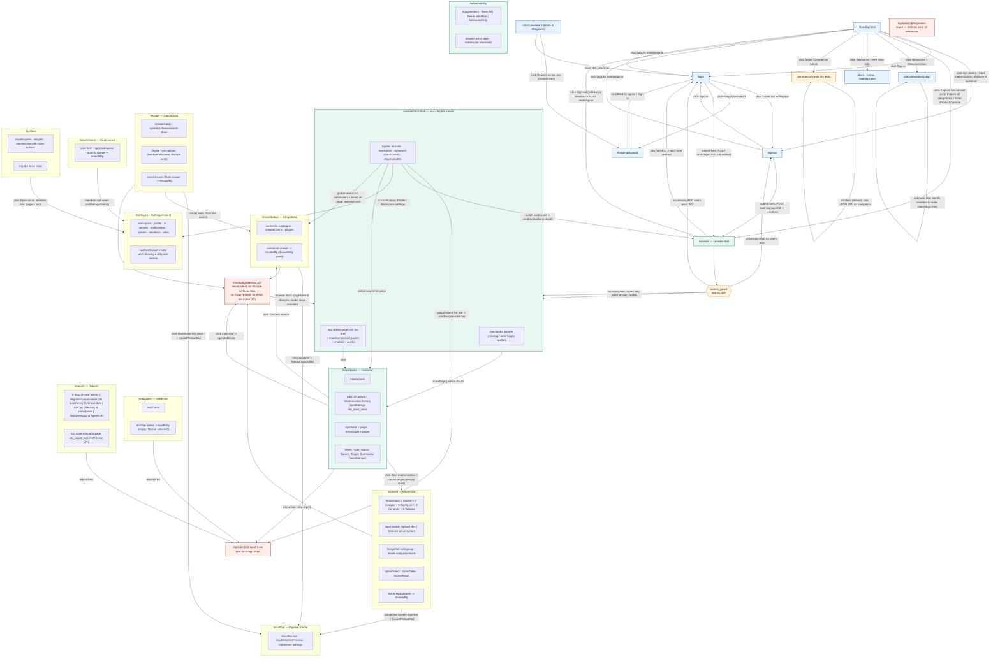

# Navigation flow — MetaBridge AI web frontend

Traced from source on branch `metabridge-branch-0.2.0`. Nothing in this document
is inferred from a filename; every claim is anchored to a file and line.

## Architecture summary

The frontend is **not** a JS SPA framework app. It is a FastAPI application
(`web/app.py`) serving five standalone Jinja-free HTML templates plus one large
single-document console:

| Layer | Where |
| --- | --- |
| Route table | `web/app.py` — FastAPI decorators, no router/blueprint files |
| Auth + RBAC | `web/auth.py` (`AuthStore`, `PERMISSIONS`), enforced by `access_guard` middleware at `web/app.py:309` |
| Workspace scoping | `web/workspaces.py`, resolved per-request at `web/app.py:314-325` |
| Marketing site | `web/templates/landing.html` (707 lines) |
| Auth screens | `login.html`, `signup.html`, `forgot.html`, `reset.html` |
| Product console | `web/templates/console.html` — **12,900 lines, one document**; 11 sections toggled by `.visible`, addressed by URL hash |
| Docs site | `web/docsite.py` renders `docs/*.md` at `/documentation/{slug}` |
| Commercial admin | `web/commercial_app.py`, mounted at `/commercial` (own `X-Commercial-Key` auth, own datastore) |

There is exactly **one authenticated HTML page** (`/console`). Everything a
signed-in user does happens inside it, addressed by `location.hash`.

## Server-side routing and guards

### The guard

`access_guard` (`web/app.py:309-357`) is the only auth gate.

- `protected = path.startswith("/api") or path.startswith("/console")` (`:312`)
- `public = path == "/" or path.startswith(any of _PUBLIC_PREFIXES)` (`:313`)
- `_PUBLIC_PREFIXES` (`:208`) = `/login`, `/signup`, `/auth/`, `/static/`,
  `/docs`, `/documentation`, `/openapi.json`, `/redoc`, `/api/v1/info`

Consequences read directly off that code:

1. **`_PUBLIC_PREFIXES` is almost entirely inert.** `public` is consulted only as
   `if protected and not public:` (`:327`), and `protected` covers only `/api` and
   `/console` (`:312`). Of the nine prefixes listed, only `/api/v1/info` can ever
   be `protected` in the first place — `/login`, `/signup`, `/auth/`, `/static/`,
   `/docs`, `/documentation`, `/openapi.json` and `/redoc` are public because they
   are *not protected*, not because they are listed. `/forgot-password` and
   `/reset-password` are public by the same mechanism without being listed at all,
   which is correct behaviour (the reset token is the credential) but implicit.
2. Three permission outcomes exist, not two:
   - signed-in session cookie → role permissions from the **active workspace**
     (`_request_user`, `:229`)
   - `METABRIDGE_API_KEY` header/query → `{jobs:read, jobs:run, jobs:delete}` (`:332-336`)
   - **no users and no API key → `perms = {"*"}` "open mode"** (`:337-338`).
     A fresh instance serves the whole console with no sign-in.
3. Redirect targets are computed, not fixed (`:340-343`):
   `/console` unauthenticated → `/signup` when `AUTH.has_users()` is false,
   otherwise `/login`. Any other protected path → `401 JSON`.
4. `403` for an authenticated-but-underprivileged role
   (`_required_permission`, `:260-306`) — the console never redirects on 403,
   the calling JS receives the message as a thrown `Error`.

### Post-auth landing and sign-out

- Login (`:488`) and signup (`:465`) both return
  `{"user": …, "redirect": "/console"}` from `_session_response` (`:457`) and set
  the `mb_session` HttpOnly cookie. The client performs the navigation
  (`login.html:106`, `signup.html:129`).
- Logout (`:498`) returns `{"ok": true}` and deletes the cookie. The client
  chooses the destination, and both sign-out buttons choose the **marketing
  landing page**, not `/login` (`console.html:3717` sidebar, `console.html:4005`
  header menu).
- Password reset success redirects to `/login` after 1.8 s (`reset.html:168`).

### Client-side session expiry

`api()` (`console.html:3460`) hard-navigates to `/login` on any `401`
(`:3484`) and throws `Error('Signing in…')`. Session TTL is 12 h
(`auth.py:26`).

## Console section routing

`showPage(key, push)` (`console.html:4058`) is the single entry point.

- A section is a valid route **only if a `nav a[data-page]` exists for it**
  (`:4059-4060`, `:4116`); an unknown hash returns `false`.
- `setHash` (`:4105`) writes `history.pushState({page: h}, '', '#' + h)` guarded
  by `gHashLock` so its own write does not re-trigger the loader.
- `popstate` → `routeFromHash() || showPage('dashboard', false)` (`:4122`)
- `hashchange` → `routeFromHash()` when not self-inflicted (`:4123-4125`)
- First load → `if (!routeFromHash()) loadDashboard()` (`:12896`)
- Settings carries a sub-section in the hash: `#settings/members` (`:4088`,
  `:4117`, `showSettings` `:4183-4194`).
- `repairSectionContainers()` (`:3448`) re-parents `.page` divs that are not
  direct children of `<main>`; `sectionError()` (`:4028`) renders a visible
  banner when a section is missing or measures zero height.

The eleven section entries are `<a>` elements **without `href`, `tabindex` or
`role`** (`:1579-1589`, `:1591`), so they are not focusable. The one exception is
`#navCommercial` (`:1590`), which carries `href="/commercial/" target="_blank"`
and is therefore the only focusable item in the nav — and it is `display:none`
unless the user is an owner on an enabled, ready instance.

## Modals, drawers and overlays

Two independent overlay systems exist:

| System | Markup | Escape | Focus trap | Focus restore | ARIA | Sites |
| --- | --- | --- | --- | --- | --- | --- |
| `#dlgBg` / `#dlgBox` (`mbDialog`, `:3782`) | `:3434-3435` | yes (`:3831`) | yes (`:3834-3840`) | yes (`:3824`) | `role="alertdialog" aria-modal="true"` | `mbConfirm` / `mbAlert` / `mbPrompt` |
| `#modalBg` / `#modalBody` (generic) | `:3431` | **no** | **no** | **no** | **none** | 20 mount sites (`$('#modalBody').innerHTML =`), 17 show sites (`display = 'flex'`) |

`#modalBg` is dismissed only by (a) a per-modal Cancel/Close button wired by the
opening function, or (b) a backdrop `mousedown`+`mouseup` pair that both land on
the backdrop (`:8168-8182`), which calls `closeDrawer()` — the connector-drawer
close path — regardless of which content is mounted.

Content mounted into `#modalBg`: connector drawer (`openConnector`), job detail
(`openJobDetail`), profile photo cropper (`openPhotoDialog`), avatar chooser
(`openAvatarChooser`), remove-photo confirm, discard-changes confirm
(`confirmDiscard`, `:4195`), estate asset/table drawers (`:10114`, `:10129`),
validation detail (`:11034`), "Ask MetaBridge AI" panel (end of file), data-load
packaging (`:5730`), auto-fix queue (`:5815`).

**No overlay is represented in the URL.** `popstate` runs `routeFromHash()`
(`:4122`) which does not touch `#modalBg`, so browser Back with a modal open
switches the page behind it and leaves the modal mounted.

## Native browser dialogs still in use

`mbPrompt`/`mbAlert` exist (`:3849`, `:3847`) but the workspace switcher uses
native chrome: `prompt('Name your new workspace:')` (`:3668`), `alert()` on
switch failure (`:3664`) and create failure (`:3674`). Job-detail open failure
also uses native `alert()` (`:11132`).

## Diagram

## Route inventory

Legend for **Auth required**: `no` = served to anyone; `session` = needs
`mb_session` cookie (or `METABRIDGE_API_KEY`, or open mode); `own key` = separate
`X-Commercial-Key`.

### HTML / navigation routes

| Route | Component | Auth required | Reachable from |
| --- | --- | --- | --- |
| `GET /` | `templates/landing.html` (`app.py:360`) | no | direct URL; `← metabridge.io` on `/login` and `/signup`; both Sign-out buttons |
| `GET /favicon.ico` | `static/favicon.ico` (`app.py:365`) | no | browser only |
| `GET /login` | `templates/login.html` (`app.py:374`) | no | landing CTA + mobile menu; `signup.html:97`; `forgot.html:72,82`; `reset.html:102,168`; `access_guard` 302 when users exist; `api()` on 401 (`console.html:3484`) |
| `GET /signup` | `templates/signup.html` (`app.py:379`) | no | landing "Get started"/"Start modernization"/"Analyze a workload"; `login.html:91`; `access_guard` 302 when no users exist |
| `GET /forgot-password` | `templates/forgot.html` (`app.py:384`) | no | `login.html:87`; `reset.html:100` |
| `GET /reset-password` | `templates/reset.html` (`app.py:389`) | no (token in `#fragment`) | emailed link, or admin-minted link from Settings → Members (`POST /api/users/{email}/reset-link`), or `metabridge auth reset-link` on the host. **No UI link.** |
| `GET /console` | `templates/console.html` (`app.py:415`) | session | four landing links, three labels: "Explore live console" (`landing.html:271`, `:549`), "Explore all integrations →" (`:512`), footer "Product Console" (`:562`); `d.redirect` after login/signup |
| `GET /documentation` | 307 → `/documentation/index` (`app.py:431`) | no | landing nav "Documentation" and footer. **Not linked anywhere in `console.html`.** |
| `GET /documentation/{slug:path}` | `docsite.render_page` (`app.py:437`) | no | docsite sidebar (`docsite.py:232`); unknown slugs are silently rewritten to `index` (`docsite.py:260-262`) |
| `GET /docs`, `/redoc`, `/openapi.json` | FastAPI-generated | no (not `protected`; the `_PUBLIC_PREFIXES` entries are redundant) | landing "Resources → API" (`landing.html:246`, new tab) |
| `* /commercial/{path}` | `commercial_app` or `_stub_commercial` (`app.py:87-127`) | own key | `landing.html:561` footer; `console.html:1590` `#navCommercial`, shown only when owner **and** `enabled && ready` (`gateCommercialNav`, `:3736`) |
| `GET /api/jobs/{id}/report` | HTML report (`app.py:4946`) | session | job detail, dashboard/validation/reports links, global-search job hits — all `target="_blank"` |
| `GET /api/jobs/{id}/govreport` | HTML report (`app.py:4981`) | session | `report_url` of a governance job (`app.py:5218`); also as `gov_report_url` (`app.py:5321`) |
| `GET /api/jobs/{id}/migration-report` | HTML report (`app.py:4972`) | session | **nothing.** No caller constructs this URL anywhere in `web/` or `src/` (`src/metabridge/cli.py:734` is a same-named CLI command, not a caller). The same file is served instead via `/api/jobs/{id}/artifact?path=migration_report.html&inline=1` (`_REPORT_HTML`, `app.py:1401`) |

### Auth form endpoints

| Route | Auth required | Reachable from |
| --- | --- | --- |
| `POST /auth/signup` | no on first account; `users:manage` afterwards (`app.py:468`) | `signup.html:124` |
| `POST /auth/login` | no | `login.html:102` |
| `POST /auth/logout` | no | `console.html:3717`, `:4005` |
| `POST /auth/forgot` | no | `forgot.html:92` |
| `POST /auth/reset/validate` | no | `reset.html:126` on page load |
| `POST /auth/reset` | no (token is the credential) | `reset.html:161` |

### Console sections (hash routes inside `/console`)

All require a session. "Reachable from" lists every trigger found in
`console.html`.

| Hash | Container | Loader | Reachable from |
| --- | --- | --- | --- |
| `#dashboard` | `#page-dashboard` (`:1666`) | `loadDashboard` | sidebar; `popstate` fallback (`:4122`); no-hash first load (`:12896`); global search page hits |
| `#estate` | `#page-estate` (`:1740`) | `loadEstate` | sidebar |
| `#convert` | `#page-convert` (`:2387`) | `fillObjSelects` | sidebar; Overview "Start modernization" (`:1676`); Overview empty state "Upload project" (`:6362`) |
| `#scaffold` | `#page-scaffold` (`:2930`) | `loadMovementSettings` | sidebar; `handoffToScaffold` (`:6863`) from Modernize, Integrations (`:7499`) and Data Estate |
| `#validation` | `#page-validation` (`:1840`) | `loadValidation` | sidebar |
| `#governance` | `#page-governance` (`:2846`) | `loadGovernanceExtras` | sidebar only (`:12724` only paints its unread badge) |
| `#reports` | `#page-reports` (`:1855`) | `loadReports` | sidebar; Governance "Audit trail" button, which then clicks the `#rtAg` tab (`:12718-12722`) |
| `#observability` | `#page-observability` (`:2243`) | `loadObservability` | sidebar |
| `#system` | `#page-system` (`:2319`) | `loadSystem` | sidebar |
| `#marketplace` | `#page-marketplace` (`:2783`) | `loadMarketplace` + `loadSavedConnections` | sidebar; Overview "Connect source" (`:1675`); Overview/Estate empty states (`:6361`, `:10009`); `:4763`; global-search connection hits (`:4161`) |
| `#settings` | `#page-settings` (`:3168`) | `showSettings(curSetSec)` | sidebar; sidebar profile menu (`:1600-1602`); header account menu (`:1648-1649`); System attention "Open" (`:11112`); `:5825`; `:12531` |
| `#settings/workspace` | `#sec-workspace` (`:3188`) | `loadWorkspace` | Settings sub-nav; profile/account menus |
| `#settings/profile` | `#sec-profile` (`:3209`) | `loadProfileSec` | Settings sub-nav; profile/account menus |
| `#settings/ai` | `#sec-ai` (`:3246`) | `loadAiSettings` | Settings sub-nav only |
| `#settings/secrets` | `#sec-secrets` (`:3316`) | `loadSecrets` | Settings sub-nav only |
| `#settings/notifications` | `#sec-notifications` (`:3330`) | `loadNotifSettings` | Settings sub-nav only |
| `#settings/system` | `#sec-system` (`:3396`) | `loadSystemInfo` | Settings sub-nav; sidebar profile menu (`:1602`) |
| `#settings/members` | `#sec-members` (`:3406`) | `loadMembers` | Settings sub-nav; `:12531`; `:12526` governance link |
| `#settings/roles` | `#sec-roles` (`:3415`) | `renderRolesMatrix` | Settings sub-nav only |

Sub-tabs **not** addressable by URL, so not routes: Overview's two table views
(`localStorage mb_dash_view`), Reports' eight tool tabs (`localStorage
mb_report_tool`), Observability's three monitor filters (in-memory
`gObsMonFilter`), Estate's system/schema selects.

## Dead ends and one-way doors

Established from the source, not inferred:

1. **Every HTML report opens in a new tab** — `window.open(...,'_blank')`
   (`:4157`) and `target="_blank"` on `.jd-rep` / `.linkbtn` links. The report
   pages are standalone HTML with no MetaBridge chrome and no link back to the
   console. Exit = close the tab.
2. **`#modalBg` overlays have no keyboard exit** — no `Escape` handler is bound
   for `#modalBg` anywhere (the four `Escape` listeners cover `.infobox`
   `:3578`, `#gHits` `:4141`, `#savedConns .menu` `:7457`, twin fullscreen
   `:10730`). Exit = the Cancel/Close button (reachable only by Tabbing through
   the page behind the overlay, since focus is never moved into it) or a backdrop
   click.
3. **`/reset-password` after a refresh** — `history.replaceState(null, '',
   window.location.pathname)` (`reset.html:117-119`) strips the token from the
   address bar as soon as it is read, whenever a hash was present. Since
   app-minted links always carry the token in the fragment (`app.py:542`), the
   strip always runs and `readToken()`'s legacy `?token=` fallback (`:112`) has
   nothing to fall back to. Reloading leaves it empty, so the form is replaced by
   the "invalid, expired, or already used" panel. The only exit is "Request a new
   one" — which invalidates the token the user still holds (`auth.py:372`).
4. **`/commercial` when disabled (the default)** — `_stub_commercial(404, …)`
   (`app.py:94`) answers every path with raw JSON
   `{"error": "commercial_admin_disabled", …}`. Reached from the landing footer
   (`landing.html:561`). No HTML, no navigation.
5. **The console has no link to `/documentation`, `/docs`, or `/`** — verified by
   grep: zero occurrences in `console.html`. A signed-in user cannot reach the
   product documentation from inside the product.
6. **`/api/jobs/{id}/migration-report`** is defined and unreachable from the UI.
7. **The first Back press can leave `/console` with an overlay still painted** —
   `setHash` runs only from `showPage` with `push !== false` (`:4088`, `:4105`),
   and first load routes with `push=false` (`:12896` → `:4118`). A session that
   opens an overlay before its first nav click therefore has no history entry to
   pop.
8. **`#navCommercial`** (`:1590`) opens a different application in a new tab, under
   separate key auth, from inside the section list.

## Open questions

Items the source does not resolve; listed rather than assumed.

1. **Is "open mode" (`app.py:337-338`) intended to be reachable in production?**
   It grants `{"*"}` on any protected path when `users.json` is empty and
   `METABRIDGE_API_KEY` is unset. `login()`/`signup()` are unaffected, so an
   operator who deletes `users.json` silently converts a private deployment into
   an open one. The docstring calls it "fresh instance, nothing configured".
2. **Should sign-out land on `/` or `/login`?** Both buttons choose `/`
   (`:3717`, `:4005`). No comment states the intent, and `/` is the public
   marketing page.
3. **Is `/api/jobs/{id}/migration-report` a deprecated route or a
   not-yet-wired one?** `src/metabridge/cli.py:734` defines a
   `migration-report` CLI command, so the HTML artifact has a non-UI producer.
4. **The Swagger UI is served unauthenticated even when accounts exist**, because
   `/docs` is not `protected` (`app.py:312`) — its `_PUBLIC_PREFIXES` entry is not
   what makes it public. Whether that is deliberate for a self-hosted deployment
   behind a reverse proxy is not stated in the code or `DEPLOYMENT.md`.
5. **The section `<a>` elements have no `href`** (`:1579-1589`, `:1591`) but
   `nav a:focus-visible` styling exists (`:72`) and can never fire. Unclear
   whether focusability was intended and lost, or never implemented.
6. **Why does the landing footer link to `/commercial` unconditionally?**
   `landing.html:561` is a static link, and the marketing page cannot know
   whether the plane is enabled. `console.html` gates its own entry correctly via
   `/api/system/commercial`, so the two surfaces disagree by construction.
